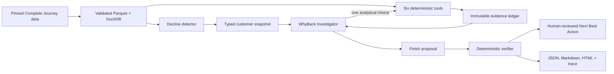

# WhyBack

### Find the why. Choose the way back.

WhyBack is an auditable customer retention investigation agent. It identifies
customers showing declining engagement, dynamically investigates likely drivers
using deterministic analytical tools, and recommends a human-reviewed Next Best
Action.

> The LLM decides what to investigate. Code calculates the evidence.
>
> A verifier determines what can be claimed.



## Quickstart

Python 3.12 and [`uv`](https://docs.astral.sh/uv/) are required. The default
demo and test paths use the deterministic `ScriptedBackend`; no API key or full
dataset is needed.

```bash
uv sync --frozen --all-extras
uv run whyback --help
uv run whyback demo --customers 5
uv run whyback verify-artifacts artifacts/demo
uv run python scripts/run_quality_gate.py
```

To reproduce the official-data detector path (the download is large and needs
network access):

```bash
uv run whyback data prepare --full
uv run whyback detect --top 20 --output-dir artifacts/local/detection
```

**Representative executed result.** Against the full official source pinned at
`5b5d061`, the detector anchored baseline weeks 38–45 and recent weeks 46–53.
It found 1,313 eligible households and flagged 304 at the declared `0.30`
threshold. Household `5`, ranked first, moved from **$98.37 retailer sales
value / 6 baskets / 4 active weeks** to **$0.00 / 0 / 0**, for a heuristic
decline score of `1.000`. This is an observed decline signal—not a churn
probability, causal explanation, or completed live-model investigation. Week 53
is shorter than an ordinary source week and is disclosed as a limitation.

## What is implemented

The repository contains a reproducible official-data path, a transparent
detector, six deterministic analytical tools, two model backends, a bounded
investigation loop, evidence-ID grounding, deterministic verification, a
governed action catalog, append-only JSONL auditing, offline report and trace
renderers, deterministic behavioral evaluations, and a CI-oriented quality
gate. The implementation favors explicit contracts and inspectable failure
states over framework abstraction.

The full official Complete Journey files were downloaded and prepared locally:
22,627,890 rows across eight pinned source files became ten canonical or derived
Parquet tables with SHA-256 hashes. Raw R files and prepared Parquet are ignored
by Git. The local detector selected the canonical top five households `5`,
`181`, `423`, `472`, and `682`.

The preserved prior-submission artifacts record that `OPENAI_API_KEY` was absent
and that the then-current live GPT investigation was skipped. That is historical
evidence, not the status of the current provider. The active live backend is now
Gemini. A live synthetic contract request returned a provider-issued Gemini
function-call ID and one valid analytical decision. A longer synthetic attempt
completed three model/tool turns before a later provider request reached its
bounded timeout and failed closed. No completed live Gemini investigation is
therefore claimed, and no official customer-behavior data was sent to Gemini.
Credential-free scripted investigations exercise the same runner, tools,
verifier, report renderer, and trace writer; their manifests label the execution
mode.

To run an explicitly authorized live investigation, keep the credential out of
Git and run:

```bash
export GEMINI_API_KEY="..."
uv run whyback investigate --household-id 5 --backend gemini
uv run whyback demo --customers 5 --backend gemini
uv run whyback verify-artifacts artifacts/live
```

The default model is `gemini-3.7-flash`, overridable with `RETENTION_MODEL`.
Thinking level defaults to `medium` and is overridable with
`RETENTION_THINKING_LEVEL` using `low`, `medium`, or `high`.

## Architecture

WhyBack separates control from calculation:

- Data acquisition verifies the official repository, pinned commit, file size,
  and SHA-256 before preparation. The manifest records schemas, row counts,
  missingness, derived-table definitions, prepared hashes, and source-tree
  version.
- DuckDB exposes read-only views over canonical Parquet. Tools own SQL and
  calculations; the model never receives raw data and never calculates report
  metrics.
- The WhyBack Investigator receives only a compact typed snapshot: detector
  facts, completed-tool summaries, evidence IDs and values, limitations, open
  questions, and remaining budgets. Each fresh decision offers one analytical
  function call or `finish_investigation`.
- An immutable application-owned ledger records every successful deterministic
  value. The final proposal uses evidence IDs and qualitative prose.
- The verifier checks evidence ownership and origin, action prerequisites,
  partial-data limitations, analytical reconciliation diagnostics, confidence,
  and prohibited numerical or causal free text before rendering.

See [Architecture](docs/architecture.md),
[Reliability](docs/reliability.md), the original
[agent-loop ADR](docs/adr/001-own-the-agent-loop.md), and the current
[Gemini provider ADR](docs/adr/007-use-gemini-function-calling.md).

## Decline detector

The detector anchors two non-overlapping eight-week windows to the maximum
observed week. With the official 53-week source, baseline is weeks 38–45 and
recent is weeks 46–53. A household is eligible with at least four baseline
active weeks, six baseline baskets, and positive baseline retailer sales value.

```text
sales_drop       = clip((baseline_sales - recent_sales) / baseline_sales, 0, 1)
trip_drop        = clip((baseline_trips - recent_trips) / baseline_trips, 0, 1)
active_week_drop = clip((baseline_weeks - recent_weeks) / baseline_weeks, 0, 1)
decline_score    = 0.50*sales_drop + 0.30*trip_drop + 0.20*active_week_drop
```

At the predeclared thresholds, the executed official-data diagnostics flagged
430 households at `0.20`, 304 at `0.30`, and 202 at `0.40`, from the same 1,313
eligible households. The formula was not tuned to produce attractive cases and
must not be interpreted as a probability.

## Analytical tools

All six LLM-visible tools have strict Pydantic inputs and a shared typed result
envelope with status, evidence, limitations, retryability, and provenance.

| Tool | Question answered | Safety invariant |
| --- | --- | --- |
| `customer_trend` | Is decline mainly frequency, value, recency, or trajectory? | Empty windows are explicit; recorded quantity carries a fuel-scale caveat. |
| `category_decomposition` | Which departments/categories account for lost retailer sales value? | `UNKNOWN` is retained and category totals reconcile. |
| `basket_behavior` | Are there fewer visits, smaller baskets, or changed cadence/store behavior? | Metrics are computed at distinct-basket grain. |
| `promotion_response` | Did purchasing associated with promotion availability change? | The join preserves rows and retailer sales value; availability is not household exposure. |
| `coupon_campaign_history` | What participation, redemption, and transaction coupon behavior is known? | Type A exact delivered coupons remain unavailable and produce `partial`. |
| `peer_comparison` | Is the target unusual among behavioral peers? | Robust baseline behavior drives peers; demographics do not; target is excluded. |

For source-specific caveats, see
[Complete Journey data semantics](docs/data-semantics.md).

## Agent loop

`GeminiFunctionCallingBackend` calls the Gemini Interactions API through
Google's official Gen AI SDK with explicit function schemas, forced function
selection, stateless requests, and fresh compact state. Gemini can propose
parallel calls, so the adapter rejects any response that does not contain
exactly one function call. `ScriptedBackend` provides credential-free,
deterministic decisions for tests and demos. Both pass through the same
`InvestigationRunner`.

The runner permits at most five actual analytical attempts and six model
decisions by default. It rejects exact normalized duplicates, enforces the
active household, times out tools, retries only `retryable_error` once, removes
unavailable tools, and exposes only finishing during repair or after budget
exhaustion. A rejected finish gets at most one structured repair; otherwise the
system returns `INSUFFICIENT_EVIDENCE` rather than improvising a claim.

## Evidence grounding

Every customer-behavior quantity is resolved by code from run-owned detector
evidence or a run- and household-owned tool `EvidenceRecord`. Operational
attempt, retry, and timing facts come from typed application history and audit
events. None comes from model-authored prose. Failed calls cannot create
evidence. The model may describe a plausible driver, but it must cite ledger
IDs; numerical and causal assertions in free-form final fields are rejected.
The verifier also checks category reconciliation, promotion non-multiplication,
peer exclusion, action-catalog prerequisites, limitation propagation, and a
deterministic confidence cap.

The only possible recommendations are
`CATEGORY_WINBACK`, `VISIT_FREQUENCY_REACTIVATION`,
`PROMOTION_VALUE_REENGAGEMENT`, `PERSONALIZED_CHECK_IN`, `MONITOR`, and
`INSUFFICIENT_EVIDENCE`. Every catalog entry requires human review. WhyBack
does not send messages, issue coupons, or mutate a CRM.

## Failure handling

Tools return one of `ok`, `partial`, `missing_data`, `invalid_request`,
`retryable_error`, or `fatal_error`. Non-success results carry no evidence.
Expected limitations remain visible in state and reports. The opt-in-only
`DemoFaultInjector` supports `promotion_response:timeout-once` and
`promotion_response:timeout-always`; the persistent case records both failed
attempts, stops retrying, continues with other tools, and cannot cite promotion
evidence.

```bash
uv run whyback investigate \
  --household-id 5 \
  --demo-fault promotion_response:timeout-always
```

See [Reliability and failure semantics](docs/reliability.md).

## Results for five customers

The official detector deterministically selected households `5`, `181`, `423`,
`472`, and `682`. This ordering is preserved even when paths look similar.
Households `181`, `472`, and `682` have legitimate Type A campaign history,
which permits a real partial-data exercise: participation and redemption may be
known, while the exact 16 delivered coupon identities are not.

`artifacts/demo/` contains five investigations over a compact synthetic fixture;
they are explicitly labeled `scripted` and demonstrate orchestration and
deterministic analytics, not live-model quality. `artifacts/official/` is the
preserved OpenAI-era submission record: it records the official top-five
selection and then-current no-key skip status without manufacturing customer
reports. It is not evidence of a live Gemini run.
`artifacts/live-gemini-synthetic-failure/` is the current live-provider audit:
three Gemini-selected analytical tools completed over fabricated data, then the
fourth provider request timed out and the run failed closed without a customer
action. The artifact manifest is the authoritative record of execution mode,
source, hashes, and omissions.

| Scripted control | Decline score | Verified action | Report | Trace |
| --- | ---: | --- | --- | --- |
| Synthetic household 101 | 0.875 | `VISIT_FREQUENCY_REACTIVATION` | [HTML](artifacts/demo/customer_101/report.html) · [JSON](artifacts/demo/customer_101/report.json) | [HTML](artifacts/demo/customer_101/trace.html) · [JSONL](artifacts/demo/customer_101/trace.jsonl) |
| Synthetic household 102 | 0.803 | `VISIT_FREQUENCY_REACTIVATION` | [HTML](artifacts/demo/customer_102/report.html) · [JSON](artifacts/demo/customer_102/report.json) | [HTML](artifacts/demo/customer_102/trace.html) · [JSONL](artifacts/demo/customer_102/trace.jsonl) |
| Synthetic household 103 | 0.725 | `VISIT_FREQUENCY_REACTIVATION` | [HTML](artifacts/demo/customer_103/report.html) · [JSON](artifacts/demo/customer_103/report.json) | [HTML](artifacts/demo/customer_103/trace.html) · [JSONL](artifacts/demo/customer_103/trace.jsonl) |
| Synthetic household 104 | 0.641 | `VISIT_FREQUENCY_REACTIVATION` | [HTML](artifacts/demo/customer_104/report.html) · [JSON](artifacts/demo/customer_104/report.json) | [HTML](artifacts/demo/customer_104/trace.html) · [JSONL](artifacts/demo/customer_104/trace.jsonl) |
| Synthetic household 105 | 0.559 | `VISIT_FREQUENCY_REACTIVATION` | [HTML](artifacts/demo/customer_105/report.html) · [JSON](artifacts/demo/customer_105/report.json) | [HTML](artifacts/demo/customer_105/trace.html) · [JSONL](artifacts/demo/customer_105/trace.jsonl) |

Reviewer entry points:

- [Synthetic five-customer results](artifacts/demo/RESULTS.md) and
  [strict artifact manifest](artifacts/demo/manifest.json).
- [Persistent retry-failure report](artifacts/demo/failure_example/report.html)
  and [trace](artifacts/demo/failure_example/trace.html).
- [Prior OpenAI-era official full-data no-key status](artifacts/official/live_model_status.json)
  and [manifest](artifacts/official/manifest.json).
- [Live Gemini synthetic bounded-timeout report](artifacts/live-gemini-synthetic-failure/report.html),
  [trace](artifacts/live-gemini-synthetic-failure/trace.html), and
  [manifest](artifacts/live-gemini-synthetic-failure/manifest.json).
- [Official Type A household 181 report](artifacts/official-type-a/customer_181/report.html),
  [trace](artifacts/official-type-a/customer_181/trace.html), and
  [embedded data provenance](artifacts/official-type-a/data_provenance.json).
- [Deterministic evaluation summary](artifacts/evals/EVAL_SUMMARY.md),
  [quality-gate audit](artifacts/tests/TEST_AUDIT.md), and
  [Git commit summary](artifacts/git/COMMIT_SUMMARY.md).

## Complete execution trace

Each run writes an append-only `trace.jsonl` with sanitized external decision
records, complete typed tool-result envelopes, retries, evidence additions,
verifier events, and final status. It never stores hidden reasoning.
`trace.html` is a self-contained, offline timeline with the same validated
events. Start with the [household 101 trace](artifacts/demo/customer_101/trace.html),
then inspect the [persistent-failure trace](artifacts/demo/failure_example/trace.html)
the [live Gemini bounded-timeout trace](artifacts/live-gemini-synthetic-failure/trace.html),
and [official Type A trace](artifacts/official-type-a/customer_181/trace.html).

## Testing and evaluations

The baseline is independent of full data, Gemini, Phoenix, MCP, and other
services. Tests cover hand-calculated analytics, data contracts, properties,
prepared-data integration, bounded orchestration, evidence verification,
failure injection, reports, and trace sanitation. Six behavioral scenarios
score observable invariants rather than exact prose: relevant selection,
unnecessary-call avoidance, budgets, verification, grounding, limitation
propagation, graceful degradation, duplicates, and unsupported evidence.

```bash
uv run ruff format --check .
uv run ruff check .
uv run pyright
uv run pytest
uv run python scripts/run_quality_gate.py
```

The latest machine-captured commands, outputs, exit codes, environment, JUnit,
and branch-aware coverage belong in `artifacts/tests/`; do not infer final
counts from this README. Evaluation methodology is documented in
[Evaluation](docs/evaluation.md).

## Reproducibility

- Dependencies are locked by `uv.lock`; baseline CI installs with `--frozen`.
- Source data is only `bradleyboehmke/completejourney` at commit
  `5b5d06192b9856edd04e4d405787af2f2e4a1fef`.
- Source and prepared hashes, schemas, row counts, missingness, and derived-table
  definitions are recorded in `data/prepared/manifest.json` locally; the bulky
  data itself remains ignored.
- Ranking breaks score ties by normalized household ID.
- Scripted runs use stable plans and can inject a deterministic event clock;
  golden comparisons normalize timestamps, run IDs, and latency.
- Reports and artifact manifests are independently verifiable:

```bash
uv run whyback verify-artifacts artifacts/demo
```

## Productionization

The submission is a local, auditable reference architecture, not an outreach
service. Moving it to production requires a governed warehouse/query boundary,
scheduled detection, durable queues and state, idempotency keys, cancellable
queries, circuit breakers, RBAC and consent controls, model/prompt registries,
data-quality and drift alerts, service objectives, cost/latency telemetry,
approval workflow, and deployment evaluation gates. Actions should be tested
with randomized holdouts; observational associations here do not establish
causal treatment effects. See [Productionization](docs/productionization.md).

## Deliberate non-choices

WhyBack does not add a learned churn classifier, RAG/vector database, Spark,
LangChain, LangGraph, multiple business agents, Programmatic Tool Calling,
automatic outreach, or a heavy web frontend. None is required to demonstrate
the evaluated loop, and each would add an unearned failure or governance
surface. JSONL is the authoritative local trace; OpenTelemetry/OpenInference
export and a stdio MCP adapter remain explicit future interoperability options,
not hidden core dependencies.

## Assignment compliance matrix

| Requirement | Implementation | Reviewer evidence |
| --- | --- | --- |
| Official pinned data and hashes | Verified downloader, contracts, idempotent R-to-Parquet preparation, manifest | `src/whyback/data/`, `docs/data-semantics.md` |
| Transparent decline detection | Max-week 8+8 windows, eligibility, weighted score, sensitivity | `src/whyback/detection/decline.py`, detector artifacts |
| Six deterministic tools | Strict inputs/results, DuckDB calculations, provenance | `src/whyback/tools/`, unit/property tests |
| Dynamic model selection | Provider-neutral backend; fresh Gemini function-calling requests or scripted decisions | `src/whyback/agent/backend.py`, `gemini_backend.py`, `scripted_backend.py` |
| Bounded reliable loop | Tool/turn budgets, duplicate refusal, timeout, one retry, one repair | `src/whyback/agent/runner.py`, orchestration tests |
| Evidence grounding | Immutable ledger, run/household ownership, evidence-ID finish schema | `src/whyback/agent/evidence.py`, verifier tests |
| Governed human-reviewed NBA | Exact six-action catalog and deterministic prerequisites | `configs/actions.yaml`, `src/whyback/agent/actions.py` |
| Missing-data safety | `UNKNOWN` hierarchy; Type A `partial`; empty/missing explicit statuses | tool and integration tests, failure/report artifacts |
| Promotion safety | Canonical product/store/week state and post-join reconciliation | preparation manifest, promotion property tests |
| Behavioral peers | Robust-scaled behavior, no demographics, target exclusion | `src/whyback/tools/peer.py`, peer tests |
| Replayable audit | Sanitized append-only JSONL and offline HTML viewer | `src/whyback/observability/`, `src/whyback/reporting/` |
| Reports | Strict JSON plus deterministic Markdown/HTML | report tests, `artifacts/demo/` |
| Behavioral evaluations | Six versioned scenarios and deterministic aggregate metrics | `evals/`, `artifacts/evals/` |
| Quality and CI | Frozen install, Ruff, Pyright, branch coverage/JUnit, artifact check | `.github/workflows/ci.yml`, `artifacts/tests/` |
| Honest live status | Gemini analytical-call contract validated on synthetic state; longer synthetic run timed out safely; no official data sent and no completed live investigation claimed | this README, ADR 007, and artifact manifests |
| Design and operations record | Architecture, reliability, evaluation, seven ADRs, production plan | `docs/` |

## Repository map

```text
configs/                detection policy and governed action catalog
src/whyback/data/       pinned acquisition, contracts, preparation, repository
src/whyback/detection/  decline scoring and deterministic ranking
src/whyback/tools/      six deterministic analytical tools and contracts
src/whyback/agent/      backends, state, runner, ledger, verifier, fault injection
src/whyback/observability/ sanitized JSONL events and append-only writer
src/whyback/reporting/  typed JSON, Markdown/HTML reports, static trace viewer
evals/                  scenario contracts and deterministic scorer
tests/                  unit, property, integration, orchestration, golden, live
scripts/                demo generation, artifact verification, quality audit
artifacts/              small reviewer-facing outputs; never raw/prepared data
docs/                   semantics, architecture, reliability, evaluation, ADRs
```

## Git history and test audit

The Git log is authoritative. `artifacts/git/COMMIT_SUMMARY.md` maps each
milestone commit to its recorded checks and push state; it does not invent
retroactive validation. `artifacts/tests/test_audit.json` is the authoritative
machine record for the final quality-gate execution, with a readable companion
at `artifacts/tests/TEST_AUDIT.md`.
