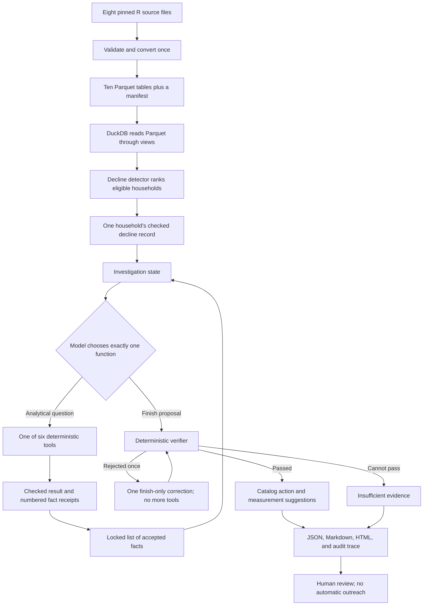

# How the WhyBack agent works

> A plain-English, code-referenced guide to the non-web parts of this repository.

## Scope of this guide

This guide explains the WhyBack data pipeline, decline detector, six analytical
tools, model-controlled investigation loop, evidence ledger, deterministic
verifier, action catalog, reports, audit trace, tests, and evaluations. It does
**not** explain the code under `web/`.

It describes the current local checkout. If the code changes later, treat the
linked source—not this prose—as authoritative.

In this guide, “the agent” means the whole controlled investigation system—not
just the language model. That distinction matters. The language model is one
replaceable decision-maker inside a much larger deterministic program.

## How to use this guide

You do not need to read all 16,000-plus words in one sitting:

- For a **five-minute mental model**, read the picture below, the
  [quick verdicts](#quick-verdicts), and the
  [five sentences to memorize](#the-five-sentences-to-memorize).
- To **correct your original notes**, read [Part I](#part-i-confirming-and-correcting-your-19-point-understanding).
- To **follow execution in order**, read [Part II](#part-ii-the-complete-agent-rundown-from-command-to-report).
- To **see one concrete case**, jump to [Part VIII](#part-viii-a-worked-run-translated-into-ordinary-language).
- To **find a file**, use [Part X](#part-x-the-non-web-repository-map).
- When a term is unfamiliar, use the [plain-English glossary](#plain-english-glossary).

Part I is a point-by-point reference against your notes. Part II intentionally
repeats some of the same facts, but as one chronological story.

## Eight words to know before the picture

| Word | Meaning in WhyBack |
|---|---|
| **Household** | The dataset's customer unit. It may represent more than one actual person. |
| **Basket/trip** | One recorded checkout event, identified within a household by basket ID. |
| **Active week** | A week in which the household has at least one recorded purchase. |
| **Retailer sales value** | Value recorded at this retailer—not profit and not the household's spending everywhere. |
| **Baseline/recent** | The earlier comparison window and the adjacent later window. |
| **Tool** | A prewritten Python/DuckDB analysis function. The model may select it but does not invent its calculation. |
| **Deterministic** | Ordinary code/rules intended to give the same substantive answer for the same validated input. |
| **Evidence record** | A numbered, source-owned receipt for one value that code calculated. |

The shortest accurate description of WhyBack is:

> Code finds a household whose recorded shopping has declined. A language model
> chooses one analytical question at a time. Code answers every question,
> records the evidence, checks the model's proposed conclusion, and allows only
> a human-reviewed action from a fixed catalog.

The repository's central trust rule is therefore:

> **The model chooses what to investigate. Code owns every number, every budget,
> every evidence record, and the final permission to publish a recommendation.**

## The whole system in one picture

This is the successful/safe-fallback path, simplified. A provider failure or
malformed live response instead ends in a failed run with no action.



There are three different kinds of work in that picture:

1. **Data work:** turn the official files into reliable, queryable tables.
2. **Analytical work:** calculate decline and investigate possible observed
   contributors.
3. **Control and governance work:** constrain the model, track evidence, reject
   unsafe claims, and stop before any customer contact.

That separation is the main idea to remember. WhyBack is not a chatbot sitting
on top of raw grocery data.

---

# Part I: Confirming and correcting your 19-point understanding

## Quick verdicts

| # | Verdict | Short correction or confirmation |
|---:|---|---|
| 1 | **Partly right** | R files really are converted to Parquet, but the conversion is not `O(1)`, and Parquet is columnar rather than “dictionary-like.” |
| 2 | **Partly right; important correction** | DuckDB is the query engine. The lasting storage is Parquet; this repo does not create a persistent DuckDB database file. |
| 3 | **Partly right** | There are strong declared validation rules, but this is not a universal “clean every possible bad value” process. Some duplicates are expected and canonicalized. |
| 4 | **Confirmed, with nuance** | Raw files, prepared files, and preparation code are hashed. A manifest proves identity and integrity; it is not itself a historical version store. |
| 5 | **Confirmed** | The Decline Score is a transparent heuristic, not churn probability and not a learned classifier. |
| 6 | **Partly right** | Baseline and recent *metrics* are compared. The code does not calculate one decline score per window and compare the two scores. |
| 7 | **Partly right; important correction** | The model receives a compact snapshot for one household per investigation, not a report containing every household above the threshold. |
| 8 | **Partly right** | The model asks one question per turn, not a batch of questions. It may finish early; it is not required to call every tool. |
| 9 | **Mostly confirmed** | Trend covers the listed ideas, but “units” is deliberately called recorded quantity and carries a fuel-scale warning. |
| 10 | **Confirmed, but incomplete** | Category analysis also checks gains, shares, unknown mappings, total reconciliation, and target-excluded category context. |
| 11 | **Mostly confirmed** | Basket analysis has those measures plus several cadence and store-switching details; it calculates at distinct-basket grain. |
| 12 | **Partly right** | The tool analyzes purchases associated with product/store/week promotion availability. It cannot establish that the household saw an advertisement or responded to it. |
| 13 | **Partly right** | It reports joinable campaign participation, coupon-bridge-matched redemptions, coupon-using baskets, and recorded coupon discount. It does not calculate frequent manufacturer-discount use. |
| 14 | **Partly right; important correction** | It compares signed retailer-sales change—not Decline Score—against both the full eligible population and nearest behavioral peers. |
| 15 | **Mostly confirmed** | Exact normalized duplicate calls are refused. Compact history, attempts, provenance, limitations, and evidence IDs are stored; successful evidence goes into a separate ledger. |
| 16 | **Confirmed** | The verifier is deterministic code, not an AI reviewer, and it checks substantially more than evidence existence. |
| 17 | **Partly right** | The model proposes an evidence-based finish. The published drivers, rationale, numbers, limitations, confidence, and policy result are resolved or constrained by code. |
| 18 | **Partly right** | The model selects an action ID. Catalog policy owns the structured measurement definition; the report exposes catalog-written metric and experiment suggestions, not model improvisation. |
| 19 | **Confirmed as a boundary** | Every action requires human review, but the core agent does not implement the real-world approval or outreach workflow; it stops at the recommendation. |

## 1. Converting `.rda` and `.rds` files to Parquet

**Verdict: partly right.**

The repository pins eight official Complete Journey files: two `.rds` files and
six `.rda` files. Each filename, byte size, SHA-256 hash, and source URL is fixed
in code ([`download.py` lines 28–85](../src/whyback/data/download.py#L28-L85)).
Preparation maps those eight files to eight logical source tables
([`prepare.py` lines 30–39](../src/whyback/data/prepare.py#L30-L39)).

“Pinned” means the filenames and expected digital fingerprints are fixed rather
than silently following whatever source happens to be newest. SHA-256 is the
digital fingerprint used to recognize exact bytes.

The loader uses `pyreadr` to deserialize—open an R-saved object—into a pandas
DataFrame, which is an in-memory Python table. It
expects exactly one R object in every file; it fails if a file contains zero or
multiple objects ([`prepare.py` lines 74–84](../src/whyback/data/prepare.py#L74-L84)).
Transaction timestamps are explicitly interpreted in `America/New_York`; using
UTC here could shift purchases across calendar dates and corrupt active-day or
cadence measures. The data is normalized, validated, and written as
Zstandard-compressed (space-saving) Parquet
([`prepare.py` lines 123–139](../src/whyback/data/prepare.py#L123-L139)).

### Why `O(1)` is not correct

`O(1)` means the amount of work or memory stays constant no matter how much data
exists. That cannot describe this conversion. To convert the source, the program
must at least read every source row, so the work is at least proportional to the
input size: roughly `O(n)` for `n` rows, plus the cost of sorting, grouping, and
writing. The current implementation also loads an R object into memory and keeps
normalized DataFrames in a Python dictionary during preparation
([`prepare.py` lines 280–320](../src/whyback/data/prepare.py#L280-L320)). Its
preparation memory is therefore not constant either.

The performance advantage comes **after** conversion, during repeated analysis:

- R serialization is an object-oriented storage format. A consumer commonly has
  to deserialize a whole object before working with it.
- Parquet is a typed, compressed, **columnar** table format. Values from the same
  column are stored together in chunks.
- A query asking only for `household_id`, `week`, and `retailer_sales_value` can
  avoid reading unrelated columns such as coupon or product metadata.
- Parquet metadata lets an engine skip irrelevant **row groups**—blocks of
  rows—when a filter makes clear that a block cannot match. For example, a week
  filter may let the engine avoid opening blocks outside those weeks. This is
  called predicate pushdown.
- Column-oriented values often compress well because adjacent values have the
  same type and frequently similar patterns.

Parquet is not really “dictionary-like.” A Python dictionary is a mapping from a
key to a value in memory. Parquet is a durable table file with columns, data
pages, row groups, types, encodings, compression, and metadata. Dictionary
encoding may be one internal compression technique, but it is not the right
mental model for the format as a whole.

### What WhyBack creates

It produces ten Parquet tables: seven normalized base tables, a canonical
promotion table, a household/week aggregate, and a basket aggregate
([`prepare.py` lines 41–71](../src/whyback/data/prepare.py#L41-L71)). The two
derived grains—“grain” means what one row represents—save later tools from
repeatedly rebuilding common groupings
([`prepare.py` lines 142–197](../src/whyback/data/prepare.py#L142-L197)).

Python accessibility is a practical benefit, but not because Python is somehow
part of Parquet. It is because pandas, PyArrow, DuckDB, Spark, Snowflake, and many
other systems understand Parquet. The same prepared files can participate in a
much wider data ecosystem than an R-specific serialized object.

## 2. Parquet storage, DuckDB, SQLite, and larger-scale alternatives

**Verdict: partly right, with one critical correction: the data is not stored in
DuckDB.**

The durable tables are the `.parquet` files. `DataRepository` opens a local
DuckDB connection and creates named views whose definitions call
`read_parquet(...)` ([`repository.py` lines 44–73](../src/whyback/data/repository.py#L44-L73)).
There is no persistent `.duckdb` database file here. DuckDB is the librarian and
calculator; Parquet is the bookshelf.

### SQLite versus DuckDB

Both are embedded databases: an application can use them as a library without
running a separate database server. Their default strengths differ:

- **SQLite** is primarily designed for transactional work: fetch or update a few
  rows, maintain application records, and safely commit small changes.
- **DuckDB** is primarily designed for analytical work: scan many rows, group,
  join, aggregate, and calculate across columns.
- SQLite is commonly described as row-oriented. Keeping all fields of a row
  together is convenient when retrieving or changing that row.
- DuckDB uses vectorized, column-oriented analytical execution. Processing a
  batch of values from one column at a time is efficient for sums, medians,
  filters, and grouped analysis.

WhyBack exposes only a narrow `query`, `scalar`, and connection-management
interface around
DuckDB ([`repository.py` lines 164–209](../src/whyback/data/repository.py#L164-L209)).
That makes the engine replaceable without putting SQL or raw-file access in the
model prompt.

### “Millions, not billions” is a rule of thumb—not a hard boundary

DuckDB is a single-machine analytical engine. Whether it can handle a billion
rows depends on column width, compression, filters, joins, available memory,
local storage speed, and the particular query. It can process data larger than
memory and can be excellent at surprisingly large local workloads. The real
boundary is not a specific row count; it is when one machine, one process, local
concurrency, recovery, governance, or service-level needs stop being adequate.

This dataset is a sensible DuckDB workload: the repository's design record notes
about 1.47 million transaction rows and 20.94 million raw promotion rows, and
explicitly says that a distributed runtime would add unnecessary extra systems
to operate, secure, monitor, and recover
([ADR 002 lines 6–19](adr/002-duckdb-and-parquet.md#L6-L19)).

### What Spark clusters, AWS EMR, and Snowflake mean

**A Spark cluster** is a group of computers that cooperate on one data job.
Spark splits a large dataset into partitions. A coordinating process plans the
job, worker processes handle different partitions, and intermediate results are
shuffled between machines when grouping or joining requires it. This helps when
data or compute is too large for one machine, but it adds cluster startup,
network transfer, partition design, failure recovery, tuning, and cost.

**AWS EMR** is an Amazon service for creating and operating managed big-data
clusters, commonly for Spark and Hadoop workloads. AWS helps provision machines,
software, scaling, logs, and integration with services such as S3. EMR is not a
new analytical method; it is infrastructure on which engines such as Spark run.

**Snowflake** is a managed cloud data warehouse. An organization stores governed
tables in a central service and runs SQL using separately scalable compute
warehouses. Snowflake handles much of the server management, concurrency,
security integration, and storage/compute separation. The trade-offs include
service cost, data governance work, network boundaries, and dependence on a
remote platform.

For production, this repository proposes replacing `DataRepository` with a
governed warehouse implementation
([`productionization.md` lines 39–60](productionization.md#L39-L60)). That is an
architectural seam, not a drop-in guarantee: current tools contain DuckDB SQL
features such as `FILTER`, `MEDIAN`, casts, and generated series. A migration
would need a compatible abstraction or deliberate SQL-dialect port while
preserving the calculation semantics.
That could be Snowflake, BigQuery, Databricks SQL, Trino, or another approved
platform. Spark/EMR would make sense for distributed preparation only if the
future data volume or processing pattern actually required it.

## 3. Data cleaning and validation

**Verdict: partly right.**

WhyBack does validate the boring-but-dangerous things, including:

- all eight required logical tables are present;
- required columns exist;
- identifiers are present, nonblank, and normalized without losing large integer
  precision;
- declared numeric fields can be converted to finite numbers;
- weeks stay within `1..53`;
- transaction timestamps and campaign/redemption dates parse;
- nonmissing campaign types are restricted to Type A, B, or C;
- product IDs are unique in the product table; and
- missing product hierarchy descriptions become the explicit label `UNKNOWN`.

Those rules live in [`contracts.py` lines 17–197](../src/whyback/data/contracts.py#L17-L197).
Cross-table preparation also reports product mapping coverage, source ranges,
row counts, and promotion duplicate-key counts
([`contracts.py` lines 200–226](../src/whyback/data/contracts.py#L200-L226)).

But “there are no silly errors” is broader than the actual contract. Important
examples:

- Transaction rows are not generically deduplicated.
- Negative or unusually large economic values are not universally rejected by
  this preparation contract.
- Product mapping coverage is measured, not required to equal 100%.
- Promotion duplicate keys are expected in the source. They are collapsed into
  one canonical product/store/week state, rather than treated as proof that the
  source is unusable ([`prepare.py` lines 200–235](../src/whyback/data/prepare.py#L200-L235)).
- Exact duplicates in the coupon-to-product campaign bridge are removed using
  the composite key `(coupon_upc, campaign_id, product_id)`
  ([`prepare.py` lines 304–309](../src/whyback/data/prepare.py#L304-L309)).

So the accurate statement is: **the pipeline enforces the declared contracts
needed by WhyBack's analyses, preserves explicit unknowns, canonicalizes known
multiplicity, and records diagnostics. It does not claim to detect every
conceivable data-quality problem.**

## 4. Hashes and dataset versioning

**Verdict: confirmed, with nuance.**

WhyBack uses hashes more thoroughly than a simple dataset checksum:

- each official source file has a pinned expected size and SHA-256;
- every prepared Parquet file receives a SHA-256;
- the exact preparation modules are hashed together;
- the transform has an explicit version;
- the source repository and source commit are recorded;
- the current WhyBack source-tree revision and dirty/clean status are recorded;
- source and prepared schemas, row counts, source missingness, table definitions,
  and diagnostics are recorded.

The manifest contract is in [`manifest.py` lines 18–103](../src/whyback/data/manifest.py#L18-L103).
Preparation reuses an existing result only if source identity, preparation code,
and every prepared hash still match
([`prepare.py` lines 238–265](../src/whyback/data/prepare.py#L238-L265)). When a
repository is opened, it independently checks manifest identity and the hashes
of all required Parquet files before creating query views
([`repository.py` lines 78–162](../src/whyback/data/repository.py#L78-L162)).

A hash answers: “Are these exact bytes the same?” A manifest answers: “What
source and transformation produced these exact tables?” Neither automatically
keeps an archive of every historical dataset. Historical version retention would
require storing each immutable snapshot and manifest somewhere durable.

## 5. The pre-detection Decline Score

**Verdict: confirmed. Your description captures the design intent well.**

WhyBack first requires a credible baseline. By default, a household needs at
least four active baseline weeks, six distinct baseline baskets, and positive
baseline retailer sales value
([`config.py` lines 37–46](../src/whyback/config.py#L37-L46)). Ineligible
households are not scored ([`decline.py` lines 213–231](../src/whyback/detection/decline.py#L213-L231)).

For eligible households, code calculates:

```text
sales_drop       = clip((baseline_sales - recent_sales) / baseline_sales, 0, 1)
trip_drop        = clip((baseline_trips - recent_trips) / baseline_trips, 0, 1)
active_week_drop = clip((baseline_weeks - recent_weeks) / baseline_weeks, 0, 1)

decline_score = 0.50 * sales_drop
              + 0.30 * trip_drop
              + 0.20 * active_week_drop
```

The exact calculation is in [`decline.py` lines 103–128](../src/whyback/detection/decline.py#L103-L128).
“Clip” means growth contributes zero decline, and a fall worse than 100% cannot
push a component beyond one. The final score is also bounded from zero to one.

The default configured `0.30` threshold marks a case as flagged. The thresholds
`0.20`, `0.30`, and `0.40` are also applied to the same eligible population for
sensitivity reporting; they do not retrain or change the formula
([`decline.py` lines 260–280](../src/whyback/detection/decline.py#L260-L280)).

### Why it is not churn probability

A probability would mean something like: “Among cases like this, an estimated
`p%` will meet a precisely defined future churn event.” That requires a label,
prediction horizon, training population, out-of-sample validation, calibration,
and monitoring. WhyBack has none of those ingredients for a churn target. Its
score simply combines three observed drops using declared weights.

Here, a **label** is the known outcome used as an answer key; a **prediction
horizon** says how far into the future to predict; **out-of-sample validation**
tests cases the model did not learn from; **calibration** means, for example,
that roughly 20% of cases assigned 20% actually experience the event; and
**drift** means customer/data patterns change after deployment.

Calling it a probability would be false precision. Calling it a transparent
heuristic is accurate.

### What XGBoost, neural networks, survival models, and LSTMs would do

- **XGBoost** trains an ensemble of decision trees. Each new tree focuses on
  errors left by earlier trees. It is often strong on tabular customer features,
  but it needs a trustworthy target label and still requires probability
  calibration and drift checks if its output is called a probability.
- **A neural network** learns flexible combinations of features through layers
  of weighted transformations. It can represent complex patterns, but it also
  needs labels, careful validation, and enough representative data. Complexity
  alone does not make the target definition valid.
- **A survival model** predicts time until an event while handling cases for
  which the event has not yet been observed, called censoring. It would require
  a defensible churn event and time origin.
- **An LSTM** is a recurrent neural-network design intended to learn patterns in
  sequences. Weekly shopping histories could be sequences, but an LSTM still
  cannot rescue an undefined or mislabeled outcome.

Those approaches would answer a different question: “Who is likely to meet a
future churn definition?” WhyBack's current question is: “Whose observed
engagement has declined enough to merit a bounded investigation, and what
recorded evidence helps describe it?” A more sophisticated classifier would be
the wrong solution unless the product intentionally changed to a prediction
problem and acquired valid labels.

## 6. Comparing two time windows

**Verdict: partly right.**

The detector anchors two adjacent, non-overlapping windows to the maximum week
present in the prepared data. With the official 53-week source and default
eight-week lengths, baseline is weeks 38–45 and recent is weeks 46–53. Window
construction is deterministic ([`decline.py` lines 29–64](../src/whyback/detection/decline.py#L29-L64)).

The code aggregates retailer sales value, distinct baskets, and active weeks in
each window ([`decline.py` lines 137–181](../src/whyback/detection/decline.py#L137-L181)).
It then turns the differences into the three drop fractions and one combined
score.

So there is **one decline score produced from two windows**, not a baseline
decline score and a recent decline score being compared. The baseline supplies
the reference level; recent behavior supplies the comparison.

The official source's week 53 has fewer calendar days than an ordinary week.
WhyBack preserves its max-week anchoring rule but attaches that limitation to
the snapshot rather than silently moving the window
([`decline.py` lines 205–211](../src/whyback/detection/decline.py#L205-L211)).

## 7. What the model initially receives

**Verdict: partly right, with an important unit-of-work correction.**

Detection can rank many eligible households, and a demo can choose the top
flagged cases. But an investigation run is for **one household**. The starting
state contains that household's complete typed `DeclineSnapshot`: window
boundaries, baseline/recent retailer sales value, baskets, active weeks, the
three drop components, score, eligibility, flag, and partial-week limitation
([`decline.py` lines 67–89](../src/whyback/detection/decline.py#L67-L89)).

Each fresh model request gets a compact JSON-like state containing:

- the one-household decline snapshot;
- summaries of completed tools;
- every available evidence ID and its deterministic values;
- open questions;
- failed, partial, and unavailable tools;
- remaining tool and decision budgets; and
- any verifier issue codes that need one repair.

The serializer is [`state.py` lines 289–337](../src/whyback/agent/state.py#L289-L337).
It deliberately does not send raw transaction rows or an ever-growing chat
transcript.

The direct `whyback investigate` command accepts any household with an eligible
baseline, even if its score is below the configured flag threshold. `locate_snapshot`
searches all eligible detector results and does not require `flagged == true`
([`demo.py` lines 1182–1204](../src/whyback/demo.py#L1182-L1204)). In contrast,
the batch demo path selects flagged cases. “Flagged” and “eligible to inspect”
are therefore related but not identical concepts.

One more operational distinction: the CLI's default investigation backend is
`scripted`, not a live model ([`cli.py` lines 206–230](../src/whyback/cli.py#L206-L230)).
An actual language-model request happens only when `--backend gemini` is chosen
and a credential is present.

## 8. Model questions, tool mapping, and dynamic orchestration

**Verdict: partly right.**

On every turn, the model must choose exactly one offered function:

- one of the currently available analytical tools; or
- `finish_investigation`.

The model returns one concise `investigation_question`, one selected function,
strict arguments, and one concise decision summary
([`state.py` lines 209–238](../src/whyback/agent/state.py#L209-L238)). It does not
return a batch of analytical questions for parallel execution.

Nothing reads the English question and guesses which tool it maps to. In the
same structured response, the model supplies both:

- the human-readable question, which is saved so a reviewer understands the
  investigative intent; and
- the exact function name plus arguments, which is what the runner validates
  and executes.

For example, it might submit the question “Did basket size or cadence change?”
and explicitly select `basket_behavior`. The function choice—not an
interpretation of the sentence—controls dispatch.

The live adapter forces function selection and rejects zero, two, or more
function calls ([`gemini_backend.py` lines 247–286](../src/whyback/agent/gemini_backend.py#L247-L286),
[`gemini_backend.py` lines 348–368](../src/whyback/agent/gemini_backend.py#L348-L368)).
It also rejects a function that was not offered. A terminally unsuccessful
**dispatched** tool is removed from later menus, and analytical tools are not
offered during a finish-repair turn
([`runner.py` lines 217–247](../src/whyback/agent/runner.py#L217-L247)). An exact
duplicate refusal is different: no dispatch occurs, so the tool can remain on
the menu for genuinely different normalized arguments.

The runner executes the selected tool, adds successful evidence, and builds a
new compact state. The next model call is fresh and stateless; it sees the new
state instead of relying on conversational memory. The loop is “dynamic” because
the next choice may depend on the evidence returned so far. It is still tightly
bounded:

- five actual analytical attempts by default;
- six model decisions by default;
- one retry only for an explicitly retryable error;
- no execution for an exact duplicate call;
- one repair after a rejected finish; and
- a 30-second local tool timeout.

Those defaults are runner-owned application policy
([`config.py` lines 49–59](../src/whyback/config.py#L49-L59)), not values the
model can change. The Stage 0 wiring note explains why editing the TOML agent
section alone does not currently alter this direct path.

The model does not have to use all six tools. It may finish early. Conversely, a
retry consumes a real analytical attempt, so five attempts do not always mean
five distinct tools.

## 9. Tool 1: Customer Trend

**Verdict: mostly confirmed.**

This tool answers: **“What shape does the recorded decline have?”** It compares
baseline and recent:

- retailer sales value;
- distinct trips/baskets;
- active weeks;
- average retailer sales value per trip;
- median retailer sales value per trip;
- recorded quantity;
- distinct products;
- recency in weeks; and
- the slope of weekly retailer sales value.

The metric contract is visible in [`trend.py` lines 116–145](../src/whyback/tools/trend.py#L116-L145)
and the evidence construction in [`trend.py` lines 380–465](../src/whyback/tools/trend.py#L380-L465).
It also creates a zero-filled week-by-week series. A week with no recorded
purchase appears as zero rather than disappearing, which prevents a sparse
series from looking artificially continuous
([`trend.py` lines 95–113](../src/whyback/tools/trend.py#L95-L113)).

“Average basket value” is implemented as average retailer sales value per
distinct trip. “Units purchased” needs a correction: the source field is exposed
as **recorded quantity**, and WhyBack attaches a limitation because fuel quantity
uses a very different scale from ordinary packaged goods. It is not a primary
engagement measure.

If one period has no transactions, the tool can still return valid zeros and
other evidence, but it marks the result `partial` because per-trip measures for
that period are unavailable ([`trend.py` lines 366–379](../src/whyback/tools/trend.py#L366-L379)).

## 10. Tool 2: Category Decomposition

**Verdict: confirmed, but the real tool is richer than your summary.**

This tool answers: **“Which mapped departments and product categories account
for the recorded change?”** For each category it can calculate:

- baseline and recent retailer sales value;
- absolute change;
- percentage change when a baseline denominator exists;
- baseline and recent share of the household's retailer sales value;
- share shift; and
- contribution to **gross lost** retailer sales value.

Gross loss is the sum of category losses before category gains offset them. A
category's contribution therefore answers “what share of all category-level
loss came from here?”, not “what share of the final net change?” The calculation
and loss/gain ordering are in [`category.py` lines 394–445](../src/whyback/tools/category.py#L394-L445).

The tool deliberately preserves product rows with missing hierarchy under
`UNKNOWN`, reports mapping coverage, and checks that the sum of all category
totals reconciles to direct transaction totals for both periods within a tight
declared numerical tolerance (`1e-6` absolute tolerance)
([`category.py` lines 354–392](../src/whyback/tools/category.py#L354-L392),
[`category.py` lines 554–631](../src/whyback/tools/category.py#L554-L631)). If
the totals do not reconcile, the call fails rather than publishing plausible
but economically inconsistent numbers.

For the selected largest loss categories, it also compares the target with
other eligible, target-excluded households that had meaningful baseline activity
in that same category. It calculates cohort size, median signed change, declining
share, target-minus-median gap, and a context classification
([`category.py` lines 447–552](../src/whyback/tools/category.py#L447-L552)). This
guards against treating a retailer-wide category movement as a uniquely personal
preference change.

## 11. Tool 3: Basket Behavior

**Verdict: mostly confirmed.**

This tool answers: **“Did the household make fewer baskets, smaller baskets, or
change its cadence or store pattern?”** It works from one prepared row per
distinct basket, not raw product line items. For each period it calculates:

- basket count and active weeks;
- baskets per calendar week;
- mean and median basket retailer sales value;
- mean and median recorded quantity per basket;
- mean distinct products per basket;
- mean distinct categories per basket;
- mean and median days between baskets;
- primary store and its share of baskets;
- number of stores visited; and
- consecutive store-switch rate.

The metric definitions are in [`basket.py` lines 75–120](../src/whyback/tools/basket.py#L75-L120)
and their calculation is in [`basket.py` lines 127–173](../src/whyback/tools/basket.py#L127-L173).
It separately reports whether the primary store changed and what share of recent
baskets occurred at stores not seen in baseline
([`basket.py` lines 327–338](../src/whyback/tools/basket.py#L327-L338)).

With fewer than two baskets in a period, interval and consecutive-switch metrics
do not exist. The tool returns `partial` and says so instead of inventing zeros
([`basket.py` lines 340–366](../src/whyback/tools/basket.py#L340-L366)). Recorded
quantity carries the same fuel-scale limitation as Tool 1.

## 12. Tool 4: Promotion Response

**Verdict: partly right, and the word “response” must be read cautiously.**

The source says whether a product had a display or mailer code at a particular
store in a particular week. Preparation collapses duplicate raw rows to exactly
one state per `(product_id, store_id, week)` by OR-ing availability and retaining
sorted nonzero location codes
([`prepare.py` lines 200–235](../src/whyback/data/prepare.py#L200-L235)).

The tool joins the household's **purchased transaction lines** to that canonical
availability state. It compares:

- retailer sales value on purchased lines that matched any promotion key;
- the share of total retailer sales value on those matched lines;
- display-associated retailer sales value;
- mailer-associated retailer sales value; and
- up to `N` category rows ordered from the most negative signed change upward
  among promotion-associated purchases.

Those calculations are in [`promotion.py` lines 181–277](../src/whyback/tools/promotion.py#L181-L277).
If every category increased, the retained rows are the smallest gains; the
current ranking does not require a retained row to be an actual loss.

This supports the statement:

> “The household bought this product at this store during a week when promotion
> availability was recorded.”

It does **not** support:

- the household saw the display or mailer;
- the promotion reached a particular person in the household;
- the promotion caused the purchase;
- the absence of a matched row means no other marketing existed; or
- the change was a psychological “response” to advertising.

The limitation is hard-coded on the evidence
([`promotion.py` lines 25–32](../src/whyback/tools/promotion.py#L25-L32)). The tool
also compares row count and retailer sales value before and after enrichment. A
join that multiplied economic rows becomes a fatal error
([`promotion.py` lines 138–179](../src/whyback/tools/promotion.py#L138-L179)).

## 13. Tool 5: Coupon and Campaign History

**Verdict: partly right.**

This tool answers: **“What campaign assignment, redemption, and transaction
coupon behavior is actually recorded for this household?”** It reports:

- number of campaign participation records that join to a campaign description;
- campaign ID, type, dates, and campaign coupon-pool size;
- number and identities/dates of redemptions that match the coupon bridge;
- baseline versus recent coupon-using baskets; and
- baseline versus recent recorded coupon plus coupon-match discount.

The queries are in [`coupon.py` lines 55–88](../src/whyback/tools/coupon.py#L55-L88),
and the evidence fields are in [`coupon.py` lines 137–217](../src/whyback/tools/coupon.py#L137-L217).
Unmatched campaign or redemption source rows are omitted by those inner joins,
and preparation does not enforce these particular foreign-key relationships.
The tool therefore reports **joinable/enriched records**, not a guaranteed count
of every raw source row.

Two wording corrections matter:

1. Campaign “participation” means the household appears in the campaign table.
   That is not automatically the same as opening, noticing, or engaging with a
   message.
2. The tool does not calculate whether the household “frequently used
   manufacturer discounts.” It calculates recorded coupon-discount baskets and
   recorded discount value.

Coupon identity has a source-specific limitation. Type B and Type C campaign
participants are associated with the campaign's coupon set. Type A participants
received 16 coupons selected from a larger pool, but the source does not say
which 16 a particular household received. When Type A is present, the tool keeps
known participation and redemption facts, marks the result `partial`, and does
not turn the larger pool into fake household exposure
([`coupon.py` lines 18–21](../src/whyback/tools/coupon.py#L18-L21),
[`coupon.py` lines 219–256](../src/whyback/tools/coupon.py#L219-L256)).

## 14. Tool 6: Population and Behavioral Peer Comparison

**Verdict: partly right, with one major correction: it does not compare Decline
Scores.**

The tool compares the target's **signed retailer-sales change**:

```text
(recent retailer sales value - baseline retailer sales value)
-------------------------------------------------------------
             baseline retailer sales value
```

A more negative number means a worse decline
([`peer.py` lines 66–83](../src/whyback/tools/peer.py#L66-L83)). It builds two
different comparison groups, always excluding the target:

1. **Eligible population:** every other household satisfying the peer tool's
   baseline activity policy.
2. **Behavioral peers:** the nearest eligible households based on baseline
   behavior.

Peer features are:

- log-transformed baseline retailer sales value;
- baseline trip count;
- baseline median basket value;
- baseline active weeks; and
- baseline category concentration.

The peer algorithm robust-scales each feature using the comparison population's
median and interquartile range, measures Euclidean distance, and selects the
nearest households with stable ID tie-breaking
([`peer.py` lines 243–280](../src/whyback/tools/peer.py#L243-L280)). The target is
excluded not only from the final peer list, but also from fitting those scaling
values.

In ordinary language, category concentration means “how concentrated baseline
value was across all of the household's categories.” Code squares every
category's baseline share and adds those squares together: the result is higher
when a few categories dominate and lower when value is spread more evenly
([`peer.py` lines 153–173](../src/whyback/tools/peer.py#L153-L173)). Robust
scaling puts dollars, trips, basket value, active weeks, and concentration onto
comparable scales so dollars do not dominate merely because their raw numbers
are larger. The algorithm then selects households with the smallest combined
difference across those five traits.

The peer/category context policy is a separate `ContextPolicy` object. Its
default eligibility thresholds match the detector defaults in this checkout,
but a customized `DetectionConfig` is not automatically copied into it
([`contracts.py` lines 95–107](../src/whyback/tools/contracts.py#L95-L107)). So
“same rules” is true of today's defaults, not a guaranteed shared configuration
object.

For population and peers, the tool can calculate:

- median signed change;
- 25th and 75th percentiles;
- the target's percentile;
- share of households declining; and
- target-minus-median change.

It then classifies the context as:

- `customer_specific`: target is materially worse than both comparison medians
  without broad decline;
- `broad_context`: decline is widespread and the target resembles both groups;
- `mixed`: some signals disagree or broad movement coexists with a worse target;
  or
- `insufficient_context`: the cohorts or required statistics are too small.

The classification thresholds are explicit in `ContextPolicy`
([`methodology.py` lines 48–65](../src/whyback/methodology.py#L48-L65)) and the
decision rules are in [`methodology.py` lines 68–132](../src/whyback/methodology.py#L68-L132).

Your demographic reasoning is correct. Demographics are not used in peer
selection. Behavioral similarity is closer to the question, demographic data is
incomplete, and using protected or proxy attributes would create fairness and
governance risk without establishing causality. The tool's exact methodology and
limitations say this is a descriptive comparison, not a causal control group
([`peer.py` lines 29–48](../src/whyback/tools/peer.py#L29-L48)).

## 15. Duplicate calls and structured state

**Verdict: mostly confirmed.**

For each schema-valid requested tool call, the registry validates strict
arguments and applies defaults. It serializes the normalized arguments in stable
key order and hashes `(tool name + normalized arguments)`
([`registry.py` lines 133–141](../src/whyback/tools/registry.py#L133-L141)).
If the arguments are schema-invalid, normalization cannot succeed. The runner
instead fingerprints the raw mapping for duplicate detection but retains an
empty normalized-arguments object—not the invalid raw payload
([`runner.py` lines 463–484](../src/whyback/agent/runner.py#L463-L484)).

If that signature was already requested in the run, the runner:

- refuses dispatch;
- records an `invalid_request` history entry with no attempts;
- preserves the signature, tool, question, safe normalized arguments (when
  validation succeeded), and limitation;
- emits a failed audit event; and
- tells the next model turn to choose a different question or finish.

The refusal path is [`runner.py` lines 463–529](../src/whyback/agent/runner.py#L463-L529).
Because no tool executes, a duplicate consumes a model decision but not an
analytical-execution attempt.

For a real dispatch, structured history stores each attempt's call ID, status,
retryability, elapsed time, limitations, final status, compact model summary,
provenance diagnostics, and evidence IDs
([`state.py` lines 75–115](../src/whyback/agent/state.py#L75-L115)). The complete
typed `ToolResult` is also written into the sanitized audit event. Successful
evidence records are separately appended to the evidence ledger.

## 16. The deterministic verifier

**Verdict: confirmed. This is not an AI reviewer.**

The model proposes a finish, but `FinalVerifier` decides whether anything is
publishable. Its stable rejection codes cover unknown/foreign evidence,
unsupported drivers, action policy, numeric or causal prose, claim strength,
counterevidence, peer self-comparison, category reconciliation, promotion row
multiplication, and misuse of the insufficient-evidence action
([`verifier.py` lines 40–61](../src/whyback/agent/verifier.py#L40-L61)).

In plain English, it asks questions such as:

- Does every cited evidence ID exist in this run's ledger?
- Does it belong to this run and this household?
- Did it come from a successful or valid partial attempt?
- Is an evidence record being called both support and counterevidence?
- Is each driver tied to its declared evidence?
- Does the claimed strength stay at or below the evidence's ceiling?
- Did the model try to make a causal claim from observational data?
- Did model-authored prose contain a raw number that should instead be resolved
  from code-owned evidence?
- Did it claim household promotion exposure?
- Does the selected catalog action's machine-readable prerequisite actually
  match the cited evidence?
- Did the model omit broad or mixed population/category context that materially
  qualifies its proposed driver?
- Do category totals reconcile?
- Did promotion enrichment preserve rows and retailer sales value?
- Is the target excluded from its comparison population and peer cohort?

Evidence ownership and successful-origin checks are in
[`verifier.py` lines 897–979](../src/whyback/agent/verifier.py#L897-L979). Claim
and prose checks are in [`verifier.py` lines 985–1042](../src/whyback/agent/verifier.py#L985-L1042).
Action and counterevidence rules begin at
[`verifier.py` lines 1044–1221](../src/whyback/agent/verifier.py#L1044-L1221), and
the tool reconciliation checks are in
[`verifier.py` lines 1351–1392](../src/whyback/agent/verifier.py#L1351-L1392).

Limitations are not entrusted only to the model. The verifier gathers
limitations from cited evidence, partial calls, unavailable tools, population
context, and category context, then deterministically propagates them into the
verified result ([`verifier.py` lines 1232–1272](../src/whyback/agent/verifier.py#L1232-L1272)).

## 17. The model's evidence-based review

**Verdict: partly right.**

When the model finishes, it must propose a strict structure containing:

- up to four qualitative driver claims;
- a claim type for each driver;
- supporting evidence IDs for each driver;
- counterevidence IDs or a reason none was material;
- driver limitations;
- overall support and counterevidence sets;
- proposed low/medium/high confidence;
- one catalog action ID;
- rationale;
- alternative explanations; and
- uncertainties.

That contract is [`state.py` lines 117–206](../src/whyback/agent/state.py#L117-L206).
The schema technically accepts `causal`, which is useful for testing attacks,
but the verifier makes every causal proposal unpublishable. A valid substantive
finish must resolve to descriptive or associational wording.
So yes, the model performs an evidence-oriented synthesis. But its prose is not
the final authority.

After policy passes, code selects only the evidence records that actually match
the chosen action, reduces claim strength to the weakest permitted level, and
replaces the public driver and rationale with safe code-owned templates
([`verifier.py` lines 813–880](../src/whyback/agent/verifier.py#L813-L880)). The
verified alternative explanation and uncertainty are also code-owned, and the
report renders tool-derived numbers from the evidence ledger, detector numbers
from the run-owned decline snapshot, and operational counts/timing from typed
application history
([`render.py` lines 107–132](../src/whyback/reporting/render.py#L107-L132),
[`render.py` lines 502–555](../src/whyback/reporting/render.py#L502-L555),
[`render.py` lines 659–685](../src/whyback/reporting/render.py#L659-L685),
[`verifier.py` lines 1325–1349](../src/whyback/agent/verifier.py#L1325-L1349)).
Although the model may propose up to four drivers, this resolver combines the
action-matching support and publishes at most one code-templated driver.

The most accurate wording is:

> The model proposes which observed driver and action are plausible and cites
> its evidence. Deterministic code decides what part of that proposal survives
> into the published result.

## 18. Next Best Action and measurement policy

**Verdict: partly right.**

The model selects one ID from an exact six-item allowlist
([`actions.py` lines 27–38](../src/whyback/agent/actions.py#L27-L38)):

- `CATEGORY_WINBACK`
- `VISIT_FREQUENCY_REACTIVATION`
- `PROMOTION_VALUE_REENGAGEMENT`
- `PERSONALIZED_CHECK_IN`
- `MONITOR`
- `INSUFFICIENT_EVIDENCE`

It cannot invent a seventh action. Each non-fallback action has one or more
machine-readable evidence prerequisites. Every action also has:

- a human-readable description;
- contraindications;
- `human_review_required: true`;
- a success metric and direction;
- an evaluation window; and
- a suggested experiment or audit holdout.

The strict action schema is [`actions.py` lines 127–175](../src/whyback/agent/actions.py#L127-L175).
The actual policy values live in [`configs/actions.yaml`](../configs/actions.yaml).

The model does **not** write the measurement definition or report suggestions.
It chooses an action ID, and the verifier retrieves the catalog-owned success
metric and experiment descriptions
([`verifier.py` lines 1325–1348](../src/whyback/agent/verifier.py#L1325-L1348)).
This is stronger governance: a model cannot quietly change the outcome metric,
holdout design, or review requirement to make its suggestion easier to call a
success.

## 19. Human review

**Verdict: confirmed as the final boundary, not as an implemented business
workflow.**

Every action definition literally requires `human_review_required` to be true
([`actions.py` lines 148–160](../src/whyback/agent/actions.py#L148-L160)). The
runner records that requirement on completion
([`runner.py` lines 404–418](../src/whyback/agent/runner.py#L404-L418)), and a
standalone run manifest explicitly records both:

```text
human_review_required: true
customer_outreach_executed: false
```

That publication boundary is in [`demo.py` lines 468–507](../src/whyback/demo.py#L468-L507).

The non-web agent does not approve a case, contact a household, issue a coupon,
change a campaign, or mutate a CRM. A production review queue, consent check,
suppression rules, and execution service are future operational systems, not
hidden capabilities of this agent. The repository's production guide makes
that proposed separation explicit
([`productionization.md` lines 204–216](productionization.md#L204-L216)).

---

# Part II: The complete agent rundown, from command to report

This section follows the real control flow in the order it happens.

## Stage 0: Configuration and code defaults define the rules of the game

The command-line program is installed as `whyback`, which points to the Typer
application in `whyback.cli`
([`pyproject.toml` lines 37–38](../pyproject.toml#L37-L38)). Configuration is
split into typed groups:

- product identity;
- pinned source and window lengths;
- decline eligibility and thresholds;
- model/tool budgets and timeouts; and
- local data/artifact paths and model settings.

The types and defaults are in [`config.py` lines 16–74](../src/whyback/config.py#L16-L74).
The objects are frozen and reject unknown fields. Environment variables can
override only a narrow set of paths and model settings
([`config.py` lines 77–101](../src/whyback/config.py#L77-L101)).

### Important current wiring limitation

These typed settings are **not yet one completely wired runtime bundle**:

- `whyback data status` can display the TOML source repository/commit, but the
  downloader itself uses the module's hard-coded pinned constants. Changing the
  TOML fields alone does not redirect acquisition
  ([`cli.py` lines 52–78](../src/whyback/cli.py#L52-L78)).
- `whyback detect` passes `settings.detection`, but direct `whyback investigate`
  forwards only the window lengths into `locate_snapshot`; that lookup constructs
  the detector's default policy rather than forwarding a customized
  `DetectionConfig`
  ([`demo.py` lines 1182–1204](../src/whyback/demo.py#L1182-L1204)).
- `run_investigation` constructs `InvestigationRunner` without passing
  `settings.agent`, so the runner uses a new default `AgentConfig` for budgets,
  retry count, and tool timeout
  ([`demo.py` lines 438–451](../src/whyback/demo.py#L438-L451),
  [`runner.py` lines 123–145](../src/whyback/agent/runner.py#L123-L145)).

The checked-in TOML values currently equal those Python defaults, which hides
the gap during ordinary use. But changing `[detection]` or `[agent]` in
`configs/app.toml` does not automatically change every `investigate` runtime.
Model name/thinking-level and path settings are separately wired through
`load_settings`.

Plain-English meaning: the model does not get to decide how much work it may do,
which source version is authoritative, how decline is scored, or what action
IDs exist. Those are product policy.

## Stage 1: Acquire the exact official source

`whyback data download` downloads the eight files from one pinned GitHub commit.
That acquisition identity comes from the module constants, not a source argument
passed by the CLI.
For each file, the download process:

1. writes to a `.part` file;
2. verifies exact byte size;
3. computes and verifies SHA-256;
4. atomically renames the verified partial file; and
5. removes the partial file if anything fails.

That path is [`download.py` lines 88–159](../src/whyback/data/download.py#L88-L159).
An existing file is reused only after being reverified.

Why this matters: “same filename” is weak provenance. “Exact expected bytes from
the pinned commit” is a reproducible input identity.

## Stage 2: Prepare normalized and derived Parquet tables

`whyback data prepare --full` refuses to silently substitute a sample
([`cli.py` lines 81–124](../src/whyback/cli.py#L81-L124)). Preparation then:

1. verifies all source files;
2. reads one R object from each;
3. records the original row count, schema, and missing-value counts;
4. normalizes identifiers, numerics, dates, names, and `UNKNOWN` hierarchy values;
5. deduplicates the exact coupon bridge key;
6. validates cross-table contracts and records diagnostics;
7. canonicalizes promotions;
8. writes the base Parquet tables;
9. builds `household_week` and `baskets` derived tables; and
10. writes the versioned manifest.

The orchestration is [`prepare.py` lines 268–351](../src/whyback/data/prepare.py#L268-L351).
Writes are temporary-file-then-rename operations, which reduces the chance of a
half-written file being mistaken for a complete one.

### The ten prepared tables

| Table | What one row represents | Main use |
|---|---|---|
| `transactions` | One normalized purchased product line | Detailed trend, category, promotion, and coupon calculations |
| `products` | One product and its hierarchy | Department/category enrichment |
| `demographics` | One household's available demographic attributes | Retained for documented context; not used for primary peer/action choice |
| `campaigns` | One household/campaign participation | Campaign history |
| `campaign_descriptions` | One campaign's type and date range | Campaign interpretation |
| `coupons` | One deduplicated campaign/coupon/product bridge row | Coupon set and redemption joins |
| `coupon_redemptions` | One observed household redemption | Redemption history |
| `promotion_state` | One product/store/week availability state | Safe promotion enrichment |
| `household_week` | One household/week aggregate | Fast decline detection and eligibility |
| `baskets` | One household/distinct basket aggregate | Trip value, cadence, store behavior, and peers |

The relationships are easier to remember like this:

```text
household_id
  ├─ transaction line items
  │    ├─ product_id ───────────────→ product hierarchy
  │    ├─ product + store + week ───→ promotion availability state
  │    ├─ grouped by household/week → household_week summary
  │    └─ grouped by basket_id ─────→ basket summary
  ├─ campaign participation ────────→ campaign description
  │                                    └─ campaign/coupon/product bridge
  └─ observed coupon redemptions ──→ coupon identity
```

`household_week` and `baskets` do not add new customer events. They are
pre-summarized convenience tables built from transaction lines so the detector
and tools do not repeat the same grouping work on every call.

The repository treats `retailer_sales_value` as a precise domain term. It is the
retailer's recorded sales value, not proof of a household's total grocery spend
across the market. Purchases at competitors and many real-life influences are
unobserved.

## Stage 3: Open a verified analytical repository

Before analysis, `DataRepository` checks that required tables exist, validates
the manifest's source identity and preparation-code identity, and hashes each
required Parquet file again. Only then does it open DuckDB views
([`repository.py` lines 44–162](../src/whyback/data/repository.py#L44-L162)).

Tools do not open arbitrary files. They use the repository's parameterized SQL
boundary. This centralizes:

- which prepared tables are legal;
- path resolution;
- manifest verification;
- the time-zone setting;
- connection ownership; and
- cancellation/fork behavior.

Every real tool attempt gets a separate repository connection so a timed-out
query can be interrupted without racing the next attempt
([`repository.py` lines 184–200](../src/whyback/data/repository.py#L184-L200)).

## Stage 4: Detect and rank declining households

`whyback detect` reads only `household_week`, builds the two windows, removes
ineligible households, computes the three drop components and Decline Score,
then sorts by descending score and stable household-ID order
([`cli.py` lines 127–203](../src/whyback/cli.py#L127-L203),
[`decline.py` lines 184–257](../src/whyback/detection/decline.py#L184-L257)).

The detector returns all eligible snapshots; each snapshot contains a `flagged`
boolean. The CLI filters to flagged snapshots for display/export. This separation
is useful because analysts can inspect threshold sensitivity without recomputing
the underlying household metrics.

The detector is deterministic: same verified input, code, settings, and window
produce the same score and ranking. No model participates in this stage.

## Stage 5: Select one case and assemble the runtime

`whyback investigate --household-id ...` resolves one eligible detector snapshot.
`run_investigation` then:

1. opens and validates the prepared repository;
2. confirms whether the dataset is the official source or the synthetic fixture;
3. collects manifest and data hashes;
4. chooses the scripted or Gemini backend;
5. loads the exact six-tool registry;
6. loads and validates the action catalog;
7. opens an append-mode JSONL audit writer;
8. constructs `InvestigationRunner`; and
9. passes in the one-household snapshot.

This wiring is in [`demo.py` lines 358–451](../src/whyback/demo.py#L358-L451).
Despite the module name, this is the actual orchestration path used by the
`investigate` command as well as demos.

## Stage 6: Create authoritative investigation state

`InvestigationState.start` copies the detector's household and window into a
frozen state object and gives it the runner's active budgets
([`state.py` lines 241–287](../src/whyback/agent/state.py#L241-L287)). The runner
adds three initial, application-authored open questions:

1. Which observed behavioral changes best explain the decline?
2. What evidence argues against the leading explanation?
3. Is the decline unusual relative to population and peer movement?

See [`runner.py` lines 171–190](../src/whyback/agent/runner.py#L171-L190).

These are agenda prompts, not mandatory gates. The runner does not require the
model to answer all three or use a minimum number of tools before finishing.

The state is “immutable” in the functional sense: code creates a new validated
copy for every update rather than changing fields in place. This makes budget,
history, and ledger transitions easier to reason about and test.

### Detector facts versus tool evidence

The detector snapshot is authoritative application data, but it is not a tool
`EvidenceRecord` in the investigation ledger. Reports can display detector
numbers directly from the snapshot. A non-fallback catalog action, however,
must be supported by tool evidence satisfying its action policy. The model does
not receive a detector evidence ID that it can cite as a substitute for an
analytical tool.

## Stage 7: Ask for exactly one model decision

At the start, every non-unavailable analytical tool is offered, plus the finish
function. The backend gets:

- the compact state;
- compact action-selection policy;
- currently offered tool JSON schemas; and
- repair issues, if this is the one permitted repair.

The investigator instruction explicitly says to use only evidence IDs in state,
never invent numbers, avoid causal/exposure/guaranteed-retention claims, consider
context, cite counterevidence, choose only a catalog action, and avoid hidden
reasoning ([`prompts.py` lines 7–24](../src/whyback/agent/prompts.py#L7-L24)).

The model must choose one function. There is no free-form assistant answer that
the runner attempts to parse into an action.

The case file also totals provider-reported input tokens, output tokens, total
tokens, decision count, and model-call latency
([`state.py` lines 52–72](../src/whyback/agent/state.py#L52-L72)). Those numbers
are accounting metadata, not another source of customer evidence. The enforced
limit is the remaining **decision-turn budget**; this code does not enforce a
separate token quota. After each successful backend response, the runner adds
the provider's usage numbers and consumes one turn
([`runner.py` lines 273–285](../src/whyback/agent/runner.py#L273-L285)). If the
provider fails before returning usage, the runner still records one attempted
decision, marks the run failed, and does not invent token counts.

## Stage 8A: If the model chooses an analytical tool

The runner first normalizes and validates the strict input. Model-visible inputs
are deliberately small
([`contracts.py` lines 63–93](../src/whyback/tools/contracts.py#L63-L93)):

| Tool | Model may provide |
|---|---|
| Customer Trend | `household_id` |
| Category Decomposition | `household_id`, `top_n` from 1–20 (local default: 8) |
| Basket Behavior | `household_id` |
| Promotion Response | `household_id`, `top_n_categories` from 1–10 (local default: 5) |
| Coupon/Campaign History | `household_id` |
| Peer Comparison | `household_id`, `peer_count` from 5–100 (local default: 50) |

The Pydantic contracts can fill those three defaults for local/direct registry
validation. The live Gemini adapter deliberately closes its function schemas and
marks every declared property required, so a Gemini function call must state
them explicitly
([`gemini_backend.py` lines 130–174](../src/whyback/agent/gemini_backend.py#L130-L174)).

The model cannot provide run ID, source hashes, analysis windows, source version,
application version, or context thresholds. Those arrive in a separate
application-owned `ToolExecutionContext`
([`contracts.py` lines 95–112](../src/whyback/tools/contracts.py#L95-L112)). It
also cannot switch households: the requested ID must equal the active case.

The registry maps the selected `ToolName` to one sealed Pydantic input schema and
one deterministic Python handler
([`registry.py` lines 38–110](../src/whyback/tools/registry.py#L38-L110)). There is
no generic “run whatever SQL the model writes” tool.

### A real attempt

For each actual attempt—including a retry—the runner creates a distinct call ID
and a full execution context. Household-ownership rejection and deliberate
fault injection can produce recorded attempts without executing the tool
handler. If the handler really is dispatched, that execution gets an isolated
repository fork and runs in a one-worker thread pool. If it exceeds the
configured timeout, the runner asks DuckDB to interrupt, returns a typed
`retryable_error`, and does not wait for the worker indefinitely
([`runner.py` lines 535–623](../src/whyback/agent/runner.py#L535-L623),
[`runner.py` lines 715–781](../src/whyback/agent/runner.py#L715-L781)).

Local Python thread cancellation is not a perfect production cancellation
mechanism: underlying work may take time to stop. That is why the production
plan calls for server-side warehouse deadlines or isolated worker processes.

## Stage 8B: Interpret the tool status

Every tool call returns one of six statuses
([`contracts.py` lines 32–38](../src/whyback/tools/contracts.py#L32-L38)):

| Status | Meaning | Evidence allowed? | Retry? |
|---|---|---:|---:|
| `ok` | Requested calculation completed | Yes | No |
| `partial` | Valid facts exist, but an important requested fact is unavailable | Yes, with limitations | No |
| `missing_data` | Required household/table/window facts are absent | No | No |
| `invalid_request` | Arguments, ownership, or duplicate policy failed | No | No |
| `retryable_error` | A transient attempt may succeed once | No | At most once |
| `fatal_error` | A non-retryable execution/integrity failure occurred | No | No |

The `ToolResult` schema enforces that only `ok` and `partial` may contain
evidence, every `partial` result has a limitation, and only `retryable_error`
sets `retryable=true`
([`contracts.py` lines 176–211](../src/whyback/tools/contracts.py#L176-L211)).

A retry consumes a second analytical attempt because it costs time and compute.
Only the final attempt's evidence can enter the ledger. A terminally unsuccessful
tool is marked unavailable and disappears from later model menus
([`runner.py` lines 530–713](../src/whyback/agent/runner.py#L530-L713)). A partial
tool remains a valid evidence source, but its limitations remain attached.

## Stage 9: Admit successful evidence to the ledger

Think of an `EvidenceRecord` as a numbered receipt for one deterministic fact.
It contains:

- unique evidence ID;
- run and household owner;
- source tool and exact call ID;
- metric name and dimensions;
- baseline/recent/value/text/change fields;
- unit;
- maximum permissible claim type;
- limitations; and
- query hash.

The contract is [`contracts.py` lines 115–151](../src/whyback/tools/contracts.py#L115-L151).
Tools create these receipts through one call-scoped `EvidenceFactory`, so IDs are
stable and unique **within that invocation/run** and tied to the actual call
([`common.py` lines 79–120](../src/whyback/tools/common.py#L79-L120)).
Separate live reruns receive fresh run UUIDs, so their evidence IDs need not
match.

Before adding records, `EvidenceLedger` independently checks successful status,
run ownership, household ownership, source-call ownership, and uniqueness across
the run ([`evidence.py` lines 17–68](../src/whyback/agent/evidence.py#L17-L68)).

This defense exists twice—once in `ToolResult`, once in the ledger—because an
evidence grounding system is only useful if malformed or foreign records cannot
enter it.

## Stage 10: Build fresh compact state and loop

The runner records compact tool history and emits an audit event containing the
complete typed result. A new model request sees the accepted evidence and tool
summary. It does not receive the full raw query result, raw rows, or a previous
chat transcript.

This repeats until one of the following happens:

- the model chooses finish;
- the tool budget reaches zero, after which only finish is offered;
- the decision budget reaches zero, causing deterministic insufficiency;
- a model/backend error makes the run fail closed; or
- a verification repair succeeds or exhausts its single chance.

## Stage 11: If the model chooses finish

The finish function is not an ordinary prose response. Pydantic first validates
the complete `FinishProposal`: references must be unique and consistently
assigned to drivers, and every driver must either cite counterevidence or state
why none was material
([`state.py` lines 117–206](../src/whyback/agent/state.py#L117-L206)). The
deterministic verifier then additionally requires the proposal-level support and
counterevidence sets to be disjoint
([`verifier.py` lines 897–909](../src/whyback/agent/verifier.py#L897-L909)).

The runner immediately sends that proposal to `FinalVerifier`
([`runner.py` lines 328–418](../src/whyback/agent/runner.py#L328-L418)). There is
no model-authored report inserted between finish and verification, and there is
no second LLM reviewer afterward.

## Stage 12: Verify, repair once, or fall back safely

If verification passes, the run becomes `completed` or
`insufficient_evidence`. If it fails and one decision remains, the runner gives
the same backend a single finish-only repair turn containing structured issue
codes. Analytical tools are not offered during repair
([`runner.py` lines 419–448](../src/whyback/agent/runner.py#L419-L448)).

If repair fails, returns a tool call, has no remaining turn, or the model-decision
budget is exhausted, the runner constructs a deterministic empty-support
`INSUFFICIENT_EVIDENCE` proposal and verifies that fallback
([`runner.py` lines 783–875](../src/whyback/agent/runner.py#L783-L875)). This uses
one deliberate **safe-fallback exception**: it may publish no-action
`INSUFFICIENT_EVIDENCE` even if records in the full ledger could satisfy another
action, because orchestration ended without a valid model proposal that survived
verification. Other ownership, grounding, and fallback rules still apply. The
exception permits no customer treatment; it does not manufacture a positive
recommendation
([`verifier.py` lines 1109–1122](../src/whyback/agent/verifier.py#L1109-L1122)).

An API failure or malformed provider response is different: the run becomes
`failed`, with a sanitized reason, rather than pretending a verified no-action
decision occurred ([`runner.py` lines 242–271](../src/whyback/agent/runner.py#L242-L271)).

## Stage 13: Resolve confidence

The model may propose low, medium, or high confidence. Code computes the maximum
permitted level.

Base policy is:

- no supporting evidence: insufficient;
- at least two supporting records from at least two tools and no relevant
  limitations: high may be possible;
- otherwise, valid support is capped at medium.

See [`verifier.py` lines 536–547](../src/whyback/agent/verifier.py#L536-L547).

Context can lower that maximum:

- `broad_context` caps a customer-specific interpretation at low;
- `mixed` caps it at medium;
- `insufficient_context` caps it at medium and adds a missing-context limitation;
- `customer_specific` adds no further context cap;
- broad category context similarly caps a category win-back hypothesis at low.

The complete resolver recomputes context from the full ledger and then takes the
most conservative applicable cap
([`verifier.py` lines 767–810](../src/whyback/agent/verifier.py#L767-L810)).

Confidence here means “breadth and cleanliness of the recorded evidence under
these rules.” It is not a probability that the driver is true, the customer will
churn, or the action will work.

## Stage 14: Resolve the action and measurement text

The verifier keeps only supporting records that satisfy the selected action's
machine rules—for example, visit frequency must have worsened to support a
visit-frequency action. It may reject a broad generic action when a
narrower catalog action is already supported. It also applies specific safeguards
for unknown category loss and sparse cadence evidence
([`verifier.py` lines 1054–1221](../src/whyback/agent/verifier.py#L1054-L1221)).

On success, code creates `VerifiedFinalDecision` with:

- safe code-owned driver wording;
- resolved claim level and confidence;
- exact support and counterevidence IDs;
- catalog action description;
- code-owned rationale, alternative, and uncertainty;
- propagated limitations;
- `human_review_required: true`; and
- catalog-owned success-metric and experiment descriptions.

Construction is in [`verifier.py` lines 1278–1349](../src/whyback/agent/verifier.py#L1278-L1349).

## Stage 15: Render reports and the trace

Reporting reconstructs authoritative **quantities, conclusions, confidence, and
action** from the detector snapshot, application history, evidence ledger, and
verified final—not from unverified model claims
([`render.py` lines 487–709](../src/whyback/reporting/render.py#L487-L709)). One
model-authored field remains visible for transparency: each investigation-path
row includes the model's question. The runner first sanitizes that question for
raw numerical and unsafe causal prose; it is investigative intent, not accepted
evidence ([`runner.py` lines 287–317](../src/whyback/agent/runner.py#L287-L317),
[`render.py` lines 523–555](../src/whyback/reporting/render.py#L523-L555)).
It writes matching:

- `report.json`: strict machine-readable report;
- `report.md`: portable reviewer report;
- `report.html`: self-contained human-readable report;
- `trace.jsonl`: chronological audit events; and
- `trace.html`: self-contained visual replay of the JSONL trace.

The report writers are [`render.py` lines 765–812](../src/whyback/reporting/render.py#L765-L812),
and trace rendering is [`trace.py` lines 118–209](../src/whyback/reporting/trace.py#L118-L209).

That is where the non-web agent ends.

---

# Part III: The two backends—one is an LLM, one is not

The runner depends on a small provider-neutral `ModelBackend` interface: return
one typed decision plus provider metadata
([`backend.py` lines 25–48](../src/whyback/agent/backend.py#L25-L48)). There are
two usable implementations.

## ScriptedBackend

`ScriptedBackend` returns decisions that were written in advance. It records
what tools and budgets the runner offered, validates the next predeclared
decision, and returns it as if it were a backend response
([`scripted_backend.py` lines 25–85](../src/whyback/agent/scripted_backend.py#L25-L85)).

This is **not artificial intelligence**. It is a deterministic test driver that
exercises the real:

- detector snapshot;
- runner and budgets;
- tools and DuckDB queries;
- evidence ledger;
- verifier;
- action catalog;
- reports; and
- audit trace.

The standard script calls Customer Trend, Category Decomposition, Basket
Behavior, and Peer Comparison, then proposes Visit Frequency Reactivation
([`scripted_plans.py` lines 128–178](../src/whyback/agent/scripted_plans.py#L128-L178)).
Other scripts deliberately exercise Type A partial coupon evidence and promotion
timeouts.

This distinction is essential when reading `artifacts/demo/`: a fully verified
report there proves the deterministic machinery worked for the scripted path. It
does not prove that a live model independently chose that investigation path.

## GeminiFunctionCallingBackend

This is the live language-model adapter. It requires `GEMINI_API_KEY`, uses the
configured Gemini model, and submits stateless function-calling requests
([`gemini_backend.py` lines 199–238](../src/whyback/agent/gemini_backend.py#L199-L238)).

For each turn it:

1. converts offered tools to strict function schemas;
2. adds `finish_investigation`;
3. serializes compact state, action policy, and repair issues;
4. forces selection from the allowed function names;
5. limits output tokens;
6. requests no thinking summary;
7. sets `store=False`; and
8. rejects anything other than exactly one valid function call.

“No thinking summary” means WhyBack does not ask the provider to return a recap
of hidden reasoning. `store=False` asks the API not to create a stored
interaction for later conversational continuation; it is not a substitute for
the provider's own retention and governance terms.

The request is [`gemini_backend.py` lines 240–346](../src/whyback/agent/gemini_backend.py#L240-L346),
and single-call validation is
[`gemini_backend.py` lines 348–414](../src/whyback/agent/gemini_backend.py#L348-L414).

The adapter is stateless: every turn sends current application-owned state from
scratch. It does not pass an old provider conversation ID and hope the model
remembers the correct facts. That reduces hidden state and makes the auditable
case card authoritative.

Python does not contain a decision tree saying “run Trend first, then Basket.”
In a Gemini run, the model chooses from the currently offered menu based on the
prompt and current evidence, so the path may vary. Python controls which choices
are legal and whether the finish may be published; it does not prove that the
model chose the most informative possible next question.

### Provider failure behavior

The backend sanitizes provider failures rather than echoing raw exception bodies
that might contain request details. Malformed/unoffered/parallel calls become a
typed model-backend error. The runner does not invent a substitute model
decision; it marks the run failed.

### Current defaults

The checked-in default live model is `gemini-3.7-flash`, with medium thinking
level and a 60-second provider request timeout
([`config.py` lines 54–59](../src/whyback/config.py#L54-L59),
[`gemini_backend.py` lines 202–220](../src/whyback/agent/gemini_backend.py#L202-L220)).
The default CLI backend is still scripted. “WhyBack supports a live model” and
“this particular artifact came from a live model” are separate claims; execution
mode and backend are recorded in run provenance
([`provenance.py` lines 15–35](../src/whyback/provenance.py#L15-L35)).

---

# Part IV: The action catalog in plain English

`configs/actions.yaml` is both a governance allowlist and an executable policy
input. Loading fails unless it contains exactly the six known action IDs with
valid structures ([`actions.py` lines 178–199](../src/whyback/agent/actions.py#L178-L199)).

## What each action means

| Action | Minimum machine-checkable idea | Human meaning | Catalog measurement idea |
|---|---|---|---|
| `CATEGORY_WINBACK` | A mapped, known category has a supported loss or positive contribution to gross loss | Test a reviewer-approved category-focused re-engagement idea | Compare selected-category retailer sales value with a randomized holdout over 8 weeks |
| `VISIT_FREQUENCY_REACTIVATION` | Trips, active weeks, basket rate, or visit intervals deteriorated | Test an idea focused on restoring shopping cadence | Compare distinct trips per week with a randomized holdout over 8 weeks |
| `PROMOTION_VALUE_REENGAGEMENT` | Promotion-associated purchasing or recorded coupon behavior declined | Test a value-oriented idea without pretending availability proves exposure | Compare incremental retailer sales value with a randomized holdout over 8 weeks |
| `PERSONALIZED_CHECK_IN` | At least two qualifying records from two distinct tools support a complex/multifactor case | Consider a human-reviewed service workflow when no narrow single-driver action fits | Compare post-review active weeks and retailer sales value with a randomized holdout over 8 weeks |
| `MONITOR` | At least one qualifying trend, basket, or peer decline record exists | Do not intervene now; recommend that a reviewer schedule reassessment | Check engagement stability over 4 weeks using a matched comparison |
| `INSUFFICIENT_EVIDENCE` | No supporting evidence is required; it is fallback-only | Take no customer action; recover evidence or reassess later | Audit reviewer resolution over 4 weeks |

The exact predicates and text are in
[`configs/actions.yaml` lines 1–282](../configs/actions.yaml#L1-L282).

## Why “Next Best Action” needs quotation marks in your head

The system does not calculate expected profit or optimize across every possible
treatment. It does not estimate which action has the largest causal lift. “Next
Best Action” means:

> The model-selected action family from the approved catalog whose cited evidence
> passed deterministic policy.

That is valuable governance, but it is not mathematical proof that the action
is actually best. Only a valid experiment can measure whether an approved action
causes incremental retention or retailer value.

## Prerequisites versus contraindications

A **prerequisite** is evidence that must be present. A **contraindication** is a
reason the action may be unsafe or inappropriate. A **holdout** is a comparable
group deliberately not given the proposed action, so later outcomes have a
reference point.

Evidence prerequisites are structured and machine-evaluated: source tools,
metrics, directions, thresholds, dimensions, record counts, and distinct-tool
counts ([`actions.py` lines 59–124](../src/whyback/agent/actions.py#L59-L124)).

Catalog contraindications are reviewer/model-facing strings. The verifier mirrors
some important contraindications in hard-coded rules—for example, a category
action dominated by `UNKNOWN`, sparse interval evidence, or a generic action when
a narrower one is supported. But there is no universal natural-language engine
that automatically enforces every contraindication string. Consent, contact
preference, capacity, offer validity, and similar real-world facts are not
available to this agent.

## Internal measurement definition versus report suggestions

The catalog stores structured metric name, direction, evaluation weeks,
experiment design, holdout fraction, and description
([`actions.py` lines 127–160](../src/whyback/agent/actions.py#L127-L160)). The
verified report currently carries the human-readable success-metric and
experiment descriptions—two strings, not the whole structured definition
([`models.py` lines 338–351](../src/whyback/reporting/models.py#L338-L351),
[`report.md.j2` lines 160–168](../src/whyback/reporting/templates/report.md.j2#L160-L168)).

It is not a scheduled experiment. It does not assign treatment, calculate sample
size or statistical power, price the treatment, check inventory, enroll a
holdout, or ingest later outcomes. A production experimentation owner must turn
the catalog suggestion into a valid operational design.

---

# Part V: Evidence, claims, and causality

## Three claim levels

WhyBack defines three ordered claim types
([`methodology.py` lines 11–17](../src/whyback/methodology.py#L11-L17)):

1. **Descriptive:** directly reports what the recorded data contains. Example:
   “Recorded trips were lower in the recent window.”
2. **Associational:** cautiously connects observed measures without saying one
   caused the other. Example: “Reduced visit cadence is a plausible contributor
   to the observed decline.”
3. **Causal:** says one thing produced another. Example: “Fewer promotions caused
   the customer to leave.”

Current tools may support descriptive or limited associational claims. They do
not support causal claims. The data is observational, marketing assignment may
be targeted, and many alternative factors are invisible.

## Why causal language is not just a wording preference

Suppose promotion-associated purchasing and retailer sales value both fall. At
least four stories could fit:

- promotion availability changed behavior;
- the household was already buying less, so fewer purchased lines happened to
  match promotions;
- campaign targeting changed in response to earlier household behavior; or
- an unobserved event affected both purchasing and offer assignment.

A before/after join cannot distinguish these stories. Causality would need an
appropriate design—usually randomized assignment or a carefully justified
quasi-experiment, meaning a nonrandom comparison designed to imitate an
experiment as credibly as possible—not stronger prose.

The verifier therefore rejects causal driver types and scans every model-authored
final text field for causal, guaranteed-outcome, exposure, and raw numerical
claims ([`verifier.py` lines 133–203](../src/whyback/agent/verifier.py#L133-L203),
[`verifier.py` lines 278–305](../src/whyback/agent/verifier.py#L278-L305)). This
is deterministic pattern/rule enforcement, not perfect understanding of every
possible English sentence. Defense also comes from replacing the accepted public
driver and rationale with code-owned text.

## Supporting evidence versus counterevidence

Supporting evidence satisfies the selected action's adverse-direction predicate.
Counterevidence is not any unrelated fact the model wants to cite. The verifier
checks that it actually qualifies the proposed driver—for example, stable or
improving action-relevant behavior, or broad/mixed peer/category context
([`verifier.py` lines 384–449](../src/whyback/agent/verifier.py#L384-L449)).

If the ledger already contains broad or mixed context that materially qualifies
the chosen driver, the model must cite it as counterevidence. This prevents the
model from running a peer comparison and then ignoring an inconvenient result.

## The source cannot observe the whole customer

The dataset observes retailer-visible behavior for frequent-shopper households.
It does not observe competitor purchases, intent, satisfaction, relocation,
travel, health, many stockouts, all marketing exposure, or many other plausible
influences. A household ID can also represent multiple people. WhyBack can
describe recorded movement; it cannot know the household's private reason.

---

# Part VI: Failure handling and hard bounds

Safety is not only about successful calls. WhyBack makes failures visible and
bounded.

## What consumes which budget

| Event | Model-decision budget | Tool-execution budget |
|---|---:|---:|
| Model selects a valid tool | 1 | 1 per actual attempt |
| Retry of a retryable failure | 0 extra model decisions | 1 extra attempt |
| Exact normalized duplicate | 1 | 0 |
| Invalid tool arguments | 1 | 1 |
| Model selects finish | 1 | 0 |
| One finish repair | 1 | 0; tools unavailable during repair |

The runner decrements the decision budget immediately after a backend response
and the tool budget after every actual attempt
([`runner.py` lines 273–325](../src/whyback/agent/runner.py#L273-L325),
[`runner.py` lines 610–668](../src/whyback/agent/runner.py#L610-L668)).

## Why failed calls cannot support a conclusion

A failed result is prohibited from containing evidence by the Pydantic result
contract. Even if malformed state were constructed, the ledger and final
verifier independently check successful origin. The three layers are:

1. tool-result schema;
2. ledger admission; and
3. final citation verification.

This is defense in depth, not needless duplication.

## Partial is not failure

`partial` means some valid computed evidence exists, but an important limitation
must be carried. Examples include:

- one empty trend/basket period;
- fewer peer households than requested;
- too small a population/category cohort for stable distribution statistics; or
- Type A participation with unknown household-specific delivered coupons.

Partial evidence may support an action if its metric satisfies policy, but it
can cap confidence and its limitation appears in the final report.

## Deliberate fault injection

The repo includes an opt-in demo-only fault injector for promotion timeouts. One
scenario fails once and then succeeds; another fails the initial attempt and the
single retry. It requires an explicit scenario plus `enabled=True`, so ambient
state cannot silently activate it
([`faults.py` lines 19–99](../src/whyback/agent/faults.py#L19-L99)).

These cases demonstrate that the run can continue using other evidence while
never citing a failed promotion call.

## Important local limitation

There is no overall investigation wall-clock timeout, durable workflow resume,
transactional cross-worker budget update, or provider retry in the runner. A
provider/malformed-response failure ends the run. The implementation is a local,
single-process reference system, not a queue-backed production service.

---

# Part VII: Audit trail, reports, and provenance

The run produces two related but different records:

- the **audit trace** answers “what happened, and in what order?”; and
- the **report** answers “what verified conclusion may a reviewer see?”

Keeping those separate is useful. A reviewer should not have to read a machine
log to understand the recommendation, but an auditor should be able to trace the
recommendation back through every accepted evidence ID.

## The append-only audit trace

The trace is newline-delimited JSON, usually called JSONL. Each line is one
complete JSON event. Event names cover run start, model request/response, tool
request/start/result, retry, evidence admission, finish, verification, and run
completion ([`events.py` lines 27–44](../src/whyback/observability/events.py#L27-L44)).

Plain English: it is like a numbered case diary. Rather than continually
rewriting one giant status document, the program adds “this happened next” to
the end.

The writer opens the file in append mode, revalidates every event before
writing, and serializes appends made through that **writer instance**. Separate
writer instances or processes are not coordinated by this lock. It can flush or
`fsync` each event—`fsync` asks the operating system to force buffered bytes onto
the storage device
([`audit.py` lines 20–71](../src/whyback/observability/audit.py#L20-L71)). The
reader parses and validates every nonblank line; a malformed line fails the
read instead of being ignored
([`audit.py` lines 85–101](../src/whyback/observability/audit.py#L85-L101)).

“Append-only” here describes how WhyBack opens and writes the local file. It is
**not** a cryptographic, tamper-proof ledger. Someone with filesystem access
could still alter it. For a stronger production audit guarantee, the trace
would need immutable object retention, an external log service, signatures, or
another write-once control.

There is also an intentional distinction between scripted and live runs:

- a deterministic scripted demo removes its old trace before replaying the same
  stable run; and
- a live run refuses to use a directory that already contains any of the five
  primary outputs (`trace.jsonl`, `trace.html`, `report.json`, `report.md`, or
  `report.html`), so it cannot casually overwrite those prior live records.

That policy is in [`demo.py` lines 401–426](../src/whyback/demo.py#L401-L426).

## What the trace deliberately does not store

WhyBack records concise external decisions such as the investigation question,
selected function, validated/normalized arguments, decision summary, statuses,
and evidence IDs. Invalid raw arguments are fingerprinted for duplicate control
but are not copied into the trace. At finish, the trace stores compact action,
confidence, claim-type, and evidence-ID accounting—not the full proposal prose.
It does not request or preserve hidden chain of thought
([`runner.py` lines 328–350](../src/whyback/agent/runner.py#L328-L350),
[`runner.py` lines 463–484](../src/whyback/agent/runner.py#L463-L484)).

Audit details pass through a sanitizer that:

- redacts secret-looking fields such as tokens, passwords, and API keys;
- redacts recognizable credential-like string values;
- rejects non-JSON values and non-finite numbers; and
- always rejects fields named like hidden reasoning or chain of thought.

See [`events.py` lines 58–228](../src/whyback/observability/events.py#L58-L228).
This means the trace is intended to explain the system's externally observable
decisions, not reproduce a model's private internal deliberation.

## The report boundary

`ReportData` is a strict, frozen schema. It contains detector facts, population
context, investigation steps, accepted drivers, supporting evidence,
counterevidence, the complete evidence ledger, limitations, warnings,
verification issues, action information, and a mandatory human-review flag
([`models.py` lines 354–384](../src/whyback/reporting/models.py#L354-L384)).

The report model rechecks important invariants even though the runtime verifier
already checked them. For example, a completed report must have a supported
catalog action, a failed report cannot have an action, every record must belong
to this run and household, and driver citations must exactly match accepted
evidence ([`models.py` lines 386–467](../src/whyback/reporting/models.py#L386-L467)).

This is another example of defense in depth: corrupt or hand-edited intermediate
state should not quietly become an authoritative report.

One report object is rendered three ways from the same data:

1. sorted JSON for machines and exact validation;
2. Markdown for portable human review; and
3. self-contained HTML for a polished offline view.

The shared renderer is in
[`render.py` lines 765–812](../src/whyback/reporting/render.py#L765-L812). The
JSONL audit trace can separately become a self-contained HTML trace viewer
([`trace.py` lines 182–209](../src/whyback/reporting/trace.py#L182-L209)).

## Provenance: the label on the evidence box

Every run can carry a `RunProvenance` record containing:

- dataset kind, repository, pinned commit, and source hashes;
- backend and execution mode;
- model name;
- application version;
- prompt version and prompt hash;
- UTC generation time; and
- timing mode.

The typed schema is
[`provenance.py` lines 15–47](../src/whyback/provenance.py#L15-L47), and the demo
runner fills it after the investigation
([`demo.py` lines 451–467](../src/whyback/demo.py#L451-L467)). This makes “which
data, code-facing prompt, model label, and mode produced this?” answerable.

It does not, by itself, recreate a vanished external model or prove that a
provider will return the same answer later. It is reproducibility metadata, not
a guarantee that a nondeterministic live call can be replayed byte for byte.

## Artifact manifests and portable verification

When requested, a standalone run manifest labels the dataset and execution
mode, records completed/failed households, states that human review is required
and outreach was not executed, and hashes the output files
([`demo.py` lines 470–507](../src/whyback/demo.py#L470-L507)).

`scripts/verify_artifacts.py` can then validate an artifact directory without
rerunning an investigation. It checks strict schemas, evidence references,
execution-mode labels, render consistency, trace/report reconciliation, and
declared SHA-256 digests. Those checks span the full
[`verify_artifacts.py`](../scripts/verify_artifacts.py) implementation.

That portable verifier is separate from the agent's finish verifier:

- the **finish verifier** decides whether a proposed conclusion/action is safe
  during a run; and
- the **artifact verifier** checks whether saved files are internally consistent
  afterward.

---

# Part VIII: A worked run, translated into ordinary language

The checked-in customer 101 artifact is a useful concrete example. It is
explicitly **synthetic** and uses the **scripted control backend**—so it
demonstrates the real data/tool/verifier/report machinery, but it is not evidence
of live LLM judgment.

You can inspect its [Markdown report](../artifacts/demo/customer_101/report.md),
[structured JSON](../artifacts/demo/customer_101/report.json), and
[JSONL trace](../artifacts/demo/customer_101/trace.jsonl).

To trace one fact yourself:

1. open the Markdown report and choose a supporting evidence ID;
2. search that ID in `trace.jsonl`;
3. find its tool result and source call ID;
4. open that tool's source file from the repository map; and
5. confirm that the reported value came from the code-owned evidence record,
   not model prose.

## Step 1: The detector notices a large recorded decline

For household `101`, the baseline is weeks 1–8 and the recent period is weeks
9–16:

| Detector measure | Baseline | Recent | Drop |
|---|---:|---:|---:|
| Retailer sales value | $160 | $12 | 92.5% |
| Distinct baskets | 16 | 2 | 87.5% |
| Active weeks | 8 | 2 | 75.0% |

Applying the published, hard-coded weights gives:

```text
0.50 × 0.925 + 0.30 × 0.875 + 0.20 × 0.750 = 0.875
```

So the household is eligible and exceeds the `0.30` flag threshold. Again,
`0.875` means a very strong combination of observed drops under this formula;
it does not mean “87.5% likely to churn.”

## Step 2: The scripted control asks four questions

The standard scripted plan calls, in order:

1. Customer Trend;
2. Category Decomposition;
3. Basket Behavior; and
4. Behavioral Peer Comparison.

That fixed sequence is visible in
[`scripted_plans.py` lines 128–177](../src/whyback/agent/scripted_plans.py#L128-L177).
A live Gemini run could choose a different next tool or finish earlier, subject
to the same budgets and contracts.

The first three calls succeed. The peer call is `partial`, not failed, because
only 23 eligible peers were available instead of the requested 50. Its valid
comparison records still enter the ledger, carrying that limitation.

## Step 3: Evidence suggests less frequent recorded shopping

The chosen support is deliberately simple:

- Customer Trend records distinct trips falling from 16 to 2.
- Basket Behavior independently records basket count falling from 16 to 2.

These are two evidence records from two different tools. They support an
**associational** statement that reduced recorded visit cadence is a plausible
contributor. They do not reveal intent or prove a cause.

The peer tool also says every available comparison household declined and
classifies the context as `mixed`. The proposal must not hide that inconvenient
context, so its context evidence ID is cited as counterevidence.

## Step 4: Code limits confidence and resolves the action

The scripted proposal asks for high confidence and
`VISIT_FREQUENCY_REACTIVATION`. The deterministic policy sees mixed context and
caps the published confidence at **medium**. It then supplies the catalog-owned
rationale, success measure, and randomized-holdout experiment language.

The final recommendation means approximately:

> A reviewer may consider a controlled cadence-focused reactivation test,
> because recorded visits fell sharply. Treat this as a testable hypothesis;
> do not claim that visit cadence is the customer's known reason.

The artifact explicitly states `human_review_required: true`; the program sends
nothing to household 101.

## What this example proves—and what it does not

It proves that the local deterministic path can:

- calculate the detector and tool values;
- carry a partial-result limitation;
- require counterevidence;
- cap confidence;
- resolve a catalog action; and
- render a traceable report.

It does **not** prove that:

- a live model would choose these four questions;
- this action causes visits to return;
- the synthetic customer represents real customers; or
- the system has measured churn prediction accuracy.

---

# Part IX: Tests and evaluations—what confidence they actually provide

## The testing layers

The repository deliberately splits tests by purpose:

| Area | What it checks |
|---|---|
| `tests/unit/` | Exact contracts and calculations in small, isolated examples. |
| `tests/property/` | Invariants over many generated inputs, such as score bounds and ownership rules. |
| `tests/integration/` | Components working together: prepared repository, demo pipeline, CLI, and evaluation cases. |
| `tests/orchestration/` | Bounded loop behavior, retries, duplicates, repair, failures, and evidence flow. |
| `tests/live/` | Opt-in external Gemini behavior; this needs credentials/network and is not part of ordinary offline confidence. |

The test inventory is visible under [`tests/`](../tests/), and Pytest marks live
or slow cases explicitly
([`pyproject.toml` lines 72–80](../pyproject.toml#L72-L80)). Hand-calculated tool
tests are especially important because the agent's core promise is that code,
not prose, owns the numbers.

The normal quality gate performs frozen Python and npm installs, Python
formatting/lint/type checks, Pytest with coverage, the web lint/test/build gate,
deterministic evaluation scoring, and artifact verification. In ordinary
language: it installs both locked development environments, checks likely code
mistakes and declared types, runs behavior tests, builds the reviewer app, and
validates saved evidence bundles. It does **not** currently include an explicit
wheel build or isolated built-wheel installation check
([`run_quality_gate.py` lines 495–573](../scripts/run_quality_gate.py#L495-L573),
[`run_quality_gate.py` lines 943–980](../scripts/run_quality_gate.py#L943-L980)).

## The 12 behavioral evaluation scenarios

The baseline catalog covers frequency decline, category collapse,
promotion-associated decline, ambiguous peer context, missing Type A delivery
identity, persistent timeout, broad versus customer-specific decline, broad
versus target-specific category decline, insufficient comparison population,
and a causal-language attack
([`run_evals.py` lines 28–58](../evals/run_evals.py#L28-L58),
[`scenarios.yaml`](../evals/scenarios.yaml)).

The evaluation scorer checks facts such as:

- whether a relevant tool was selected;
- whether unrelated tools were avoided as mandatory calls;
- whether tool/model budgets were respected;
- whether cited evidence exists;
- whether limitations and failures were handled correctly;
- whether context and confidence policy match expectations;
- whether causal language was rejected; and
- whether the permitted catalog action was produced.

The evaluation pipeline has two distinct stages:

1. `whyback.evaluation_cases.build_normalized_synthetic_runs` prepares a
   scenario-specific synthetic dataset and exercises the real detector, tool
   registry, runner, ledger, verifier, and action catalog for all 12 cases using
   prewritten `ScriptedBackend` decisions. This executes the analytical tools but
   no live LLM
   ([`evaluation_cases.py` lines 277–298](../src/whyback/evaluation_cases.py#L277-L298),
   [`evaluation_cases.py` lines 525–559](../src/whyback/evaluation_cases.py#L525-L559)).
2. `evals/run_evals.py` then **does not invoke a model or analytical tool**. It
   scores the already-completed normalized facts against the YAML contracts
   ([`run_evals.py` lines 1–6](../evals/run_evals.py#L1-L6)). The quality gate
   consumes the previously generated demo evaluation artifact rather than
   regenerating it
   ([`run_quality_gate.py` lines 943–980](../scripts/run_quality_gate.py#L943-L980)).

Therefore a perfect evaluation report means the supplied deterministic runs
satisfy these scenario contracts. It does not independently judge
natural-language quality or prove that a live model will investigate every
unseen case well.

## What the test suite cannot establish

Even a fully green suite cannot establish real-world treatment effectiveness,
causal truth, fairness across an unobserved population, production scalability,
or live-model consistency. Those require other evidence: representative data,
prospective experiments, operational testing, monitoring, and governance.

The tests are strong evidence about **implementation behavior**. They are not a
substitute for validating the business hypothesis.

---

# Part X: The non-web repository map

Here is the quickest way to know where a responsibility lives.

| Path | Responsibility | Plain-English analogy |
|---|---|---|
| [`src/whyback/__init__.py`](../src/whyback/__init__.py) | Package identity and installed version lookup | The nameplate |
| [`src/whyback/config.py`](../src/whyback/config.py) and [`configs/app.toml`](../configs/app.toml) | Product defaults, windows, detector thresholds, budgets, model settings | The rule sheet |
| [`src/whyback/immutability.py`](../src/whyback/immutability.py) | Deeply frozen JSON-compatible containers | Tamper-resistant sleeves inside the case file |
| [`src/whyback/methodology.py`](../src/whyback/methodology.py) | Claim levels and population/category context policy | The interpretation rulebook |
| [`src/whyback/data/download.py`](../src/whyback/data/download.py) | Pinned source-file identities and safe download | Receiving the sealed source boxes |
| [`src/whyback/data/contracts.py`](../src/whyback/data/contracts.py) | Required columns/types and data validation | The intake checklist |
| [`src/whyback/data/prepare.py`](../src/whyback/data/prepare.py) | R loading, normalization, derived tables, Parquet writing | The preparation kitchen |
| [`src/whyback/data/manifest.py`](../src/whyback/data/manifest.py) | Source/prepared/code hashes and dataset identity | The evidence-box label and seal |
| [`src/whyback/data/repository.py`](../src/whyback/data/repository.py) | Validated DuckDB access to Parquet views | The guarded records room |
| [`src/whyback/detection/decline.py`](../src/whyback/detection/decline.py) | Eligibility, two-window metrics, Decline Score, ranking | The triage desk |
| [`src/whyback/tools/contracts.py`](../src/whyback/tools/contracts.py) | Tool names, input/result/evidence/status schemas | Standard laboratory forms |
| [`src/whyback/tools/common.py`](../src/whyback/tools/common.py) | Shared windows, hashing, changes, evidence helpers | Shared measuring equipment |
| [`src/whyback/tools/trend.py`](../src/whyback/tools/trend.py) | Overall value, frequency, activity, recency, weekly trend | “What kind of decline?” |
| [`src/whyback/tools/category.py`](../src/whyback/tools/category.py) | Category losses/gains, contribution, reconciliation, context | “Where did recorded value move?” |
| [`src/whyback/tools/basket.py`](../src/whyback/tools/basket.py) | Basket size, composition, cadence, stores | “How did shopping trips change?” |
| [`src/whyback/tools/promotion.py`](../src/whyback/tools/promotion.py) | Purchase association with promotion availability | “Was purchased merchandise listed as promoted?” |
| [`src/whyback/tools/coupon.py`](../src/whyback/tools/coupon.py) | Campaign participation, redemptions, coupon baskets/discount | “What coupon/campaign history is actually recorded?” |
| [`src/whyback/tools/peer.py`](../src/whyback/tools/peer.py) | Eligible-population and behavioral-neighbor comparison | “Is this unusual relative to shoppers with similar baselines?” |
| [`src/whyback/tools/registry.py`](../src/whyback/tools/registry.py) | Approved tool lookup and strict dispatch | The locked tool cabinet |
| [`src/whyback/agent/backend.py`](../src/whyback/agent/backend.py) | Provider-neutral decision interface | The socket any approved decision-maker must fit |
| [`src/whyback/agent/gemini_backend.py`](../src/whyback/agent/gemini_backend.py) | Stateless Gemini function-calling adapter | The live investigator adapter |
| [`src/whyback/agent/scripted_backend.py`](../src/whyback/agent/scripted_backend.py) and [`scripted_plans.py`](../src/whyback/agent/scripted_plans.py) | Replayable non-AI control decisions | The rehearsal script |
| [`src/whyback/agent/state.py`](../src/whyback/agent/state.py) | Immutable run state, compact model view, attempts, decisions | The authoritative case file |
| [`src/whyback/agent/evidence.py`](../src/whyback/agent/evidence.py) | Immutable evidence ledger and admission checks | The evidence locker |
| [`src/whyback/agent/runner.py`](../src/whyback/agent/runner.py) | Loop, budgets, tool execution, retry, duplicate control, finish | The case manager |
| [`src/whyback/agent/verifier.py`](../src/whyback/agent/verifier.py) | Evidence/action/claim/confidence publication rules | The compliance gate |
| [`src/whyback/agent/actions.py`](../src/whyback/agent/actions.py) and [`configs/actions.yaml`](../configs/actions.yaml) | Typed, validated action catalog | The approved playbook |
| [`src/whyback/agent/prompts.py`](../src/whyback/agent/prompts.py) | Compact investigator instructions and prompt hash | The investigator's brief |
| [`src/whyback/agent/faults.py`](../src/whyback/agent/faults.py) | Opt-in demo timeout injection | The fire drill |
| [`src/whyback/observability/`](../src/whyback/observability/) | Sanitized typed events and JSONL persistence | The case diary |
| [`src/whyback/reporting/`](../src/whyback/reporting/) | Strict report model and JSON/Markdown/HTML/trace rendering | The reviewer packet |
| [`src/whyback/provenance.py`](../src/whyback/provenance.py) | Dataset/backend/model/prompt/time identity | The packet's chain-of-custody label |
| [`src/whyback/demo.py`](../src/whyback/demo.py) | Synthetic/official assembly and artifact publication | The end-to-end demonstration builder |
| [`src/whyback/demo_limits.py`](../src/whyback/demo_limits.py) | Shared 3–24-customer bounds with a five-customer default | The demonstration's capacity sign |
| [`src/whyback/evaluation_cases.py`](../src/whyback/evaluation_cases.py) | Executable synthetic cases that create normalized scenario runs | The exam-case generator |
| [`src/whyback/cli.py`](../src/whyback/cli.py) | `whyback` commands exposed to a person or script | The front desk |
| [`evals/`](../evals/) | Deterministic scenario contracts and scoring | The behavior exam |
| [`tests/`](../tests/) | Unit, property, integration, orchestration, and live checks | The inspection program |
| [`scripts/`](../scripts/) | Demo, quality-gate, and artifact-verification entry points | The maintenance toolbox |
| [`artifacts/`](../artifacts/) | Small, labeled reviewer-facing examples | The showroom |
| [`docs/`](../docs/) | Architecture, semantics, reliability, evaluation, production, and decision records | The design notebook |
| [`pyproject.toml`](../pyproject.toml) and [`uv.lock`](../uv.lock) | Package metadata, exact dependency environment, tools, and CLI installation | The bill of materials |
| [`Makefile`](../Makefile) | Shortcuts for sync, format, lint, types, tests, and the quality gate | The developer control panel |
| [`.env.example`](../.env.example) and [`.gitignore`](../.gitignore) | Document expected environment variables (examples must use placeholders) and exclude real `.env`, raw/prepared data, and local outputs | The storage and privacy signs |

The checked-in artifact folders are examples and verification records, not a
second database:

| Artifact path | What it is for |
|---|---|
| [`artifacts/demo/`](../artifacts/demo/) | Five synthetic scripted customer packets, normalized evaluation input, a deliberate failure example, and a Type A partial-evidence example. |
| [`artifacts/official/`](../artifacts/official/) | The current official-data batch status, candidate/sensitivity summaries, manifest, provenance, and honest live-model status. It need not contain customer reports when a live run was skipped. |
| [`artifacts/official-type-a/`](../artifacts/official-type-a/) | An official-data scripted control showing the known missing Type A coupon-delivery identity limitation. |
| [`artifacts/live-gemini-synthetic-failure/`](../artifacts/live-gemini-synthetic-failure/) | A deliberately labeled historical live-provider failure packet, not evidence of a successful live investigation. |
| [`artifacts/evals/`](../artifacts/evals/) | Aggregate deterministic evaluation scores and their reader-facing summary. |
| [`artifacts/tests/`](../artifacts/tests/) | Captured quality, coverage, evaluation, and artifact-verification records. |
| `artifacts/local/` | Ignored, regenerable local outputs; these are not tracked showroom artifacts. |

The dependency flow should point mostly in one direction:

```text
configuration/data → repository → detector/tools → agent state/verifier
                                           ↓
                                 audit and reporting
```

The model backend depends on typed contracts and receives a compact view; the
tools never depend on model-authored prose. That direction is what keeps the
calculation boundary trustworthy.

## The command-line journey

The CLI is a set of thin entry points into those layers
([`cli.py` lines 18–24](../src/whyback/cli.py#L18-L24)). In conceptual order:

| Command | What it does | Does it invoke a live model? |
|---|---|---|
| `whyback config` | Shows loaded non-secret settings; the Stage 0 caveat identifies fields not wired through every path. | No |
| `whyback data status` | Shows the pinned source identity, data path, and whether a prepared manifest exists. | No |
| `whyback data download` | Downloads and hash-verifies the eight pinned official files. | No |
| `whyback data prepare --full` | Builds and validates the complete Parquet/manifest dataset. `--full` is required so a sample is never silently substituted. | No |
| `whyback detect` | Calculates, ranks, displays, and optionally exports flagged decline candidates. | No |
| `whyback investigate --household-id ...` | Runs one bounded investigation with either the scripted or Gemini backend and writes report/trace artifacts. | Only with `--backend gemini` |
| `whyback demo` | Builds a bounded top-ranked batch: 3–24 customers, with five by default. Scripted uses synthetic data; Gemini uses official prepared data. | Depends on backend and key availability |
| `whyback verify-artifacts ...` | Read-only validation of saved artifact hashes, grounding, trace order, and mode labels. | No |
| `whyback official-type-a` | Builds the official-data Type A missing-delivery-identity control using the scripted backend. | No |

Those entry points are defined in
[`cli.py` lines 44–395](../src/whyback/cli.py#L44-L395). The shared demo batch
validator rejects fewer than 3 or more than 24 requested customers, and the demo
builder fails if the dataset cannot supply the exact requested number of flagged
households instead of silently returning a smaller batch
([`demo_limits.py` lines 5–21](../src/whyback/demo_limits.py#L5-L21),
[`demo.py` lines 76–90](../src/whyback/demo.py#L76-L90)).

The `investigate` command is the most direct way to follow one investigation
case. Its
call chain is roughly:

```text
CLI
  → locate the household's detector snapshot
  → identify and validate the prepared dataset
  → construct repository, backend, registry, catalog, audit writer, and runner
  → execute the bounded loop
  → build report.json/report.md/report.html
  → build trace.html beside trace.jsonl
```

Using `--backend scripted` proves the local mechanics without claiming model
execution and requires no model credential. Direct
`investigate --backend gemini` accepts either a validated synthetic or official
prepared dataset, requires `GEMINI_API_KEY`, performs a live external call, and
is not deterministic. The separate **batch** command
`whyback demo --backend gemini` specifically routes to official prepared data.
Raw and prepared official data stay local and are ignored by Git.

---

# Part XI: Important implementation subtleties

These are the details most likely to be lost in a high-level explanation.

## Not every row that looks repeated is a bad duplicate

Transaction data is line-item data. The same household, basket, or product may
legitimately appear many times. WhyBack validates declared grain and
relationships rather than simply deleting every repeated-looking transaction.
Promotion rows are canonicalized and coupon bridge relationships are
deduplicated where those table semantics call for it.

## Percentage change and Decline Score use different sign conventions

The detector stores **drop fractions**, where a larger positive value means a
worse decline and increases are clipped to zero. Many analytical tools store
**signed change**:

```text
(recent - baseline) / |baseline|
```

Under signed change, `-0.40` means a 40% decline and `+0.20` means a 20%
increase. Under detector drop, a 40% decline is `+0.40`. Do not compare those
numbers without remembering the convention.

## Top-category contributions may not sum to 100%

Category contribution is each loss divided by **gross recorded category loss**.
If only the top `N` categories are returned, smaller losses are omitted from
that displayed subset. Gains are also reported separately. Therefore the shown
top-loss contributions need not add to exactly 100%, even though the underlying
full category totals reconcile to the transaction total.

## Promotion “top losses” are ranking output, not causal findings

The promotion tool sorts category-level promotion-associated changes and keeps
the requested leading rows. Its current implementation does not require every
retained row to be negative before applying that label
([`promotion.py`](../src/whyback/tools/promotion.py)). More importantly, even a
negative row only describes purchased value on lines whose product/store/week
was marked promotion-available. It does not prove household exposure or
response.

## Coupon history mixes two time scopes intentionally

Campaign participation and coupon redemption counts summarize available
recorded history. Coupon-using baskets and coupon-discount amounts are compared
over the configured baseline/recent windows. A reader should not assume every
coupon metric has the same date scope
([`coupon.py`](../src/whyback/tools/coupon.py)).

## A failed first call still blocks an exact repeat

The normalized call signature is recorded before dispatch. Consequently, the
same model-selected function and effective arguments are refused later even if
its first execution failed. An automatic retry is a separate, runner-controlled
attempt and is allowed only once for an explicitly retryable failure. This
prevents the model from evading call bounds by repeatedly asking the same thing.

## Tools are not required to run in numerical order

“Tool 1” through “Tool 6” is a useful teaching list, not a workflow. The live
model may start with Category, Basket, Promotion, Coupon, or Peer if the compact
state makes that the most useful next question. Exactly one action is chosen per
turn; relevant evidence, not tool order or maximum tool count, determines when
to finish.

## The decline detector and evidence ledger are both authoritative—but distinct

The detector snapshot is run-owned evidence used for eligibility and the report
summary. Analytical action prerequisites, however, resolve from immutable tool
`EvidenceRecord`s in the ledger. A model cannot cite the detector ID as though
it were an arbitrary tool metric, and it cannot use model prose as evidence.

---

# Part XII: Glossary and final mental model

## Plain-English glossary

| Term | Meaning here |
|---|---|
| **Agent** | The entire controlled system: state, model decision, tools, ledger, verifier, catalog, audit, and reporting. |
| **LLM/model/backend** | The replaceable component that selects one next function and supplies typed arguments; only Gemini is a live model here. |
| **Household** | The source's customer unit; one ID may represent multiple people. |
| **Basket/trip** | One checkout identified by the household plus basket ID. |
| **Active week** | A week with at least one recorded household purchase. |
| **Baseline/recent window** | The earlier reference period and the adjacent later comparison period. |
| **Retailer sales value** | Purchase value recorded by this retailer, not profit or all-market household spend. |
| **Deterministic** | Given the same validated inputs and code, the calculation or rule is intended to produce the same substantive result. Timing and live-provider responses are exceptions. |
| **Heuristic** | A transparent rule chosen for usefulness, such as the weighted Decline Score; it is not learned probability. |
| **Pydantic contract** | A Python schema that validates shape, types, allowed values, and cross-field rules. Think “form that cannot be accepted unless its fields agree.” |
| **Schema** | The required fields, types, and structural rules for a table or message. |
| **Hash/SHA-256** | A digital fingerprint used to detect any byte-level change. |
| **Manifest** | A validated inventory tying source identities, preparation code, table schemas, row counts, and hashes together. |
| **Frozen/immutable state** | Existing state objects cannot be casually edited in place. The program creates a validated updated copy. |
| **Parquet** | Typed, compressed, column-oriented table files used as durable prepared storage. |
| **DuckDB** | The in-process analytical SQL engine that reads those Parquet files. |
| **Tool** | One approved, prewritten analysis function; the model selects it but Python/DuckDB owns its arithmetic. |
| **Partial result** | Valid calculated evidence exists, but a named limitation or missing fact must travel with it. |
| **EvidenceRecord** | One computed metric plus identity, source call, dimensions, unit, claim ceiling, limitations, and query hash. |
| **Evidence ledger** | The immutable collection of successful or valid-partial evidence admitted during this run. |
| **Query hash** | A fingerprint of the tool's declared SQL/query text, used for provenance rather than as the evidence value itself. Normalized parameters are recorded separately. |
| **Function calling** | The model must select a declared function with JSON arguments instead of answering with an unrestricted essay. |
| **Dynamic orchestration** | The next analytical function depends on current evidence rather than a fixed always-run-all-tools pipeline. |
| **Counterevidence** | Relevant valid evidence that qualifies or pushes against the proposed explanation. |
| **Claim ceiling** | The strongest kind of claim an evidence record is permitted to support. |
| **Associational** | Two observed facts move together or plausibly relate; this does not prove one caused the other. |
| **Contraindication** | A reason an otherwise available action may be unsafe or inappropriate. |
| **Holdout** | A comparable group deliberately not receiving a proposed action so later outcomes have a reference. |
| **Provenance** | Information identifying the data, hashes, code-facing prompt, backend/model label, and time behind an output. |
| **JSONL** | One JSON object per line, used for the chronological audit trace. |
| **Human review** | A person must decide whether and how to use a recommendation; WhyBack performs no outreach itself. |

## What WhyBack is not

WhyBack is not:

- a churn-probability model;
- a system that lets an LLM query raw rows or write SQL;
- a persistent DuckDB data warehouse;
- a fixed pipeline that must run all six tools;
- an LLM reviewer sitting after the deterministic verifier;
- a causal explanation engine;
- a CRM, campaign sender, coupon issuer, or customer-contact system;
- proof that a recommended action will work;
- a production-scale distributed service with queues and resumable workers; or
- an audit system that stores hidden chain of thought.

The docs discuss future OpenTelemetry/OpenInference export and a local MCP
adapter, but neither is implemented in the current core runtime. Likewise, the
backend boundary is provider-neutral in shape, but Gemini is the only live model
adapter currently implemented.

## The five sentences to memorize

1. WhyBack converts pinned R sources into validated Parquet tables and queries
   them locally with DuckDB.
2. A transparent two-window heuristic identifies eligible households with large
   declines in retailer sales value, trips, and active weeks.
3. For one household, a model chooses one typed analytical question at a time,
   while the detector and deterministic tools calculate customer-behavior values
   and valid tool records enter an immutable ledger.
4. The model may propose a driver and action ID, but deterministic code checks
   evidence ownership, status, relevance, counterevidence, limitations, claim
   strength, confidence, budgets, and catalog policy before anything is
   publishable.
5. The output is a traceable recommendation plus catalog-owned prospective
   measurement suggestions for human review—not customer contact, churn
   probability, or proven causality.

That is the whole agent architecture: **model-guided investigation inside a
code-owned evidence and governance envelope.**
