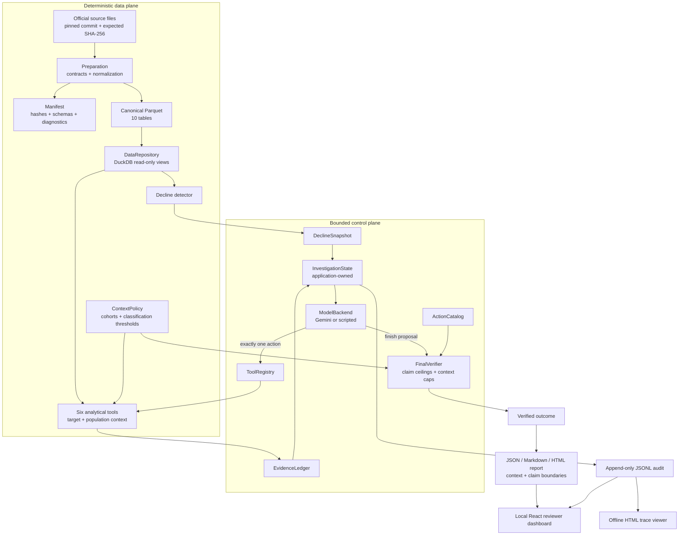
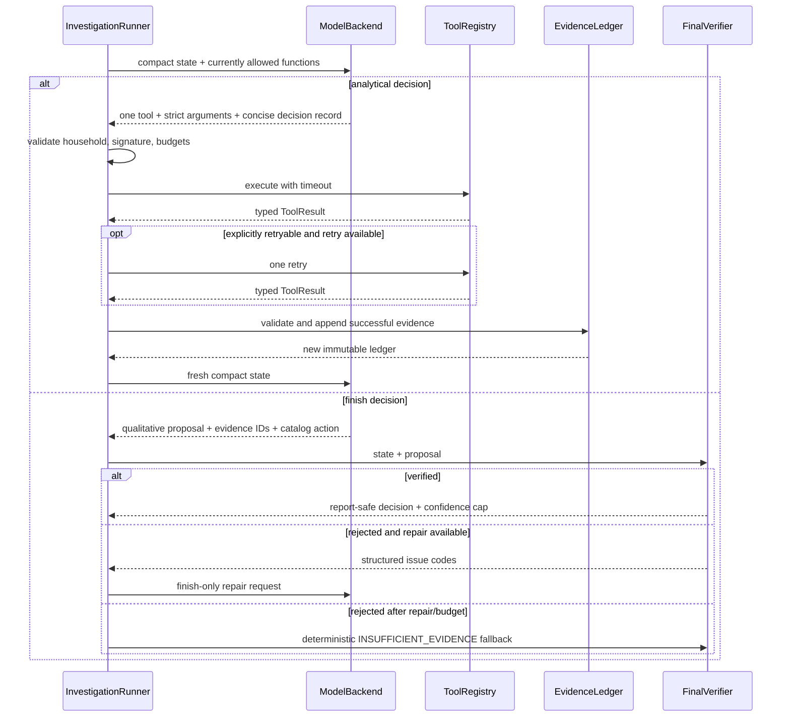

# WhyBack architecture

## Purpose and boundary

WhyBack is an evidence-grounded investigation system, not a predictor or an
outreach service. It finds households with transparent behavioral decline,
allows one model-directed analytical question at a time, and produces only a
human-reviewed catalog recommendation after deterministic verification.

The central trust boundary is deliberate:

> The model controls analytical sequence and qualitative synthesis. Typed
> application code controls data access, calculations, state, budgets,
> evidence, policy, and publication.

## Component view

| Area | Responsibility | Explicitly does not do |
| --- | --- | --- |
| `whyback.data` | Pin, acquire, hash, normalize, validate, prepare, and query source data | Choose business actions or expose raw data to a model |
| `whyback.detection` | Construct windows, enforce eligibility, score and rank decline | Estimate churn probability |
| `whyback.tools` | Validate inputs and compute all analytical metrics with provenance | Decide which tool should run next |
| `whyback.agent` | Ask for one decision, enforce bounds, own state and evidence, verify finish proposals | Calculate customer metrics or execute outreach |
| `whyback.observability` | Validate, sanitize, and append external lifecycle events | Store hidden chain of thought or credentials |
| `whyback.reporting` | Resolve authoritative state into strict JSON and static reports/viewers | Trust model-authored numerical prose |
| `evals` | Score observable behavior and safety invariants | Judge stylistic prose or prove causal effectiveness |
| `web` | Serve and review sanitized local artifacts and bounded live-run status | Calculate evidence, choose actions, expose credentials, or mutate customer systems |

## Data plane

### Acquisition and preparation

The only supported full-data source is
`bradleyboehmke/completejourney` at commit
`5b5d06192b9856edd04e4d405787af2f2e4a1fef`. Acquisition checks the expected
file size and SHA-256 for all eight official R files. Preparation then:

1. reads each RDS/RDA object;
2. normalizes identifiers, timestamps, measures, and hierarchy labels;
3. validates table and cross-table contracts;
4. deduplicates exact coupon bridge keys;
5. canonicalizes promotions at `(product_id, store_id, week)`;
6. writes canonical and derived Parquet atomically; and
7. writes a strict manifest with source/prepared hashes and diagnostics.

The local full-data execution read 22,627,890 source rows. Important prepared
tables are `transactions` (1,469,307 rows), `promotion_state` (20,927,744),
`household_week` (69,674), and `baskets` (155,848). The raw promotions table
contained 12,785 duplicate keys, all collapsed by the canonical state. These
numbers describe the executed pinned source, not hard-coded acceptance rules.

Preparation is idempotent: existing outputs are reused only when every source
and prepared hash still matches the manifest. Temporary files are replaced
atomically. Raw and prepared data remain outside Git.

### Repository boundary

`DataRepository` owns one DuckDB connection and registers named, read-only
views over required Parquet tables. Callers issue parameterized SQL through a
narrow query/scalar boundary. This centralizes file discovery, missing-table
errors, time-zone setup, and connection lifetime; individual tools do not open
arbitrary files or parse R objects.

### Detection

The decline detector aggregates from `household_week`, anchors two eight-week
windows to maximum observed week, applies declared eligibility, and calculates
the exact weighted score in Python. Results are sorted by score descending and
then normalized household ID, making any bounded top-ranked selection stable.
The full source resolves to baseline weeks 38–45 and recent weeks 46–53.

## Analytical tool plane

The single `ToolRegistry` contains exactly six tools and is shared by every
backend. Each definition includes a strict Pydantic JSON schema and operational
description. `ToolExecutionContext` supplies run identity, active household,
window, source commit/hashes, and application version; model arguments cannot
override these values.

Each invocation returns a common `ToolResult`:

- a stable call ID and exact tool name;
- one of six typed statuses;
- a bounded model summary;
- zero or more immutable `EvidenceRecord` values;
- limitations and explicit retryability; and
- normalized parameters, query hash, rows examined, elapsed time, cache state,
  source hashes/version, and invariant diagnostics.

Only `ok` and `partial` may carry evidence. Tool and contract code reject
evidence whose source name or call ID does not match its envelope. Full results
remain in application state and the sanitized tool-completion trace event; the
model receives a compact form.

### Population and category context

`ContextPolicy` is the single immutable policy for comparison eligibility,
minimum cohort sizes, and classification thresholds. With its declared
defaults, baseline eligibility requires four active weeks, six distinct
baskets, and positive retailer sales value. Reliable context requires 20
target-excluded eligible households, five target-excluded behavioral peers, or
20 target-excluded category households. A category comparison also requires at
least 1.0 retailer sales value of baseline activity in that category.

`peer_comparison` computes the target's signed retailer-sales change and the
eligible-population and behavioral-peer median, interquartile range,
percentile, declining share, target-minus-median gap, and cohort count. Signed
change is `(recent - baseline) / baseline`; lower means worse. The target is
excluded from both distributions, and robust scaling is fitted on comparison
households only. `category_decomposition` computes corresponding
contemporaneous context for selected major loss categories while preserving
its existing target-total reconciliation.

Classification is deterministic. A 0.10-or-larger target gap below both
medians is `customer_specific` only without broad movement and is otherwise
`mixed`. `broad_context` requires at least a 0.60 declining share in both
population and peers and target movement within 0.10 of both medians. Cohorts
below their minimum are `insufficient_context`; other reliable combinations
are `mixed`. These are household-level descriptive comparisons, not causal
controls. With roughly one year of source data, widespread movement is called
**broad contemporaneous context**, never proven recurring seasonality.

The live finish boundary derives verifier-aligned action candidates from the
ledger. Qualifying mapped losses with `customer_specific` category context are
marked as household-differentiating and presented before generic signals shared
by many selected households. Model-selected evidence is narrowed to records that
actually satisfy the chosen action predicate; claim strength and material
counterevidence are resolved from the ledger. Published category drivers name
the deterministically selected department/category, and the batch index exposes
that factor beside each household.

## Control plane

### Backend boundary

`ModelBackend` has one provider-neutral operation: decide the next step from
current typed state and the currently offered tools. The two implementations
are:

- `GeminiFunctionCallingBackend`, which makes a fresh stateless Gemini
  Interactions request using declared functions and forced function selection;
  because Gemini may propose parallel calls, the adapter accepts exactly one
  function call and rejects every other cardinality; and
- `ScriptedBackend`, which supplies predetermined decisions while exercising
  the production runner, registry, tools, ledger, verifier, audit, and reports.

The backend is a decision source, not the state store. Provider call IDs and
token/latency usage are recorded, but provider conversation history is not
authoritative.

### Application-owned state

`InvestigationState` is a frozen Pydantic value containing:

- run and household identity;
- the immutable detector snapshot and analysis window;
- compact tool history and every actual attempt;
- the evidence ledger;
- open questions, failed/partial tools, and unavailable tools;
- normalized requested signatures;
- remaining tool and decision budgets;
- model usage and terminal status; and
- a final proposal, resolved confidence, or verification issues.

Every transition creates a copied state value. A model turn sees a bounded
projection of this state rather than raw data or an accumulating transcript.
The projection contains computed evidence values because those are the facts
needed for selection and synthesis; it omits raw rows and internal application
objects.

### Investigation sequence

There is no hard-coded production tool sequence. The model sees the tools still
available and chooses one analytical question. Scripted plans are explicit
fixtures for repeatability; they are labeled and must not be represented as live
model behavior.

## Grounding and publication boundary

The evidence ledger accepts records only from successful results and checks
unique ID, run, household, and source-call ownership. A finish proposal contains
typed qualitative driver statements, support and counterevidence IDs,
confidence, one allowlisted action, alternatives, and uncertainties. Every
substantive driver declares `descriptive`, `associational`, or `causal`, cites
counterevidence or records why none was material, and carries limitations.
Every evidence record declares the strongest claim type it can support.

`FinalVerifier` fails closed on:

- missing, foreign, or failed-call evidence;
- drivers not mapped to their support set;
- driver claim types above a cited evidence ceiling, including every causal
  driver from the current observational tools;
- overlap between support and counterevidence;
- action IDs or evidence prerequisites outside policy;
- raw numerical or causal/guaranteed-retention claims in free text;
- category totals that did not reconcile;
- promotion enrichment that did not preserve row count and retailer sales
  value; or
- target inclusion in its own peer cohort.

When verification passes, the verifier resolves the catalog description,
measurement plan, propagated limitations, and maximum allowed confidence.
Broad population or peer context caps customer-specific confidence at low;
mixed or missing context caps it at medium. Matching broad category movement
also caps a category interpretation at low. Missing context is a limitation,
not neutral evidence, and each adjustment is recorded with its evidence IDs in
the audit trace. The renderer builds customer-behavior tables from tool ledger
records and typed, run-owned detector evidence. It builds operational attempt
and timing facts from typed history and audit events—never from model prose.
JSON is the stable report boundary; Markdown and self-contained HTML are views
of the same typed object. All three expose population/comparison context, claim
labels, counterevidence, what the analysis can and cannot establish, unobserved
factors, and a human-reviewed measurement plan.

## Audit and replay

The runner emits a fixed event vocabulary from `run_started` through
`run_completed`. Events contain timestamps, IDs, selected tool, sanitized
arguments, statuses, retries, latency, evidence IDs, versions, and verifier
outcomes as appropriate. The audit layer redacts secret-like keys/values and
rejects fields resembling hidden reasoning.

JSONL is append-only at the application writer boundary and is the authoritative
local execution record. Every actual tool-completion, partial, or failure event
includes its complete typed `ToolResult` envelope. Replaying analytical
calculations requires the pinned data/source hashes, source-tree version,
normalized parameters, query hashes,
and configuration stored in state, traces, and manifests. The static HTML trace
viewer is an offline rendering, not a second source of truth.

## Security and external effects

The data repository is local and read-only during analysis. The model receives
household identifiers and compact derived evidence, so a production deployment
would still require formal privacy review and data minimization. Secrets come
only from environment configuration and are never placed in artifacts.

No component sends email, SMS, advertisements, coupons, or CRM updates. Every
action is a recommendation with `human_review_required: true`. External action
execution is intentionally outside the system boundary.

## Extension seams

The model protocol can host another decision provider without changing state or
tools. The repository can be replaced by a governed warehouse implementation
behind the query boundary. The registry can later be exposed through a thin
local stdio MCP adapter without duplicating calculations. OpenTelemetry with
OpenInference-compatible attributes can mirror selected events to OTLP, while
JSONL remains authoritative. These last two are deliberate extension points,
not dependencies of the submitted core.
