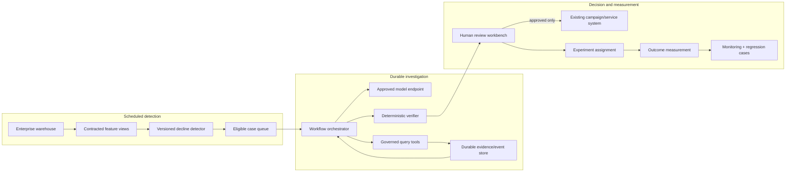

# Productionizing WhyBack

The submission is a local, single-process reference implementation. It proves
the analytical and governance contracts that should survive a production
migration; it is not itself a customer-contact service.

## Target operating model

A production version should remain split into three governed planes:

The model remains a bounded analytical planner. It should not receive warehouse
write credentials, decide its own budgets, bypass the verifier, or call
customers directly.

## Data and query layer

### Move Parquet views to a governed warehouse

Replace local `DataRepository` with an implementation over the organization's
warehouse or federated query layer (for example, Snowflake, BigQuery, Databricks
SQL, Trino, or a governed lakehouse). Preserve the narrow repository contract
and parameterized tool queries. Do not rewrite calculations into prompts.

Materialize or incrementally maintain the local derived grains as warehouse
models:

- canonical transactions with retailer-sales terminology;
- one promotion state per `(product_id, store_id, week)`;
- household-week aggregates;
- basket aggregates; and
- an explicit `UNKNOWN` product hierarchy mapping.

Use partitioning/clustering on the keys and weeks exercised by the tools. Put
statement timeouts, bytes/rows scanned, and warehouse query IDs in provenance.
Keep direct pre/post reconciliation for category and promotion operations even
when upstream models claim uniqueness.

### Data contracts and lineage

Promote current Pydantic checks and manifest diagnostics into versioned producer
contracts with owners and severity. Validate schema, type, key multiplicity,
week completeness, null rates, negative/unusual economic values, product
mapping coverage, campaign types, freshness, and row-count changes before
publishing detector inputs. Quarantine bad partitions rather than silently
falling back to stale or sampled data.

Register dataset, feature-view, SQL/query, detector, application, and action-
catalog versions in a lineage system. Retain immutable input snapshot IDs so a
case can be reconstructed after source tables evolve.

## Scheduled decline detection

Run decline detection on a declared business cadence after the last complete
source week closes. The local heuristic treats source week 53 transparently;
production should establish a calendar completeness contract instead of
assuming every numbered week is full.

Store each detection batch with:

- detector version and parameters;
- baseline/recent calendar boundaries;
- population and eligibility counts;
- threshold-sensitivity diagnostics;
- ranked snapshots and stable tie-breaking; and
- source snapshot and data-quality status.

Deduplicate open cases by `(household_id, detector_version,
recent_window_end)`. Define cooling-off and reassessment policies so repeated
batches do not create conflicting investigations or outreach pressure.

## Durable orchestration

Move the in-memory runner into a durable workflow engine or queue-backed worker
system. Persist state after every model decision, tool attempt, evidence append,
and verification event. A worker restart should resume from authoritative state
without replaying an already successful external or expensive operation.

Use idempotency keys at each boundary:

- investigation: stable detector case ID;
- model decision: `(run_id, decision_number, prompt_version, model_version)`;
- tool attempt: current stable call ID plus attempt;
- evidence: unique `(run_id, evidence_id)`; and
- human approval/treatment: separate business-system idempotency key.

The current exact normalized tool signature should remain a within-run duplicate
guard, but production also needs transactional compare-and-set updates so two
workers cannot consume the same budget concurrently.

## Retries, backoff, and circuit breaking

Preserve the semantic distinction between retryable and terminal errors. For
provider and warehouse throttling, add bounded exponential backoff with jitter
and honor `Retry-After`. Retry only operations known to be idempotent. Keep a
small per-run attempt bound and add service-level circuit breakers so an
unhealthy dependency does not create a retry storm.

The local thread timeout cannot cancel a running DuckDB query. Production tools
must set server-side statement deadlines and issue cancellation, or run in an
isolated process/container that can be terminated. Use bulkheads for expensive
promotion/peer queries and a dead-letter queue with typed failure context for
cases that exhaust policy.

## Security, privacy, and governance

- Store API and warehouse credentials in a managed secret service; use short-
  lived workload identity rather than static keys.
- Apply least-privilege RBAC separately to detector reads, tool reads, audit
  writes, report reads, human approvals, and any downstream treatment system.
- Enforce row/column policies, tenant boundaries, encryption in transit/at rest,
  network egress restrictions, and key rotation.
- Minimize model inputs. Household IDs should be tokenized when operationally
  possible, and raw transactions should never be placed in prompts.
- Define lawful purpose, retention, deletion, consent, contact preference, and
  suppression handling with privacy/legal owners.
- Keep demographics out of primary peer and action selection. Monitor for proxy
  effects and disparate treatment even when protected fields are not direct
  features.
- Write audit events to immutable, access-controlled storage with integrity
  signatures, sequence enforcement, retention policy, and reviewer-access logs.
- Run secret and dependency scans in build/release pipelines and sign images,
  code, prompts, policies, and artifact manifests.

The model must have no direct write path to CRM, messaging, coupon, or campaign
systems. A separate approval service should verify current consent and policy
at execution time; approval is not implied by an investigation result.

## Prompt, model, and policy versioning

Treat the investigator instructions, strict function schemas, compact-context
serializer, model name/snapshot, reasoning settings, NBA catalog, verifier
rules, and detector policy as independently versioned release artifacts. Record
their immutable identifiers on every run.

Use a controlled model/prompt registry with review, offline evaluation results,
rollout owner, activation window, and rollback target. Do not silently upgrade
the model alias. Shadow new combinations on replayable cases, compare tool path,
cost, failure, grounding, and action distributions, then canary before broad
release.

Verifier and catalog changes are policy changes, not prompt tweaks. Require
business, risk, privacy, and analytical review when they alter which customer
action can be recommended.

## Observability and service objectives

JSONL remains the authoritative portable record for a local case. In production,
emit selected spans and metrics via OpenTelemetry with OpenInference-compatible
model/tool attributes, masking content by default. Send them to the approved
OTLP backend; do not make Phoenix or any one vendor a runtime dependency.

Suggested service-level indicators include:

- detector batch completion and data freshness;
- queue age and investigation completion latency (median, p95, p99);
- verified outcome rate and insufficient-evidence rate;
- model decision latency, token count, estimated cost, and malformed-response
  rate by model/prompt version;
- tool latency, rows/bytes scanned, error, timeout, retry, and partial-data rate;
- duplicate-refusal and budget-exhaustion rate;
- verification rejection/repair/fallback rates by issue code;
- artifact publication and integrity-verification success; and
- human review time, acceptance, override, and no-action rate.

Example initial objectives—not claims about the local project—might be:

- 99% of scheduled detector batches complete within the declared freshness
  window;
- 99% of accepted cases reach a verified terminal state within an hour;
- 100% of published non-insufficient actions pass the deterministic verifier;
  and
- 100% of external treatments have a recorded human approval and experiment
  assignment.

Alert on sustained data drift, tool partial/error rates, verification issue-code
spikes, cost/latency budget breaches, and action-distribution shifts. A low
service error rate is not enough if `INSUFFICIENT_EVIDENCE` or human overrides
quietly rise.

## Human approval workflow

Build a reviewer work queue that shows the decline snapshot, investigation
path, supporting and counterevidence, limitations, tool failures, confidence
cap, catalog action, proposed success metric, and experiment assignment. The
reviewer should be able to approve, reject, request more evidence, choose
no-action, or override with a coded reason.

Before approval becomes executable, independently enforce eligibility, contact
consent, frequency caps, inventory/offer validity, channel rules, and current
suppression lists. Use four-eyes review for higher-risk actions. Preserve the
original model proposal, verified output, and human disposition; never rewrite
the audit trail to match the final decision.

## Deployment evaluation gates

Every detector, model, prompt, tool, verifier, or catalog release should pass:

1. frozen build, static checks, deterministic tests, branch coverage, dependency
   and secret policy;
2. golden trace and artifact integrity checks;
3. the six baseline behavioral scenarios plus all historical incident cases;
4. replay on a versioned representative sample with budget, grounding,
   limitation, failure, action-distribution, cost, and latency thresholds;
5. privacy/fairness checks and human review of material output changes;
6. warehouse load/cancellation and dependency failure tests; and
7. shadow/canary evaluation with an explicit rollback condition.

Any production failure should become a minimized deterministic regression
fixture when technically possible. Keep the incident's root-cause category and
expected safe behavior even after the immediate prompt/model version is
retired.

## Experimentation and causal measurement

Complete Journey is observational. A category loss, changed visit cadence,
promotion availability, coupon redemption, or peer difference can be associated
with decline; it does not establish why decline occurred. Likewise, WhyBack's
recommended action is a hypothesis. This case study provides **no evidence that
the action will cause retention or incremental retailer sales**.

For each approved action, assign a randomized A/B treatment and persistent
holdout before execution. Pre-register eligibility, unit of randomization,
intervention, primary metric, guardrails, evaluation window, power/minimum
detectable effect, and analysis. Protect against household spillover and repeated-treatment
contamination. Measure intention-to-treat first; report uncertainty and costs,
not only raw post-treatment outcomes.

The action catalog already supplies a suggested metric and holdout design, but
production experimentation owners must validate feasibility and policy.
`MONITOR` and `INSUFFICIENT_EVIDENCE` also need audited samples to estimate
missed opportunities and false insufficiency.

Only after sufficient randomized history exists should NBA selection evolve
toward uplift or heterogeneous treatment-effect modeling. Such a model should
rank incremental response to each feasible treatment—not propensity to decline—
with overlap, calibration, policy constraints, cost, and exploration monitored.
It should augment, not bypass, evidence display, catalog governance, human
approval, and randomized exploration.

## Business outcome framework

Track operational, decision, and causal business outcomes separately:

- **Operational:** completion, latency, cost, failure, partial-data, verification,
  and reviewer cycle time.
- **Decision:** NBA acceptance, rejection, override reason, no-action rate,
  evidence-recovery rate, and reviewer agreement.
- **Customer/business:** retention or active-week stability, incremental retailer
  sales value, visit frequency, margin/treatment cost, opt-out/complaint rates,
  and adverse contact pressure.
- **Causal:** incremental lift versus randomized holdout, confidence interval,
  heterogeneity, and long-run effects—not unadjusted before/after change.

Report both per-action and population-level results. Optimizing NBA acceptance
alone can reward recommendations that look persuasive but do not create
incremental value.

## Phased roadmap

1. **Harden the analytical service:** warehouse repository, data contracts,
   cancellable queries, durable event/state store, idempotent workers.
2. **Govern the decision service:** model/prompt/policy registry, RBAC, immutable
   audit, SLOs, replay and release gates.
3. **Pilot human review:** limited eligible population, no automatic execution,
   override taxonomy, consent and suppression validation.
4. **Run controlled experiments:** approved catalog actions with randomized
   holdouts and predeclared outcomes.
5. **Optimize incrementality:** only after sufficient trials, evaluate uplift or
   treatment-effect models under continued exploration and governance.

Automatic outreach is not a maturity milestone for WhyBack. The target is a
reliable, measurable, human-accountable decision workflow.
