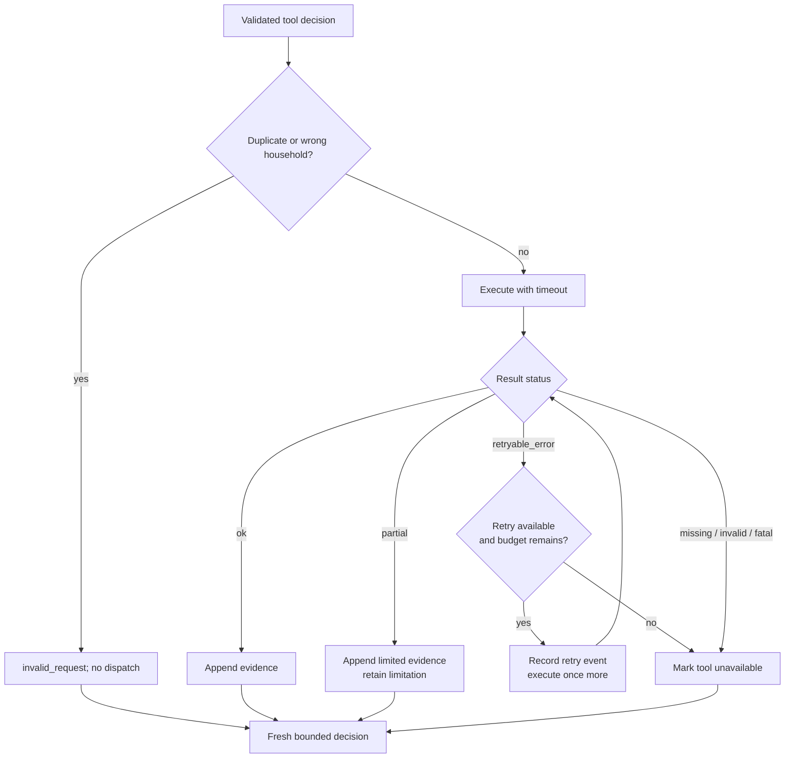

# Reliability and failure semantics

WhyBack treats model output, data availability, and tool execution as fallible.
Safety comes from typed state transitions and fail-closed publication rules,
not from asking the model to be careful.

## Hard bounds

| Control | Default | Enforcement |
| --- | ---: | --- |
| Analytical executions | 5 | Every actual attempt, including a retry, decrements the application-owned budget. It cannot become negative. |
| Model decisions | 7 | Every backend request consumes one turn, reserving capacity for five tools, finish, and one repair. |
| Actions per decision | 1 | The live adapter requires tool selection and rejects responses containing anything other than exactly one offered function call, including parallel calls. |
| Exact duplicate calls | 0 executions | `(tool_name, normalized_arguments)` is hashed and refused before dispatch. |
| Retryable retries | 1 | Only a result marked `retryable_error` and `retryable=true` can retry. |
| Structured repairs | 1 | Rejected verification exposes issue codes, or a malformed action exposes an application-authored issue, on one finish-only turn. |
| Tool timeout | 30 seconds | Configurable per runner; timeout becomes a typed retryable result. |

Tool and decision budgets are separate. A retry consumes a real analytical
execution because it consumes compute and latency. An exact duplicate is
recorded but refused before the attempt loop, so it does not consume the
analytical-execution budget. Invalid arguments or a mismatched household are
handled as attempted calls and do consume budget, even though no analytical SQL
is allowed to run. When tools are exhausted or a repair is pending, the runner
offers only `finish_investigation`.

## Status contract

Every tool result has exactly one status:

| Status | Meaning | Evidence allowed | Retry allowed |
| --- | --- | ---: | ---: |
| `ok` | Requested calculation completed with its invariants satisfied | yes | no |
| `partial` | Valid calculations exist, but a material requested fact is unavailable | yes, with limitations | no |
| `missing_data` | Required prepared data or household rows are absent | no | no |
| `invalid_request` | Arguments, household ownership, or duplicate-call policy failed | no | no |
| `retryable_error` | A transient execution failure may succeed once more | no | once |
| `fatal_error` | Execution failed in a non-retryable way | no | no |

Pydantic validates this contract. Non-success envelopes containing evidence are
invalid; partial results without limitations are invalid; only
`retryable_error` may set `retryable=true`. The ledger independently repeats
ownership and successful-origin checks before accepting records.

## Failure flow

Failed tools are placed in `failed_or_partial_tools`; terminally unsuccessful
tools are also placed in `unavailable_tools` and are no longer offered. The
model can continue with remaining analyses. A provider error or malformed live
response produces a typed failed outcome with a traceable reason rather than a
fabricated decision.

## Deterministic fault injection

`DemoFaultInjector` is test/demo-only and requires both an allowlisted scenario
and the literal constructor acknowledgment `enabled=True`. Ordinary runner
construction cannot activate it from ambient state. Supported cases are:

- `promotion_response:timeout-once`: first attempt returns a typed retryable
  timeout; the second executes normally; and
- `promotion_response:timeout-always`: initial attempt and sole retry both
  fail; promotion analysis becomes unavailable; the run continues with other
  evidence.

Injected results say that no analytical query ran, examine zero rows, include
the exact scenario and attempt in diagnostics, and generate no evidence. The
persistent-failure artifact proves the retry bound and that final citations do
not come from failed promotion calls.

## Missing and partial data

Missingness is represented rather than silently imputed or dropped:

- absent product hierarchy maps to explicit `UNKNOWN` groups;
- empty analysis windows return explicit status instead of dividing by zero;
- an absent campaign is distinguishable from a broken campaign table;
- insufficient eligible-population, behavioral-peer, or category cohorts
  return `partial`, publish their observed counts and limitations, and suppress
  unstable distribution statistics; and
- Type A campaign participation and observed redemption can be valid while the
  exact 16 delivered coupon identities remain unavailable.

The Type A case is `partial` when requested interpretation depends on delivered
identity. Its valid evidence carries limitations. If the finish proposal cites
that evidence, the verifier deterministically propagates the limitation into
the final result and renderer. WhyBack never constructs category-level
unredeemed exposure from a larger campaign coupon pool.

## Evidence integrity

The evidence ledger is immutable in the Pydantic state model and is appended by
returning a new ledger. Before a record enters it, WhyBack checks:

1. the result has `ok` or `partial` status;
2. the evidence ID is unique within the run;
3. `run_id` and `household_id` match active state;
4. `source_tool` matches the result; and
5. `source_tool_call_id` matches the actual invocation.

The final verifier rebuilds the call-status lookup from attempt history and
rejects citations that did not originate from successful calls. It also checks
that each driver cites evidence in the declared support set and that support and
counterevidence do not overlap. Evidence records expose a typed maximum claim
level. A final driver must declare its level, cite counterevidence or explain
why none was material, and cannot exceed the weakest cited ceiling. Current
observational tools never support causal evidence.

## Analytical reconciliation guards

Tool provenance includes machine-checkable diagnostics consumed by the final
verifier:

- Category decomposition must reconcile baseline and recent category totals to
  direct transaction totals within tolerance. Unmapped product rows stay in
  `UNKNOWN`.
- Promotion enrichment must preserve transaction row count and retailer sales
  value after joining the canonical one-row-per-product/store/week state.
- Peer comparison must report that the target is excluded, and its explicit
  peer ID list cannot contain the target. Its population distribution and
  robust-scaling fit also exclude the target.
- Category context compares only eligible, target-excluded households with
  meaningful baseline activity in the selected category; an undersized cohort
  produces no median, prevalence, or target gap.
- Live finish guidance lists only action-qualifying support IDs, identifies
  customer-specific category factors, and supplies material context IDs in the
  counterevidence role. Application code resolves safe qualitative prose and
  claim ceilings before the unchanged verifier evaluates the proposal.

A tool may calculate plausible values and still be unpublishable if these
diagnostics fail.

## Finish verification and safe fallback

The final proposal is intentionally qualitative. It contains typed driver
summaries, per-driver counterevidence accounting and limitations,
support/counterevidence IDs, a proposed confidence, one catalog action, a
rationale, alternatives, and uncertainties. WhyBack rejects:

- missing, foreign, or failed-call evidence;
- unsupported drivers or action prerequisites;
- a claim type above the support level of any cited evidence;
- every causal driver based on the current observational tools;
- raw numerical claims in model-authored final prose;
- causal or guaranteed-retention language;
- unsupported analytical invariants; and
- a non-empty driver/support set paired with `INSUFFICIENT_EVIDENCE`.

The model receives structured verification issue codes for one repair attempt.
It cannot call another analytical tool during repair. If repair is unavailable
or still invalid, deterministic code proposes the empty-support
`INSUFFICIENT_EVIDENCE` action and verifies that fallback. WhyBack does not
silently edit evidence or lower the bar to publish a preferred action.

## Confidence policy

The model proposes `low`, `medium`, or `high`; the verifier computes the maximum
permissible value:

- `high` requires at least two supporting records from at least two analytical
  tools and no limitation attached to cited support or a relevant unavailable
  tool; contextual caveats still remain visible even when they do not impose a
  separate cap;
- meaningful but narrower or limited support is capped at `medium`;
- `broad_context` across eligible-population and peer evidence caps a
  customer-specific interpretation at `low`;
- `mixed` or `insufficient_context` caps it at `medium`, and missing context is
  explicitly limited rather than treated as neutral;
- broad context for a cited category caps `CATEGORY_WINBACK` at `low`, while
  mixed or insufficient category context caps it at `medium`;
- a model may voluntarily propose `low`; and
- the no-action fallback resolves to `insufficient`.

A proposed value above the cap is reduced transparently and
`confidence_cap_applied` is recorded. Every context adjustment includes its
classification, maximum confidence, reason, and evidence IDs in the passing
audit event and report. Confidence describes evidence breadth and limitations,
not a calibrated probability of customer behavior. Broad contemporaneous
movement is not labeled as proven seasonality or as evidence of a specific
cause.

## Audit guarantees

The writer opens JSONL only in append mode and emits validated events using a
closed vocabulary. Each event has a UTC timestamp, run and household IDs, and
sanitized JSON details. The sanitizer:

- redacts secret-like keys and recognizable credential values;
- rejects non-JSON and non-finite values;
- rejects keys associated with hidden reasoning; and
- never requests or persists private chain of thought.

Auditable model fields are limited to the investigation question, selected
function, concise decision summary, provider call ID, and usage. Every actual
tool outcome records the complete typed `ToolResult` envelope in its sanitized
completion, partial, or failure event. Computed values also remain in typed
state and report artifacts; raw source rows are not logged.

Application append mode prevents accidental truncation by this writer; it is
not a tamper-evident durable log. Production should add immutable object storage
or a write-once event sink, sequence IDs, retention policy, encryption, access
auditing, and integrity signatures.

## Failure-mode inventory

| Failure | Current behavior | Production hardening |
| --- | --- | --- |
| Missing/corrupt prepared file | `PreparedDataError` before analysis | Manifest registry, health check, automated rebuild/quarantine |
| Unknown or mismatched household | Explicit missing/invalid result; active-state household cannot be overridden | Authorization check and tenancy boundary |
| Invalid model arguments | Strict schema rejection, no evidence | Provider/schema conformance alert |
| Duplicate model request | Refused by normalized signature | Track duplicate rate by model/prompt version |
| Tool timeout | Retryable result; at most one retry | Warehouse statement timeout/cancel, bulkhead, circuit breaker |
| Tool exception | Typed fatal result with exception class/message | Stable error taxonomy and alert routing |
| Model/API failure | Failed run with safe reason | Backoff/jitter, circuit breaker, alternate approved deployment |
| Malformed model output | Rejected unless exactly one valid offered call | Model/prompt rollback and conformance gate |
| Budget exhaustion | Finish-only path or deterministic insufficiency | Tune budgets from traces under cost/latency SLOs |
| Verification rejection | One finish-only repair, then insufficiency | Alert on issue-code rates and regression-case capture |
| Report/artifact corruption | Strict schema, evidence, trace, mode, and hash verifier fails closed | Signed manifests and immutable publication bucket |

## Known local limitations

- Python thread cancellation cannot forcibly stop a running DuckDB call. After a
  local timeout the runner returns promptly and does not wait for that worker,
  but the underlying work may finish in the background. Production should use
  cancellable warehouse statements or isolated worker processes.
- The JSONL writer is process-local. It provides a trustworthy replay artifact
  when retained intact, not cross-process ordering or disaster recovery.
- Local source-tree and dataset hashes support reproduction but do not replace
  signed builds or a software/data provenance service.
- A scripted plan validates orchestration mechanics, not live-model decision
  quality. Live checks are separate and skipped without credentials.

These limits are visible by design and expanded in
[Productionization](productionization.md).
