# WhyBack repository technical outline and presentation sourcebook

> A self-contained, point-in-time handoff for a new technical conversation.
> This document covers the Python CLI and analytics system, the agent runtime,
> generated artifacts, tests/evaluations, the localhost Node bridge, and the
> React reviewer interface.

## 0. Snapshot identity and rules for the receiving model

### Snapshot identity

- Product: **WhyBack**
- Tagline: **Find the why. Choose the way back.**
- Python package and CLI: `whyback`
- Browser product name: **WhyBack Investigator**
- Snapshot date: **2026-08-26**
- Maintained branch: `codex/whyback-build`. Exact revision, upstream relation,
  and dirty-state evidence belong in the generated quality audit and Git
  history rather than this hand-maintained guide.
- Durable repository scope: Python analytics, the bounded agent runtime,
  generated artifacts, quality evidence, the localhost Node bridge, and the
  React reviewer interface.
- Companion explanations: `docs/agent-guide.md`, this sourcebook, and
  `docs/repository-cheat-sheet.md` are reviewer guides committed with the code.

Line numbers in this sourcebook refer to the source snapshot reviewed on the
date above. They can drift when code is inserted or removed. Every important
reference therefore includes a path as well as a line range; the file and
symbol indexes are the most granular lookup source.

### Instructions for a fresh ChatGPT conversation

If this file is supplied to a model that has no other repository context, that
model should:

1. Treat this file as a map, not as executable source. If the repository is
   also attached, inspect the cited code before quoting it.
2. Put a path and line range beside every technical claim used in a slide.
3. Distinguish the **language model** from the **agent**. The model chooses one
   next function; the agent is the entire state/tool/ledger/verifier/reporting
   system.
4. Never call the Decline Score a churn probability. It is a transparent,
   bounded heuristic.
5. Call `sales_value` **retailer sales value**. It is observed value at this
   retailer, not profit or the household's total spending.
6. Describe promotion rows as product/store/week **availability**, never proof
   that a household saw a promotion.
7. Never imply that WhyBack contacts customers, sends offers, mutates a CRM, or
   autonomously approves an action. It produces a recommendation for human
   review.
8. Keep the web app in its proper role: it displays verified artifacts and can
   launch a bounded local Gemini batch. It does not calculate customer evidence
   or author the recommendation.
9. Preserve the web and live-publication boundaries in
   [Section 10.9](#109-security-and-live-publication-boundaries).
10. Preserve the current wiring and evidence-status caveats in
    [Section 14](#14-current-caveats-and-non-obvious-implementation-details),
    especially the generated-audit provenance and completion-status boundaries.

### One-sentence system description

WhyBack finds households with a large recorded decline, lets a model choose one
prewritten analytical question at a time, makes deterministic code calculate
and record the evidence, checks the model's proposed conclusion with code, and
shows a human a traceable catalog recommendation.

The product boundary is stated in [`README.md` lines 5–12](../README.md#L5-L12)
and the repository invariants are summarized in
[`AGENTS.md` lines 37–57](../AGENTS.md#L37-L57).

---

# 1. Architecture at a glance

## 1.1 Component flow

```mermaid
flowchart LR
    R[8 pinned R files] --> P[Validation and Parquet preparation]
    P --> M[Manifest with hashes and schemas]
    P --> D[(10 Parquet tables)]
    M --> Q[Validated DuckDB repository]
    D --> Q
    Q --> DET[Decline detector]
    DET --> SNAP[One typed household snapshot]
    SNAP --> RUN[InvestigationRunner]
    MODEL[Scripted or Gemini backend] -->|one typed decision| RUN
    RUN -->|one approved question| TOOLS[Six deterministic tools]
    Q --> TOOLS
    TOOLS --> LEDGER[Immutable evidence ledger]
    LEDGER --> MODEL
    MODEL -->|typed finish proposal| VERIFY[Deterministic verifier]
    LEDGER --> VERIFY
    VERIFY --> REPORT[JSON, Markdown, HTML and JSONL/HTML trace]
    REPORT --> BRIDGE[Localhost Node artifact bridge]
    BRIDGE --> UI[React reviewer interface]
    UI --> HUMAN[Human review]
```



The corresponding repository diagram is in
[`README.md` lines 14–28](../README.md#L14-L28). The architectural dependency
rule is:

```text
configuration and data
        ↓
validated repository
        ↓
detector and deterministic tools
        ↓
typed agent state, evidence ledger, and verifier
        ↓
reports and sanitized audit trace
        ↓
localhost server and browser display
```

The browser does not feed calculated metrics back into the Python evidence
system. Its only mutation endpoint starts the fixed, server-owned Gemini demo
command; that command re-enters the same Python CLI and runtime.

## 1.2 Four planes

| Plane | Owns | Does not own | Main code |
|---|---|---|---|
| Data plane | Source identity, contracts, preparation, hashes, DuckDB views | Model decisions | `src/whyback/data/`, `src/whyback/detection/` |
| Analytical plane | Six fixed calculations and typed evidence | Free-form SQL from a model | `src/whyback/tools/` |
| Control/governance plane | State, budgets, model choices, ledger, action policy, verification | Raw source rows | `src/whyback/agent/` |
| Review plane | Reports, audit replay, localhost APIs, React display, live-run launcher | Customer outreach and evidence arithmetic | `src/whyback/reporting/`, `src/whyback/observability/`, `web/` |

## 1.3 Runtime modes

| Mode | Input data | Decision source | External model call? | Typical entry |
|---|---|---|---|---|
| Scripted demo | Synthetic fixture prepared temporarily | Predeclared `ScriptedBackend` plan | No | `uv run whyback demo --customers 5` |
| Direct scripted investigation | Any validated prepared synthetic or official dataset | `ScriptedBackend` | No | `whyback investigate --backend scripted` |
| Direct Gemini investigation | Any validated prepared synthetic or official dataset | Gemini Interactions function calls | Yes | `whyback investigate --backend gemini` |
| Official Gemini batch | Pinned, validated official prepared data | Gemini | Yes | `whyback demo --backend gemini` |
| Web live batch | Pinned, validated official prepared data | Gemini via a fixed CLI child process | Yes | `POST /api/demo` from the local UI |
| Artifact replay | Already written `report.json` and `trace.jsonl` | None | No | Open the dashboard and browse a collection |

The CLI distinction between scripted synthetic and Gemini official batches is
implemented at [`cli.py` lines 323–372](../src/whyback/cli.py#L323-L372). The
web launcher hardcodes Gemini and its output directory in
[`index.mjs` lines 181–210](../web/server/index.mjs#L181-L210).

---

# 2. Repository tree and directory ownership

```text
WhyBack/
├── README.md                     Product overview, evidence claims, quickstart
├── AGENTS.md                     Repository invariants and contributor rules
├── PLANS.md                      Historical/current implementation boundaries
├── pyproject.toml                Python package, dependencies, CLI and checks
├── uv.lock                       Exact Python dependency lock
├── Makefile                      Developer shortcuts
├── .env.example                  Non-secret environment-variable template
├── configs/
│   ├── app.toml                  Checked-in application/data/agent defaults
│   └── actions.yaml              Exact six-action governed catalog
├── src/whyback/
│   ├── cli.py                    Typer CLI commands
│   ├── config.py                 Typed settings loader
│   ├── demo.py                   End-to-end assembly and artifact publication
│   ├── demo_limits.py            Shared 3–24 bounds and five-run default
│   ├── evaluation_cases.py       Executable synthetic behavioral scenarios
│   ├── immutability.py           Deeply frozen JSON containers
│   ├── methodology.py            Claim/context classification policy
│   ├── provenance.py             Run identity model
│   ├── data/                     Download, contracts, preparation, manifests, repository
│   ├── detection/                Windowing and Decline Score
│   ├── tools/                    Six analytical functions and shared contracts
│   ├── agent/                    Backends, loop, state, ledger, verifier, catalog
│   ├── observability/            Sanitized events and append-only JSONL
│   └── reporting/                Report models, renderers, templates and trace viewer
├── scripts/
│   ├── build_demo.py             Reviewer-artifact build wrapper
│   ├── run_quality_gate.py       Auditable full Python, web and artifact gate
│   └── verify_artifacts.py       Read-only cross-artifact verifier
├── evals/
│   ├── scenarios.yaml            12 deterministic behavioral contracts
│   └── run_evals.py              Normalization-independent scorer and report writer
├── tests/
│   ├── unit/                     Small contract and calculation tests
│   ├── property/                 Invariants over generated inputs
│   ├── integration/              CLI/data/demo/evaluation component integration
│   ├── orchestration/            Agent-loop behavior and failure handling
│   ├── live/                     Opt-in Gemini contract test
│   ├── fixtures/                 Hand-auditable source-shaped frames
│   └── golden/                   Normalized trace fixture
├── artifacts/
│   ├── demo/                     Committed synthetic reports and controls
│   ├── official/                 Official detector/status artifacts
│   ├── official-type-a/          Type A missing-delivery-identity control
│   ├── live-gemini-synthetic-failure/  Labeled provider-boundary failure
│   ├── evals/                    Aggregate evaluation output
│   ├── tests/                    Captured test/coverage/verification records
│   ├── git/                      Commit summary
│   └── local/                    Ignored, regenerable local/live outputs
├── docs/
│   ├── architecture.md           Detailed component and sequence design
│   ├── data-semantics.md         What the source can and cannot support
│   ├── reliability.md            Statuses, bounds, retries and fallback
│   ├── evaluation.md             Tests/evals and their limits
│   ├── productionization.md      Future operating model
│   ├── agent-guide.md            Local plain-English agent guide
│   └── adr/                      Eight architectural decision records
└── web/
    ├── package.json              Node scripts and React/Vite dependencies
    ├── scripts/dev.mjs           Starts bridge + Vite and strips key from Vite
    ├── server/                   Local artifact/live-run bridge
    ├── src/                      React app, components, types and formatting helpers
    ├── vite.config.ts            5163 dev server and /api proxy to 4173
    └── dist/                     Generated production build, ignored
```

Ignored/generated directories such as `.venv/`, `node_modules/`, caches,
`dist/`, raw R files, Parquet, local DuckDB files, and `artifacts/local/` are not
authoritative source. The exclusions are explicit in
[`.gitignore` lines 1–46](../.gitignore#L1-L46).

---

# 3. Installation, configuration, and commands

## 3.1 Python package and dependency boundary

[`pyproject.toml` lines 1–46](../pyproject.toml#L1-L46) defines:

- Python `>=3.12,<3.14`;
- Hatchling packaging;
- the `whyback` console entry point as `whyback.cli:app`;
- DuckDB, Pandas, PyArrow, Pyreadr, Pydantic, Jinja, Typer/Rich, PyYAML,
  NumPy, and the official Google Gen AI SDK;
- packaged copies of `configs/app.toml`, `configs/actions.yaml`, and the artifact
  verifier.

The optional `dev` group adds Hypothesis, Pytest/coverage/timeout, Pyright and
Ruff ([`pyproject.toml` lines 27–35](../pyproject.toml#L27-L35)). Static-policy
configuration is at [`pyproject.toml` lines 48–107](../pyproject.toml#L48-L107),
including strict Pyright and 85% branch-coverage minimum.

## 3.2 Checked-in configuration

[`configs/app.toml` lines 1–25](../configs/app.toml#L1-L25) declares:

| Setting | Current value | Meaning |
|---|---:|---|
| Source commit | `5b5d06192b9856edd04e4d405787af2f2e4a1fef` | Exact Complete Journey revision |
| Baseline / recent | `8` / `8` weeks | Adjacent comparison windows |
| Minimum baseline activity | 4 active weeks, 6 baskets, positive value | Detector eligibility |
| Decline threshold | `0.30` | Flag boundary |
| Sensitivity thresholds | `0.20`, `0.30`, `0.40` | Diagnostic counts, not tuning |
| Tool attempts | `5` | Includes retry attempts |
| Model decisions | `6` | Each fresh backend decision consumes one |
| Tool timeout | `30` seconds | Local attempt deadline |
| Retryable retries | `1` | Only explicit retryable errors |
| Model | `gemini-3.7-flash` | Default live backend model |
| Thinking level | `medium` | Gemini request setting |

Typed settings and environment overrides are defined in
[`config.py` lines 16–101](../src/whyback/config.py#L16-L101). Supported local
overrides are:

- `WHYBACK_DATA_DIR`
- `WHYBACK_ARTIFACT_DIR`
- `RETENTION_MODEL`
- `RETENTION_THINKING_LEVEL`
- `GEMINI_API_KEY` (read by the Gemini boundary, never printed as config)

The dashboard additionally accepts `WHYBACK_DASHBOARD_PORT` and a bounded
`WHYBACK_LIVE_TIMEOUT_MS`
([`index.mjs` lines 29–35](../web/server/index.mjs#L29-L35),
[`index.mjs` lines 140–148](../web/server/index.mjs#L140-L148)).

## 3.3 CLI command table

The Typer application is created at [`cli.py` lines 22–29](../src/whyback/cli.py#L22-L29).

| Command | Code | Effect |
|---|---|---|
| `whyback --version` | [`cli.py` L32–45](../src/whyback/cli.py#L32-L45) | Shows installed package version. |
| `whyback config` | [`cli.py` L50–55](../src/whyback/cli.py#L50-L55) | Prints effective non-secret settings. |
| `whyback data status` | [`cli.py` L58–69](../src/whyback/cli.py#L58-L69) | Shows configured source, commit, path and manifest presence. |
| `whyback data validate [--official]` | [`cli.py` L72–104](../src/whyback/cli.py#L72-L104) | Opens the repository boundary and optionally requires exact official identity. |
| `whyback data download [--force]` | [`cli.py` L107–119](../src/whyback/cli.py#L107-L119) | Downloads/verifies all eight pinned source files. |
| `whyback data prepare --full` | [`cli.py` L122–165](../src/whyback/cli.py#L122-L165) | Requires an explicit full build; writes ten Parquet tables and manifest. |
| `whyback detect` | [`cli.py` L168–244](../src/whyback/cli.py#L168-L244) | Ranks eligible households and optionally writes candidate/sensitivity CSVs. |
| `whyback investigate` | [`cli.py` L247–320](../src/whyback/cli.py#L247-L320) | Runs one scripted or Gemini investigation and writes report/trace artifacts. |
| `whyback demo` | [`cli.py` L323–372](../src/whyback/cli.py#L323-L372) | Builds a 3–24 household scripted synthetic or Gemini official batch, defaulting to five. |
| `whyback verify-artifacts` | [`cli.py` L375–411](../src/whyback/cli.py#L375-L411) | Calls the read-only verifier with historical live-skip support. |
| `whyback official-type-a` | [`cli.py` L414–436](../src/whyback/cli.py#L414-L436) | Builds the official scripted partial-evidence control. |

## 3.4 Common command journeys

### Credential-free demonstration

```bash
uv sync --frozen --extra dev
uv run whyback demo --customers 5 --output-dir artifacts/local/demo
uv run whyback verify-artifacts artifacts/local/demo
```

This prepares source-shaped synthetic frames in a temporary directory, runs the
real detector/tools/runner/verifier/reporting stack with scripted decisions, and
publishes an owned artifact tree atomically
([`demo.py` lines 718–898](../src/whyback/demo.py#L718-L898)).

### Official data path

```bash
uv run whyback data prepare --full
uv run whyback data validate --official
uv run whyback detect --top 20 --output-dir artifacts/local/detection
uv run whyback investigate --household-id 5 --backend scripted
```

### Direct live model path

```bash
export GEMINI_API_KEY="..."
uv run whyback investigate --household-id 5 --backend gemini
```

### Dashboard development path

```bash
uv sync --frozen --extra dev
cd web
npm ci
npm run dev
# open http://127.0.0.1:5163
```

The development wrapper starts the Node bridge and Vite without a shell; it
explicitly deletes `GEMINI_API_KEY` from the Vite child environment
([`dev.mjs` lines 9–39](../web/scripts/dev.mjs#L9-L39)).

### Built dashboard path

```bash
cd web
npm ci
npm run build
npm run server
# open http://127.0.0.1:4173
```

All web scripts are declared in
[`web/package.json` lines 6–15](../web/package.json#L6-L15).

---

# 4. Full end-to-end sequence

## 4.1 Source acquisition and preparation

1. `data download` resolves the fixed eight-file allowlist. Each entry includes
   filename, byte length and SHA-256
   ([`download.py` lines 43–87](../src/whyback/data/download.py#L43-L87)).
2. Existing files are reverified; new downloads go to `.part`, are size/hash
   checked, and are atomically renamed
   ([`download.py` lines 100–163](../src/whyback/data/download.py#L100-L163)).
3. `data prepare --full` refuses an implicit sample and invokes
   `prepare_data()` ([`cli.py` lines 122–165](../src/whyback/cli.py#L122-L165)).
4. Pyreadr deserializes exactly one object per R file. Transaction timestamps
   use `America/New_York` to avoid date shifts near midnight
   ([`prepare.py` lines 74–86](../src/whyback/data/prepare.py#L74-L86)).
5. `normalize_frame()` validates identifiers, numeric/date values, table-specific
   constraints and explicit `UNKNOWN` product hierarchy values
   ([`contracts.py` lines 97–201](../src/whyback/data/contracts.py#L97-L201)).
6. Base frames are written as Zstandard-compressed Parquet. DuckDB builds three
   derived tables: deduplicated `promotion_state`, `household_week`, and
   basket-grain `baskets`
   ([`prepare.py` lines 127–249](../src/whyback/data/prepare.py#L127-L249),
   [`prepare.py` lines 331–345](../src/whyback/data/prepare.py#L331-L345)).
7. Cross-table coverage diagnostics are calculated, and a manifest records
   source/prepared schemas, row counts, missingness, hashes, code hash and source
   identity ([`manifest.py` lines 26–127](../src/whyback/data/manifest.py#L26-L127)).
8. A current manifest lets the build return early only if source identity,
   transform version, preparation-code hash and every file hash still match
   ([`prepare.py` lines 252–279](../src/whyback/data/prepare.py#L252-L279)).

### Ten prepared tables

| Table | Grain and purpose |
|---|---|
| `transactions` | One normalized retail line item; source `sales_value` renamed `retailer_sales_value`. |
| `products` | One product and normalized hierarchy; missing descriptive levels become `UNKNOWN`. |
| `demographics` | Household context retained but not used for peer targeting/recommendations. |
| `campaigns` | Recorded household/campaign participation. |
| `campaign_descriptions` | Campaign type and dates. |
| `coupons` | Deduplicated campaign coupon-to-product bridge. |
| `coupon_redemptions` | Recorded household coupon redemption events. |
| `promotion_state` | One product/store/week with OR-aggregated display/mailer availability. |
| `household_week` | One household/week with value, units, baskets and active days. |
| `baskets` | One household/basket with store, week, timestamp, value, units and product/category counts. |

The mapping and table order are declared at
[`prepare.py` lines 30–71](../src/whyback/data/prepare.py#L30-L71).

## 4.2 Verified analytical repository

`DataRepository` validates the strict `manifest.json` model, source identity,
exact required table declarations, file hashes, transform version and
preparation-code identity before registering DuckDB views over Parquet
([`repository.py` lines 46–168](../src/whyback/data/repository.py#L46-L168)). It
provides parameterized `query`, `scalar`, allowlisted `table_count`, independent
`fork`, `interrupt`, and close/context-manager methods
([`repository.py` lines 170–221](../src/whyback/data/repository.py#L170-L221)).

There is no persistent DuckDB warehouse file in the normal architecture. DuckDB
is an in-process query engine over immutable Parquet.

## 4.3 Decline detection

1. `WindowSpec.from_max_week()` anchors adjacent non-overlapping baseline and
   recent windows to the maximum observed week
   ([`decline.py` lines 34–72](../src/whyback/detection/decline.py#L34-L72)).
2. `_aggregate_households()` calculates retailer value, distinct baskets and
   active weeks for each window
   ([`decline.py` lines 147–193](../src/whyback/detection/decline.py#L147-L193)).
3. Eligibility requires the configured baseline activity. Ineligible households
   never enter the ranked candidate list.
4. Each drop is clipped to `[0,1]`, so recent growth never creates a negative
   decline contribution
   ([`decline.py` lines 111–117](../src/whyback/detection/decline.py#L111-L117)).
5. Deterministic code calculates:

```python
decline_score = 0.50 * sales_drop + 0.30 * trip_drop + 0.20 * active_week_drop
```

The implemented formula and weight validation are at
[`decline.py` lines 119–137](../src/whyback/detection/decline.py#L119-L137).
6. `detect_declines()` produces typed `DeclineSnapshot`s and sorts by descending
   score, then stable household ID
   ([`decline.py` lines 196–269](../src/whyback/detection/decline.py#L196-L269)).
7. `sensitivity_diagnostics()` counts the same eligible population under the
   predeclared thresholds; it does not retrain or tune anything
   ([`decline.py` lines 272–292](../src/whyback/detection/decline.py#L272-L292)).

## 4.4 One investigation is assembled

`run_investigation()` is the central assembly boundary
([`demo.py` lines 398–526](../src/whyback/demo.py#L398-L526)). It:

- validates the prepared dataset identity;
- chooses `ScriptedBackend` or `GeminiFunctionCallingBackend`;
- constructs the six-tool `ToolRegistry`;
- loads the exact action catalog;
- opens a JSONL `AuditJsonlWriter`;
- constructs `FinalVerifier` and `InvestigationRunner`;
- runs one typed `DeclineSnapshot` through the bounded loop;
- builds/writes report JSON, Markdown and HTML;
- renders a self-contained trace HTML beside the JSONL trace; and
- optionally writes a per-run manifest with honest data/backend/model labels.

## 4.5 The bounded agent loop

1. `InvestigationState.start()` creates immutable state with the detector
   snapshot, analysis window, tool/turn budgets and three application-authored
   open questions
   ([`state.py` lines 253–351](../src/whyback/agent/state.py#L253-L351),
   [`runner.py` lines 181–228](../src/whyback/agent/runner.py#L181-L228)).
2. On every turn, the runner offers the currently available analytical tools
   plus `finish_investigation`, or finish only when appropriate.
3. The backend receives compact current state and strict function definitions,
   not raw data, a SQL interface, or an unbounded chat transcript.
4. Exactly one backend decision consumes one turn. Provider usage metadata is
   accumulated in `ModelUsage`
   ([`runner.py` lines 229–317](../src/whyback/agent/runner.py#L229-L317)).
5. A tool decision is schema-validated and normalized. Exact normalized repeats
   are refused; invalid raw mappings get a fingerprint but are not retained as
   raw audit payloads
   ([`runner.py` lines 464–537](../src/whyback/agent/runner.py#L464-L537)).
6. Every actual attempt gets a distinct call ID/context and consumes one tool
   attempt. The active household cannot be changed
   ([`runner.py` lines 539–637](../src/whyback/agent/runner.py#L539-L637)).
7. An executed handler gets its own repository connection in a one-worker pool.
   Timeout asks DuckDB to interrupt and returns a typed retryable error
   ([`runner.py` lines 729–798](../src/whyback/agent/runner.py#L729-L798)).
8. Only `ok` and valid `partial` results can carry evidence. The ledger rechecks
   status, run owner, household owner, call owner and ID uniqueness
   ([`evidence.py` lines 17–72](../src/whyback/agent/evidence.py#L17-L72)).
9. Successful evidence is added to state; compact tool history and limitations
   are visible on the next fresh model call. Terminally unsuccessful tools are
   removed from the future menu.
10. A finish decision supplies qualitative drivers, evidence IDs,
    counterevidence accounting, proposed confidence, a catalog action ID,
    alternatives and uncertainties
    ([`state.py` lines 119–250](../src/whyback/agent/state.py#L119-L250)).
11. `FinalVerifier.verify()` checks ownership, source status, evidence/action
    relevance, required counterevidence, limitations, analytical invariants,
    claim ceilings, forbidden numerical/causal/exposure prose and confidence
    policy ([`verifier.py` lines 915–1434](../src/whyback/agent/verifier.py#L915-L1434)).
12. A rejected finish gets at most one finish-only repair if a decision remains.
    Otherwise the runner constructs and separately verifies the safe
    `INSUFFICIENT_EVIDENCE` fallback
    ([`runner.py` lines 318–462](../src/whyback/agent/runner.py#L318-L462),
    [`runner.py` lines 801–934](../src/whyback/agent/runner.py#L801-L934)).

## 4.6 Report and audit publication

- `build_report_data()` copies detector facts from the run-owned snapshot,
  tool-derived values from ledger records, and operational facts from typed
  history; public driver/action prose is verifier-resolved
  ([`render.py` lines 503–725](../src/whyback/reporting/render.py#L503-L725)).
- `ReportData` performs extensive cross-field grounding validation before it can
  be serialized ([`models.py` lines 366–946](../src/whyback/reporting/models.py#L366-L946)).
- `write_report_bundle()` writes matching `report.json`, `report.md` and
  `report.html` ([`render.py` lines 793–840](../src/whyback/reporting/render.py#L793-L840)).
- `AuditJsonlWriter` appends one revalidated compact JSON object per line and
  flushes/fsyncs rather than truncating prior records
  ([`audit.py` lines 20–90](../src/whyback/observability/audit.py#L20-L90)).
- Audit details pass key/value secret and hidden-reasoning sanitization
  ([`events.py` lines 127–287](../src/whyback/observability/events.py#L127-L287)).
- `build_trace_view()` and `write_trace_html()` turn validated chronological
  events into an offline timeline
  ([`trace.py` lines 132–225](../src/whyback/reporting/trace.py#L132-L225)).

## 4.7 Dashboard replay path

1. `npm run dev` launches the artifact bridge on `127.0.0.1:4173` and Vite on
   `127.0.0.1:5163`; Vite proxies `/api` to the bridge
   ([`vite.config.ts` lines 8–26](../web/vite.config.ts#L8-L26)).
2. `GET /api/workspace` asks `loadWorkspace()` to discover known static
   collections and cryptographically sealed live collections
   ([`index.mjs` lines 615–621](../web/server/index.mjs#L615-L621),
   [`artifacts.mjs` lines 245–276](../web/server/artifacts.mjs#L245-L276)).
3. React initializes the preferred collection and household, then calls
   `GET /api/investigation`
   ([`App.tsx` lines 95–127](../web/src/App.tsx#L95-L127),
   [`App.tsx` lines 246–262](../web/src/App.tsx#L246-L262)).
4. The bridge reads `report.json`, normalizes allowlisted trace details from
   `trace.jsonl`, and returns them as one investigation response
   ([`artifacts.mjs` lines 294–387](../web/server/artifacts.mjs#L294-L387)).
5. The app renders:
   - `CandidateRail`: collection and ranked-household selection;
   - `OverviewPanel`: decline, trend, supported finding, action and context;
   - `EvidencePanel`: searchable/filterable ledger;
   - `AuditPanel`: provenance, investigation path, trace and static artifact links;
   - `LiveTraceDrawer`: current live-job activity;
   - `RunDemoDialog`: bounded live Gemini launch confirmation.

## 4.8 Dashboard live-run path

1. The bridge loads a repository-root `.env` without overriding an already
   exported key ([`start.mjs` lines 12–28](../web/server/start.mjs#L12-L28)).
2. `/api/workspace` reports live capability only when a server-side Gemini key
   exists and `whyback data validate --official` succeeds
   ([`index.mjs` lines 162–191](../web/server/index.mjs#L162-L191),
   [`index.mjs` lines 480–505](../web/server/index.mjs#L480-L505)).
3. The dialog permits only 3–24 customers and selects five by default. `POST /api/demo` accepts only a JSON
   object containing `customers`, requires JSON, rejects explicitly cross-site
   or nonlocal-origin mutations, rechecks capability and returns `202`
   ([`index.mjs` lines 589–598](../web/server/index.mjs#L589-L598),
   [`index.mjs` lines 679–705](../web/server/index.mjs#L679-L705)).
4. `createDemoRunManager()` admits at most one live job and rejects a concurrent
   start, gives the accepted job a UUID, serializes trace collection, caps
   retained activity at 5,000 events and exposes a cursor-based status response
   ([`live-trace.mjs` lines 367–560](../web/server/live-trace.mjs#L367-L560)).
5. The bridge spawns a fixed argument vector, never a shell string:

```text
uv run whyback demo --customers N --backend gemini
  --output-dir artifacts/local/live-runs/live-<job-id>
```

The child-process boundary, timeout, termination and artifact verification are
implemented at [`index.mjs` lines 312–562](../web/server/index.mjs#L312-L562).
6. Each job has a unique owned directory. After Python exits, the bridge runs
   the artifact verifier; only a valid terminal live-Gemini manifest receives a
   verification seal bound to both the manifest hash and complete artifact-tree
   hash ([`live-runs.mjs` lines 187–301](../web/server/live-runs.mjs#L187-L301)).
7. Only sealed collections are discoverable
   ([`live-runs.mjs` lines 304–339](../web/server/live-runs.mjs#L304-L339)).
8. React polls `GET /api/demo/status?job=...&after=...`, merges event IDs, then
   refreshes the workspace when the job completes
   ([`App.tsx` lines 123–234](../web/src/App.tsx#L123-L234),
   [`App.tsx` lines 482–493](../web/src/App.tsx#L482-L493)).

---

# 5. Typed contracts and authoritative state

WhyBack uses Pydantic models as executable forms: an object is accepted only if
its fields, types and cross-field relationships are valid. Most runtime models
are frozen, so an update creates a new validated copy rather than mutating the
old case file.

## 5.1 Key Python contracts

| Contract | Lines | Purpose |
|---|---:|---|
| `DetectionConfig` | [`config.py` 37–48](../src/whyback/config.py#L37-L48) | Detector eligibility and score thresholds. |
| `AgentConfig` | [`config.py` 49–61](../src/whyback/config.py#L49-L61) | Tool/turn/timeout/retry/model defaults. |
| `WindowSpec` | [`decline.py` 34–72](../src/whyback/detection/decline.py#L34-L72) | Constructs valid adjacent week ranges. |
| `DeclineSnapshot` | [`decline.py` 75–98](../src/whyback/detection/decline.py#L75-L98) | Run-owned detector result for one household. |
| `AnalysisWindow` | [`tools/contracts.py` 45–66](../src/whyback/tools/contracts.py#L45-L66) | Tool-visible validated copy of baseline/recent boundaries. |
| Six tool inputs | [`tools/contracts.py` 69–110](../src/whyback/tools/contracts.py#L69-L110) | Strict model-visible arguments. |
| `ToolExecutionContext` | [`tools/contracts.py` 113–133](../src/whyback/tools/contracts.py#L113-L133) | Application-owned run, household, window, source and context policy. |
| `EvidenceRecord` | [`tools/contracts.py` 135–173](../src/whyback/tools/contracts.py#L135-L173) | One grounded value/text receipt with owner, source, dimensions, claim ceiling and limitations. |
| `ToolProvenance` | [`tools/contracts.py` 176–197](../src/whyback/tools/contracts.py#L176-L197) | Parameters, SQL/query hash, rows, time and diagnostics. |
| `ToolResult` | [`tools/contracts.py` 203–237](../src/whyback/tools/contracts.py#L203-L237) | Common result envelope and status/evidence invariants. |
| `ToolHistoryEntry` | [`state.py` 88–116](../src/whyback/agent/state.py#L88-L116) | Compact decision, attempt, result and evidence history. |
| `DriverClaim` | [`state.py` 119–165](../src/whyback/agent/state.py#L119-L165) | Proposed qualitative driver with support/counterevidence and limits. |
| `FinishProposal` | [`state.py` 168–216](../src/whyback/agent/state.py#L168-L216) | Complete model finish payload and evidence-accounting rules. |
| `ToolDecision` / `FinishDecision` | [`state.py` 219–250](../src/whyback/agent/state.py#L219-L250) | Exactly one typed action returned by a backend. |
| `InvestigationState` | [`state.py` 253–351](../src/whyback/agent/state.py#L253-L351) | Authoritative run state and compact model view. |
| `VerifiedFinalDecision` | [`verifier.py` 96–116](../src/whyback/agent/verifier.py#L96-L116) | Code-resolved publishable conclusion. |
| `ReportData` | [`reporting/models.py` 366–946](../src/whyback/reporting/models.py#L366-L946) | Stable report JSON boundary with cross-grounding validation. |
| `RunProvenance` | [`provenance.py` 15–51](../src/whyback/provenance.py#L15-L51) | Data/backend/model/code/prompt/time identity. |

## 5.2 Tool status state machine

The exact status vocabulary is declared at
[`tools/contracts.py` lines 34–42](../src/whyback/tools/contracts.py#L34-L42).

| Status | Meaning | Evidence allowed? | Can retry? |
|---|---|---:|---:|
| `ok` | Complete valid tool response | Yes | No |
| `partial` | Valid evidence with a required limitation | Yes | No |
| `missing_data` | Required facts are absent | No | No |
| `invalid_request` | Wrong input or household | No | No |
| `retryable_error` | Transient/timeout-style failure | No | Once, if budget remains |
| `fatal_error` | Nonretryable execution/integrity failure | No | No |

`ToolResult.validate_status_contract()` enforces these relationships and checks
that evidence records point back to the exact tool and call
([`tools/contracts.py` lines 203–237](../src/whyback/tools/contracts.py#L203-L237)).

## 5.3 Claim levels

[`methodology.py` lines 11–16](../src/whyback/methodology.py#L11-L16) defines:

- `descriptive`: what the records show;
- `associational`: a cautious relationship between observed facts;
- `causal`: one fact caused another.

The schema can represent causal claims so attack tests can submit them, but the
current verifier makes causal publication invalid. Every evidence record has a
maximum claim ceiling.

## 5.4 Context classifications

[`methodology.py` lines 19–132](../src/whyback/methodology.py#L19-L132) defines
customer-specific, mixed, broad, and insufficient context. It compares the
target's signed change with target-excluded population and peer movement. Broad
or mixed movement becomes required counterevidence and can reduce confidence.
This is descriptive contemporaneous context, not a seasonal or causal control.

## 5.5 Frontend report contracts

The TypeScript file mirrors the JSON needed by the browser:

- collection/workspace summaries: [`types.ts` lines 3–55](../web/src/types.ts#L3-L55);
- provenance and decline: [`types.ts` lines 57–94](../web/src/types.ts#L57-L94);
- evidence and drivers: [`types.ts` lines 96–124](../web/src/types.ts#L96-L124);
- path, warnings, confidence and action: [`types.ts` lines 126–167](../web/src/types.ts#L126-L167);
- population context: [`types.ts` lines 169–203](../web/src/types.ts#L169-L203);
- complete report: [`types.ts` lines 211–236](../web/src/types.ts#L211-L236);
- saved/live trace and job status: [`types.ts` lines 238–278](../web/src/types.ts#L238-L278).

These are compile-time browser contracts. Runtime report validation belongs to
Python; the Node bridge performs narrower safety and publication checks rather
than recreating the entire Pydantic model.

---

# 6. The six deterministic analytical tools

The one registry at [`registry.py` lines 57–114](../src/whyback/tools/registry.py#L57-L114)
binds each `ToolName` to one input model, handler and model-facing description.
The model cannot add a seventh tool or supply SQL.

## 6.1 Tool matrix

| Tool | File / main function | Core question | Principal evidence | Important boundary |
|---|---|---|---|---|
| Customer Trend | [`trend.py` `customer_trend`, 214–543](../src/whyback/tools/trend.py#L214-L543) | Is the decline value, visit frequency, activity, recency or trajectory? | Value, trips, active weeks, trip value, quantity, products, recency, zero-filled weekly series and slope | Missing periods become explicit; recorded quantity has a fuel-scale warning. |
| Category Decomposition | [`category.py` `category_decomposition`, 297–831](../src/whyback/tools/category.py#L297-L831) | Which departments/categories gained or lost recorded value? | Category value/change/share, gross-loss contribution, mapping coverage, target-excluded category context | `UNKNOWN` is retained; window totals must reconcile within `1e-6`; no preference causation. |
| Basket Behavior | [`basket.py` `basket_behavior`, 248–558](../src/whyback/tools/basket.py#L248-L558) | Are there fewer, smaller, differently composed or differently timed visits? | Basket count/value/items/products/categories, cadence, stores, primary-store change | Calculated at distinct household+basket grain; sparse cadence is explicit. |
| Promotion Response | [`promotion.py` `run_promotion_response`, 59–335](../src/whyback/tools/promotion.py#L59-L335) | Did purchasing associated with recorded promotion availability change? | Promotion/display/mailer-associated value/share and category change | Join must preserve rows/value; availability is not exposure or causation. |
| Coupon/Campaign History | [`coupon.py` `run_coupon_campaign_history`, 32–261](../src/whyback/tools/coupon.py#L32-L261) | What participation, redemption and transaction coupon behavior is recorded? | Campaign counts/types/dates, known delivered coupons, matched redemptions, coupon baskets/discount | Type A household-specific delivered identities are unavailable, producing `partial`. |
| Peer Comparison | [`peer.py` `run_peer_comparison`, 118–623](../src/whyback/tools/peer.py#L118-L623) | Is the target unusual versus eligible population and similar baseline shoppers? | Target change, distribution quartiles/percentile/declining share/gap and context classification | Target excluded; robust behavioral matching; no demographics; descriptive only. |

## 6.2 Shared tool helpers

[`tools/common.py`](../src/whyback/tools/common.py) contains:

- `query_hash()` at lines 28–32: hashes normalized SQL/query text, not values or
  parameter payloads;
- `normalized_parameters()` at 35–38: records parameters separately;
- `ToolTimer` at 42–56;
- `make_provenance()` at 59–82;
- `EvidenceFactory` at 85–130: creates call-owned IDs such as
  `ev_<tool-call>_001`;
- `_finite_or_none()` at 133–141 suppresses non-finite values;
- `percentage_change()` at 144–149: signed recent-versus-baseline change;
- `median()` at 152–157 and OLS `slope()` at 160–171.

## 6.3 Customer Trend internals

| Symbol | Lines | Responsibility |
|---|---:|---|
| SQL constants | [`trend.py` 37–113](../src/whyback/tools/trend.py#L37-L113) | Household existence, period aggregates, basket medians and zero-filled weeks. |
| `_WindowMetrics` | [`trend.py` 117–149](../src/whyback/tools/trend.py#L117-L149) | Typed per-window measures and compact summary. |
| `_failed_result()` | [`trend.py` 152–183](../src/whyback/tools/trend.py#L152-L183) | Builds provenance-rich evidence-free failures. |
| `_comparison()` | [`trend.py` 186–201](../src/whyback/tools/trend.py#L186-L201) | Turns paired metrics into baseline/recent/change evidence. |
| `_window_has_partial_week()` | [`trend.py` 204–211](../src/whyback/tools/trend.py#L204-L211) | Detects week 53 limitation. |

The weekly query materializes every week in the requested range, giving zero
for no recorded shopping rather than omitting that week. That supports the
visible trend chart and a stable slope.

## 6.4 Category internals

| Symbol | Lines | Responsibility |
|---|---:|---|
| `_CategoryRow` | [`category.py` 100–131](../src/whyback/tools/category.py#L100-L131) | Value/change/share/contribution for one category. |
| `_CategoryContext` | [`category.py` 134–164](../src/whyback/tools/category.py#L134-L164) | Target-excluded category comparison result. |
| `_category_context_sql()` | [`category.py` 167–227](../src/whyback/tools/category.py#L167-L227) | Builds allowlisted selected-category comparison query. |
| `_category_context_dimensions()` | [`category.py` 230–250](../src/whyback/tools/category.py#L230-L250) | Records exact cohort/category/window/sign scope. |
| `_failed_result()` | [`category.py` 253–284](../src/whyback/tools/category.py#L253-L284) | Typed failure response. |

The tool separately checks baseline and recent category sums against transaction
totals. “Contribution” uses gross observed loss as denominator, so a truncated
top list need not add to 100%, and gains are reported separately.

## 6.5 Basket internals

| Symbol | Lines | Responsibility |
|---|---:|---|
| `_Basket` | [`basket.py` 64–75](../src/whyback/tools/basket.py#L64-L75) | Normalized one-basket row. |
| `_BasketMetrics` | [`basket.py` 78–126](../src/whyback/tools/basket.py#L78-L126) | Per-window count/value/composition/cadence/store measures. |
| `_calculate_metrics()` | [`basket.py` 135–183](../src/whyback/tools/basket.py#L135-L183) | Orders baskets, calculates intervals and deterministic primary-store ties. |
| `_failed_result()` | [`basket.py` 186–217](../src/whyback/tools/basket.py#L186-L217) | Typed failure. |
| `_comparison()` | [`basket.py` 230–245](../src/whyback/tools/basket.py#L230-L245) | Paired evidence record helper. |

The tool reports both “how much was in a basket” and “how often a basket
occurred,” so a smaller total can be separated into fewer trips versus smaller
trips.

## 6.6 Promotion internals

`run_promotion_response()` first enriches transaction lines with the deduplicated
product/store/week state. It records pre/post join row count and value, and fails
fatally if either changed beyond tolerance. It then calculates promotion,
display and mailer association, plus category rows. The code-level limitations
are declared at [`promotion.py` lines 25–32](../src/whyback/tools/promotion.py#L25-L32).

The category output is sorted by signed change ascending and sliced. If every
category grew, the smallest gains can appear in the legacy `top_category_losses`
field; that is ranking output, not a causal finding.

## 6.7 Coupon internals

The coupon tool mixes two intentionally different scopes:

- campaign participation/redemption history uses all recorded joinable history;
- transaction coupon baskets and discount amounts compare the configured two
  windows.

It uses inner joins for described campaigns and bridge-matched redemptions, so
unmatched rows are not silently reinterpreted. `TYPE_A_LIMITATION` is declared
at [`coupon.py` lines 18–21](../src/whyback/tools/coupon.py#L18-L21).

## 6.8 Peer internals

| Symbol | Lines | Responsibility |
|---|---:|---|
| `_Distribution` | [`peer.py` 52–59](../src/whyback/tools/peer.py#L52-L59) | Count, quartiles, percentile, declining share and target gap. |
| `_identifier_key()` | [`peer.py` 64–67](../src/whyback/tools/peer.py#L64-L67) | Stable numeric/text ID tie-breaking. |
| `_sales_change()` | [`peer.py` 70–74](../src/whyback/tools/peer.py#L70-L74) | Signed value change. |
| `_distribution()` | [`peer.py` 77–91](../src/whyback/tools/peer.py#L77-L91) | Target-excluded distribution summary. |
| `_dimensions()` | [`peer.py` 94–115](../src/whyback/tools/peer.py#L94-L115) | Explicit cohort/method/window dimensions. |

Behavioral distance uses baseline log value, trips, median basket, active weeks,
and category concentration. Concentration is the sum of squared category shares;
higher values mean fewer categories dominate. Each feature is robust-scaled by
the comparison population's median and interquartile range, then Euclidean
nearest neighbors are selected with stable ID ties
([`peer.py` lines 153–280](../src/whyback/tools/peer.py#L153-L280)).

---

# 7. Agent and governance source map

## 7.1 `agent/actions.py` — catalog contracts

| Symbol | Lines | What it does |
|---|---:|---|
| `ActionId` | [`actions.py` 27–35](../src/whyback/agent/actions.py#L27-L35) | Exact six-value action allowlist. |
| `DimensionPredicate.matches()` | [`actions.py` 41–56](../src/whyback/agent/actions.py#L41-L56) | Checks evidence dimension equality/inequality. |
| `EvidencePredicate.matches()` | [`actions.py` 59–86](../src/whyback/agent/actions.py#L59-L86) | Checks metric, field, dimensions, direction and threshold. |
| `EvidencePrerequisite` | [`actions.py` 89–124](../src/whyback/agent/actions.py#L89-L124) | Validates matching-record/tool/predicate requirements. |
| `SuccessMetric` | [`actions.py` 127–135](../src/whyback/agent/actions.py#L127-L135) | Prospective outcome name/direction/window. |
| `ExperimentPlan` | [`actions.py` 138–145](../src/whyback/agent/actions.py#L138-L145) | Holdout design and description. |
| `ActionDefinition` | [`actions.py` 148–175](../src/whyback/agent/actions.py#L148-L175) | One action, evidence policy, contraindications and measurement policy. |
| `ActionCatalog` | [`actions.py` 178–245](../src/whyback/agent/actions.py#L178-L245) | Requires exact allowlist, strict lookup and compact model context. |
| `load_action_catalog()` | [`actions.py` 248–265](../src/whyback/agent/actions.py#L248-L265) | Safe YAML load and fail-closed validation. |

The current catalog line ranges are:

- `CATEGORY_WINBACK`: [`actions.yaml` 3–55](../configs/actions.yaml#L3-L55)
- `VISIT_FREQUENCY_REACTIVATION`: [`actions.yaml` 56–103](../configs/actions.yaml#L56-L103)
- `PROMOTION_VALUE_REENGAGEMENT`: [`actions.yaml` 104–151](../configs/actions.yaml#L104-L151)
- `PERSONALIZED_CHECK_IN`: [`actions.yaml` 152–212](../configs/actions.yaml#L152-L212)
- `MONITOR`: [`actions.yaml` 213–259](../configs/actions.yaml#L213-L259)
- fallback-only `INSUFFICIENT_EVIDENCE`: [`actions.yaml` 260–282](../configs/actions.yaml#L260-L282)

Every entry requires human review. Measurement and holdout text recommends how
someone could test an approved action; WhyBack does not run that experiment.

## 7.2 `agent/backend.py` — provider seam

- `ModelBackendError`, `MissingModelCredential`, and
  `MalformedModelResponse`: [`backend.py` lines 13–22](../src/whyback/agent/backend.py#L13-L22).
- `BackendDecision`: [`backend.py` lines 25–33](../src/whyback/agent/backend.py#L25-L33),
  containing the parsed decision plus safe provider ID/model/usage metadata.
- `ModelBackend` protocol: [`backend.py` lines 36–48](../src/whyback/agent/backend.py#L36-L48).

This seam is provider-neutral in shape; implemented backends are scripted and
Gemini only.

## 7.3 `agent/scripted_backend.py` and scripted plans

- `ScriptedCall`: [`scripted_backend.py` 26–33](../src/whyback/agent/scripted_backend.py#L26-L33),
  an observable record of what a scripted decision saw.
- `ScriptedBackend.__init__`, `model_name`, `decide_next_step`:
  [`scripted_backend.py` 36–85](../src/whyback/agent/scripted_backend.py#L36-L85).
- `ScriptedPlan`: [`scripted_plans.py` 22–25](../src/whyback/agent/scripted_plans.py#L22-L25).
- `_tool()`, `_evidence_id()`, supported/insufficient finish builders:
  [`scripted_plans.py` 28–125](../src/whyback/agent/scripted_plans.py#L28-L125).
- `build_scripted_plan()`: [`scripted_plans.py` 128–179](../src/whyback/agent/scripted_plans.py#L128-L179).

Scripted runs are deterministic control paths, not simulated claims of live AI.
They exercise the real tool, ledger, verifier, report and audit boundaries.

## 7.4 `agent/gemini_backend.py` — live model adapter

| Symbol | Lines | What it does |
|---|---:|---|
| Provider protocols | [`gemini_backend.py` 35–55](../src/whyback/agent/gemini_backend.py#L35-L55) | Narrow client, interactions resource and function-call seams used by production and injected tests. |
| `_ToolPayload`, `_FinishPayload`, call error | [`gemini_backend.py` 61–90](../src/whyback/agent/gemini_backend.py#L61-L90) | Strict function-call payloads and typed malformed-call error. |
| `_inline_local_references()` | [`gemini_backend.py` 93–142](../src/whyback/agent/gemini_backend.py#L93-L142) | Expands local Pydantic JSON-schema references. |
| `_closed_schema()` | [`gemini_backend.py` 145–168](../src/whyback/agent/gemini_backend.py#L145-L168) | Forbids extra properties and marks every declared field required. |
| schema cleanup helpers | [`gemini_backend.py` 171–182](../src/whyback/agent/gemini_backend.py#L171-L182) | Converts to provider schema and removes model-only descriptions where required. |
| `_analytical_function()` | [`gemini_backend.py` 185–199](../src/whyback/agent/gemini_backend.py#L185-L199) | Wraps one tool schema with question/summary fields. |
| `_finish_function()` | [`gemini_backend.py` 202–216](../src/whyback/agent/gemini_backend.py#L202-L216) | Creates the strict finish function schema. |
| `_nonnegative_token_count()` | [`gemini_backend.py` 219–227](../src/whyback/agent/gemini_backend.py#L219-L227) | Normalizes provider usage counters without allowing negative values. |
| `GeminiFunctionCallingBackend.__init__()` | [`gemini_backend.py` 230–267](../src/whyback/agent/gemini_backend.py#L230-L267) | Configures client/model/timeout/catalog. Production construction requires `GEMINI_API_KEY`; tests may inject a client. |
| `decide_next_step()` | [`gemini_backend.py` 275–383](../src/whyback/agent/gemini_backend.py#L275-L383) | Sends fresh compact state, forces function selection and parses usage. |
| `_extract_one_call()` | [`gemini_backend.py` 386–407](../src/whyback/agent/gemini_backend.py#L386-L407) | Requires `requires_action` and exactly one call. |
| `_parse_call()` | [`gemini_backend.py` 410–455](../src/whyback/agent/gemini_backend.py#L410-L455) | Accepts only offered tool/finish names and strict payload keys. |

The request is stateless, caps output, uses one HTTP attempt, disables stored
interaction and thinking summaries, and exposes only the compact current case
([`gemini_backend.py` lines 275–323](../src/whyback/agent/gemini_backend.py#L275-L323)).

## 7.5 `agent/state.py` — authoritative case file

| Symbol | Lines | Responsibility |
|---|---:|---|
| `RunStatus` | 26–32 | Running/completed/insufficient/failed lifecycle. |
| `ConfidenceLevel` / `ResolvedConfidence` | 35–49 | Model proposal versus verifier result. |
| `ModelUsage.plus()` | 52–72 | Immutable decision/token/latency accumulation. |
| `ToolAttemptRecord` | 75–85 | One actual attempt, including retry. |
| `ToolHistoryEntry` | 88–114 | One requested action and all attempts/results. |
| `DriverClaim` | 119–165 | Support/counterevidence/limitations for one qualitative proposal. |
| `FinishProposal` | 168–216 | Proposal-level action and exact evidence partition. |
| `ToolDecision` | 219–235 | One analytical function choice and frozen arguments. |
| `FinishDecision` | 238–250 | One finish function choice. |
| `InvestigationState` | 253–351 | Authoritative immutable case model. |
| `InvestigationState.start()` | 277–300 | Creates run-owned window/budgets from detector snapshot. |
| `compact_model_context()` | 303–351 | Returns bounded detector/history/evidence/budget state. |

All paths refer to [`state.py`](../src/whyback/agent/state.py).

## 7.6 `agent/evidence.py` — ledger

`EvidenceLedger` is at
[`evidence.py` lines 17–72](../src/whyback/agent/evidence.py#L17-L72):

- `require_unique_ids()` at 25–29;
- `by_id()` at 33–37;
- `add_tool_result()` at 39–72, which independently enforces successful status,
  run/household/call ownership and uniqueness before returning a new ledger.

## 7.7 `agent/faults.py` — explicit reliability demonstrations

- `DemoFaultScenario`: [`faults.py` 23–27](../src/whyback/agent/faults.py#L23-L27),
  timeout once/always for promotion only.
- `DemoFaultInjector.__init__()` requires explicit enablement;
  `from_spec()` validates the string; `intercept()` returns a typed retryable
  failure without executing SQL
  ([`faults.py` lines 30–99](../src/whyback/agent/faults.py#L30-L99)).

## 7.8 `agent/runner.py` — loop symbols

| Symbol | Lines | Responsibility |
|---|---:|---|
| `InvestigationOutcome` | [`runner.py` 61–69](../src/whyback/agent/runner.py#L61-L69) | Terminal state, verification, provenance and failure. |
| `_safe_model_prose()` | 72–76 | Sanitizes and keeps history qualitative/noncausal. |
| `_stable_signature()` | 79–81 | Hashes tool+argument mapping. |
| `make_tool_call_id()` | 84–89 | Deterministic call identity inside a run. |
| `_tool_failure()` | 96–117 | Common evidence-free failure result. |
| `InvestigationRunner.__init__()` | 126–158 | Wires backend, registry, repository, catalog/verifier, config, audit and faults. |
| `_emit()` | 161–178 | Creates typed audit events. |
| `run()` | 181–462 | Complete turn/menu/backend/finish/repair loop. |
| `_handle_tool_decision()` | 464–728 | Validation, duplicates, attempts, retry, ledger, history and future availability. |
| `_execute_with_timeout()` | 729–798 | Isolated repository/thread, timeout, interruption and typed exception conversion. |
| `_fallback()` | 801–934 | Separately verifies safe insufficiency or fails closed. |

## 7.9 `agent/verifier.py` — publication policy

### Models and safe-text policy

- `VerificationIssueCode`: [`verifier.py` 40–60](../src/whyback/agent/verifier.py#L40-L60),
  the stable rejection vocabulary.
- `VerificationIssue`, confidence objects, `VerifiedFinalDecision`, and
  `VerificationResult`: [`verifier.py` 63–130](../src/whyback/agent/verifier.py#L63-L130).
- Text patterns and code-owned driver templates:
  [`verifier.py` 139–279](../src/whyback/agent/verifier.py#L139-L279).
- `contains_unsupported_causal_claim()` and
  `is_report_safe_qualitative()`:
  [`verifier.py` 282–309](../src/whyback/agent/verifier.py#L282-L309).

### Evidence/action/context helpers

| Function | Lines | Responsibility |
|---|---:|---|
| `_rule_satisfied()` | 347–369 | One action prerequisite. |
| `_action_supported()` | 372–377 | Any prerequisite group passes. |
| `_action_matching_records()` | 380–395 | Exact records matching action predicates. |
| `is_relevant_counterevidence()` | 398–462 | Context or opposite-direction evidence with matching scope. |
| `required_context_counterevidence_ids()` | 465–525 | Material broad/mixed context the proposal must address. |
| `_opposes_evidence_predicate()` | 528–549 | Same-scope nonadverse action metric. |
| `_confidence_cap()` / `_lower_confidence_cap()` | 552–573 | Evidence ceiling and monotonic cap helper. |
| `_context_assessment()` | 576–629 | Validates context evidence and target exclusion. |
| `_context_confidence_adjustments()` | 632–669 | Broad/mixed/insufficient caps. |
| `_category_context_adjustments()` | 672–781 | Category-specific caps. |
| `resolve_confidence_policy()` | 795–838 | Combines all caps deterministically. |
| `_resolved_drivers()` | 841–901 | Replaces up to four proposals with at most one safe code template. |
| `_resolved_rationale()` | 904–912 | Code-owned rationale. |

All ranges in this table are within [`verifier.py`](../src/whyback/agent/verifier.py).

### Final gate

`FinalVerifier.verify()` spans
[`verifier.py` lines 923–1389](../src/whyback/agent/verifier.py#L923-L1389).
It validates exact evidence sets, ownership/source success, action policy,
counterevidence relevance/requirements, limitations, claim ceilings, qualitative
text, narrower-action preference, contraindications and confidence. It then
resolves action descriptions/measurement text from the catalog, not model prose.

`_verify_tool_invariants()` at
[`verifier.py` lines 1392–1434](../src/whyback/agent/verifier.py#L1392-L1434)
rechecks peer exclusion, category reconciliation and promotion
nonmultiplication before publication.

---

# 8. Observability and reporting source map

## 8.1 Audit event vocabulary and sanitation

[`observability/events.py`](../src/whyback/observability/events.py) contains:

- `AuditEventName`, lines 27–44: run start/end, decision request/receipt, tool
  start/completion/partial/failure, retry, evidence, finish and verification;
- `SecretHandling`, lines 47–51, and `UnsafeAuditDetailError`, 54–55;
- secret/hidden-reasoning key/value patterns, 58–124;
- `_normalize_key`, `_is_secret_key`, `_is_hidden_reasoning_key`,
  `_looks_like_secret_value`, 127–152;
- recursive `_sanitize_value`, 155–209;
- public `sanitize_details`, `sanitize_public_text`, and `utc_now`, 212–242;
- `AuditEvent`, 245–287, enforcing aware UTC, sanitized/frozen JSON details.

## 8.2 Append-only JSONL

[`observability/audit.py`](../src/whyback/observability/audit.py) contains:

- `AuditTraceReadError`, lines 16–17;
- `AuditJsonlWriter`, 20–90;
  - constructor 23–42 opens append mode and creates an instance-local lock;
  - `append()` 49–64 revalidates, writes one compact JSON line, flushes and can
    call `fsync`;
  - `close()` and context-manager methods 66–90;
- `iter_audit_events()` 93–109, a strict ordered JSONL reader;
- `read_audit_events()` 112–115, named compatibility wrapper.

The lock coordinates threads sharing that writer instance; it is not a
cross-process lock.

## 8.3 Report models

| Model | Lines | Responsibility |
|---|---:|---|
| `DeclineReportData` | [`models.py` 45–70](../src/whyback/reporting/models.py#L45-L70) | Detector-owned summary. |
| `InvestigationStepData` | 73–87 | Compact decision/attempt path. |
| `ReportEvidenceData` | 90–119 | One ledger record plus display role/source status. |
| `DriverReportData` | 122–154 | Verified driver and exact support/counter sets. |
| `CohortComparisonReportData` | 157–212 | Target-excluded distribution with availability rules. |
| `CategoryContextReportData` | 215–272 | One category comparison tied to ledger evidence. |
| `PopulationContextReportData` | 275–287 | Population/peer/category context bundle. |
| `InterpretationLimitsReportData` | 290–313 | Observed, unobserved and causal boundaries. |
| `ConfidenceAdjustmentReportData` | 316–332 | Evidence-linked cap. |
| `ToolWarningData` | 335–347 | Failed/partial/retried step. |
| `ActionReportData` | 350–363 | Verifier-approved catalog action and measurement text. |
| `ReportData` | 366–946 | Complete internally cross-checked publication. |
| `TraceEventData` / `TraceViewData` | 949–993 | Static trace viewer boundary. |

All unqualified ranges in this table are within
[`reporting/models.py`](../src/whyback/reporting/models.py).

`ReportData.validate_terminal_report()` at lines 399–665 enforces terminal/action
consistency, evidence ownership, exact support/counter partitions, current action
policy and confidence. `_validate_population_context()` at 668–946 binds every
comparison field to exact ledger evidence.

## 8.4 Report builders/renderers

[`reporting/render.py`](../src/whyback/reporting/render.py) symbols:

- `ReportBundlePaths`, lines 60–65;
- `_qualitative()` 76–86, final prose safety boundary;
- `_verified_final()` 89–95;
- `_evidence_role()` 98–110 and `_report_evidence()` 113–145;
- `_cohort_comparison()` 164–247 and `_category_context()` 250–363;
- `build_population_context()` 366–437;
- `build_interpretation_limits()` 440–500;
- `build_report_data()` 503–725;
- Markdown/number helpers 728–768;
- strict Jinja environment 771–790;
- JSON/Markdown/HTML renderers 793–817;
- `write_report_bundle()` 820–840.

Templates are:

- [`report.md.j2`](../src/whyback/reporting/templates/report.md.j2)
- [`report.html.j2`](../src/whyback/reporting/templates/report.html.j2)
- [`trace.html.j2`](../src/whyback/reporting/templates/trace.html.j2)

## 8.5 Trace renderer

[`reporting/trace.py`](../src/whyback/reporting/trace.py) contains category/value
extractors at lines 36–129, `build_trace_view()` at 132–189,
`render_trace_html()` at 198–217, and `write_trace_html()` at 220–225.

---


# 9. Complete current Python file and symbol index

This granular lookup table follows the conceptual tour and is the preferred
source when an earlier broad range differs after documentation edits. It maps
the final working-tree inventory directly to current symbols.
Ranges are inclusive and describe the current files, not only `HEAD`.

## 9.1 Package facades and foundation modules

| File / symbols | Current lines | What they do |
|---|---:|---|
| [`whyback/__init__.py`](../src/whyback/__init__.py) | 1–10 | Resolves installed distribution version; uses an explicit source-checkout fallback and exports only `__version__`. |
| [`agent/__init__.py`](../src/whyback/agent/__init__.py) | 1–6 | Public agent facade exporting the backend protocol and investigation state. |
| [`data/__init__.py`](../src/whyback/data/__init__.py) | 1–5 | Public data facade exporting `DataRepository`. |
| [`detection/__init__.py`](../src/whyback/detection/__init__.py) | 1–5 | Public detector facade exporting `detect_declines`. |
| [`tools/__init__.py`](../src/whyback/tools/__init__.py) | 1–12 | Public tool facade exporting names, statuses, results, registry and builder. |
| [`observability/__init__.py`](../src/whyback/observability/__init__.py) | 1–31 | Public audit/event/sanitization exports. |
| [`reporting/__init__.py`](../src/whyback/reporting/__init__.py) | 1–34 | Public report/trace model, builder and renderer exports. |

### Configuration and shared policies

| Symbol | Current lines | Responsibility |
|---|---:|---|
| `ApplicationConfig` | [`config.py` 16–25](../src/whyback/config.py#L16-L25) | Frozen product identity. |
| `DataConfig` | [`config.py` 26–36](../src/whyback/config.py#L26-L36) | Pinned source and window lengths. |
| `DetectionConfig` | [`config.py` 37–48](../src/whyback/config.py#L37-L48) | Eligibility, threshold and sensitivity policy. |
| `AgentConfig` | [`config.py` 49–61](../src/whyback/config.py#L49-L61) | Tool/turn/timeout/retry/model defaults. |
| `Settings` | [`config.py` 62–76](../src/whyback/config.py#L62-L76) | Combined application settings and local paths. |
| `load_settings()` | [`config.py` 77–101](../src/whyback/config.py#L77-L101) | Selects packaged/repository TOML, validates it and applies narrow environment overrides. It does not load `.env`. |
| `FrozenDict` | [`immutability.py` 12–40](../src/whyback/immutability.py#L12-L40) | Dictionary-shaped value whose mutation methods all fail. |
| `FrozenList` | [`immutability.py` 41–73](../src/whyback/immutability.py#L41-L73) | List-shaped immutable value. |
| `freeze_json()` | [`immutability.py` 74–83](../src/whyback/immutability.py#L74-L83) | Recursively freezes nested JSON-shaped lists/dictionaries. |
| `frozen_mapping()` | [`immutability.py` 84–87](../src/whyback/immutability.py#L84-L87) | Typed convenience wrapper for a frozen string-keyed mapping. |
| `ClaimType` / `ContextClassification` | [`methodology.py` 11–33](../src/whyback/methodology.py#L11-L33) | Publication claim ceiling and customer-specific/mixed/broad/insufficient context vocabulary. |
| `resolve_context_classifications()` | [`methodology.py` 36–45](../src/whyback/methodology.py#L36-L45) | Merges available population, peer and category classifications conservatively. |
| `ContextPolicy` | [`methodology.py` 48–67](../src/whyback/methodology.py#L48-L67) | Minimum comparison sizes and movement thresholds. |
| `classify_context()` | [`methodology.py` 68–132](../src/whyback/methodology.py#L68-L132) | Deterministically classifies target movement relative to target-excluded context. |
| `RunProvenance` | [`provenance.py` 15–51](../src/whyback/provenance.py#L15-L51) | Frozen data/backend/model/code/prompt/timestamp identity with aware-UTC and frozen-hash validation. |
| Prompt constants | [`agent/prompts.py` 7–24](../src/whyback/agent/prompts.py#L7-L24) | Versioned investigator instructions and their SHA-256; explicitly forbid invented numbers, causation, exposure and hidden reasoning. |

## 9.2 Data acquisition, contracts, manifests and repository

### `data/download.py`

| Symbol | Current lines | Responsibility |
|---|---:|---|
| Typed source errors | [`download.py` 16–27](../src/whyback/data/download.py#L16-L27) | Missing/corrupt source failure vocabulary. |
| `SourceFile` | [`download.py` 29–41](../src/whyback/data/download.py#L29-L41) | Immutable filename, size and SHA-256 plus pinned raw GitHub URL. |
| `SOURCE_FILES` | [`download.py` 43–87](../src/whyback/data/download.py#L43-L87) | Exact eight-file allowlist. |
| `sha256_file()` | [`download.py` 90–98](../src/whyback/data/download.py#L90-L98) | Streaming file digest. |
| `verify_source_file()` | [`download.py` 100–117](../src/whyback/data/download.py#L100-L117) | Requires a real file, exact byte size and exact hash. |
| `verify_sources()` | [`download.py` 120–129](../src/whyback/data/download.py#L120-L129) | Verifies the entire allowlist. |
| `_open_url()` | [`download.py` 132–136](../src/whyback/data/download.py#L132-L136) | Small network seam for testing. |
| `download_sources()` | [`download.py` 138–163](../src/whyback/data/download.py#L138-L163) | Reuses valid files, writes downloads to `.part`, verifies, then atomically publishes. |

### `data/contracts.py`

| Symbol | Current lines | Responsibility |
|---|---:|---|
| `DataContractError`, `TableContract` | [`contracts.py` 13–25](../src/whyback/data/contracts.py#L13-L25) | Typed preparation error and per-source-table required/identifier/numeric fields. |
| `CONTRACTS` | [`contracts.py` 26–94](../src/whyback/data/contracts.py#L26-L94) | Contracts for all eight official source tables. |
| `normalize_identifier()` | [`contracts.py` 97–112](../src/whyback/data/contracts.py#L97-L112) | Converts safe numeric/text identifiers without losing large-integer precision. |
| `_normalize_identifiers()` | [`contracts.py` 114–119](../src/whyback/data/contracts.py#L114-L119) | Applies identifier normalization to declared columns. |
| `_normalize_numeric()` | [`contracts.py` 121–129](../src/whyback/data/contracts.py#L121-L129) | Requires parseable finite numbers. |
| `normalize_frame()` | [`contracts.py` 131–201](../src/whyback/data/contracts.py#L131-L201) | Copies a source frame, enforces columns/types/week range, renames transaction fields, maps product metadata to `UNKNOWN`, validates promotions/campaigns/dates and product uniqueness. |
| `validate_relations()` | [`contracts.py` 204–230](../src/whyback/data/contracts.py#L204-L230) | Requires all source tables and reports product-mapping/promotion-duplicate/week/row diagnostics. |

### `data/manifest.py`

| Symbol | Current lines | Responsibility |
|---|---:|---|
| Transform constants | [`manifest.py` 18–23](../src/whyback/data/manifest.py#L18-L23) | Version and exact code files that define preparation semantics. |
| `preparation_code_sha256()` | [`manifest.py` 26–35](../src/whyback/data/manifest.py#L26-L35) | Length-delimited hash of contracts, manifest and preparation modules. |
| `SourceManifestEntry` | [`manifest.py` 38–49](../src/whyback/data/manifest.py#L38-L49) | One source file's identity, rows, schema and missingness. |
| `PreparedManifestEntry` | [`manifest.py` 51–63](../src/whyback/data/manifest.py#L51-L63) | One Parquet table's hash, size, rows, schema and definition. |
| `DataManifest` | [`manifest.py` 65–84](../src/whyback/data/manifest.py#L65-L84) | Complete preparation provenance and diagnostics. |
| `parquet_manifest_entry()` | [`manifest.py` 86–103](../src/whyback/data/manifest.py#L86-L103) | Reads Parquet metadata/schema without loading rows. |
| `write_manifest()` | [`manifest.py` 106–115](../src/whyback/data/manifest.py#L106-L115) | Stable, atomic, human-readable JSON write. |
| `read_manifest()` / timestamp helper | [`manifest.py` 118–127](../src/whyback/data/manifest.py#L118-L127) | Strict Pydantic parse and aware UTC timestamp. |

### `data/prepare.py`

| Symbol/block | Current lines | Responsibility |
|---|---:|---|
| Source mapping, definitions, table order | [`prepare.py` 30–71](../src/whyback/data/prepare.py#L30-L71) | Maps eight R files to logical tables and declares ten output tables. |
| `_read_r_frame()` | [`prepare.py` 74–86](../src/whyback/data/prepare.py#L74-L86) | Reads exactly one R object and applies New York transaction-time semantics. |
| `_source_tree_identity()` | [`prepare.py` 89–124](../src/whyback/data/prepare.py#L89-L124) | Captures explicit environment identity or current Git revision/dirty flag. |
| `_write_parquet()` | [`prepare.py` 127–133](../src/whyback/data/prepare.py#L127-L133) | Zstandard-compressed atomic Parquet write. |
| `_sql_path()`, `_copy_query()` | [`prepare.py` 135–149](../src/whyback/data/prepare.py#L135-L149) | Escape controlled paths and atomically materialize DuckDB queries. |
| `_build_derived_tables()` | [`prepare.py` 152–209](../src/whyback/data/prepare.py#L152-L209) | Builds household-week and distinct-basket tables from normalized transaction/product Parquet. |
| `_write_promotion_state()` | [`prepare.py` 212–249](../src/whyback/data/prepare.py#L212-L249) | Deduplicates product/store/week promotion availability with OR flags and sorted location codes. |
| `manifest_is_current()` | [`prepare.py` 252–279](../src/whyback/data/prepare.py#L252-L279) | Permits reuse only when transform/code/source/prepared hashes still agree. |
| `prepare_data()` | [`prepare.py` 282–365](../src/whyback/data/prepare.py#L282-L365) | Complete official verification, normalization, relation checks, Parquet construction, diagnostics and manifest publication. |
| `prepare_frames_for_tests()` | [`prepare.py` 368–421](../src/whyback/data/prepare.py#L368-L421) | Runs the same canonical preparation boundary over source-shaped in-memory fixtures and labels them synthetic. |

### `data/repository.py`

| Symbol | Current lines | Responsibility |
|---|---:|---|
| `PreparedDataError`, `TABLE_FILES` | [`repository.py` 22–38](../src/whyback/data/repository.py#L22-L38) | Integrity error and exact ten-table filename map. |
| `_quote_path()` | [`repository.py` 40–43](../src/whyback/data/repository.py#L40-L43) | Escapes application-owned Parquet paths. |
| `DataRepository.__init__()` | [`repository.py` 46–79](../src/whyback/data/repository.py#L46-L79) | Requires supported files, optionally validates manifest, opens DuckDB and registers Parquet views. |
| `_validated_manifest()` | [`repository.py` 82–168](../src/whyback/data/repository.py#L82-L168) | Checks strict manifest, transform/code identity, exact official or synthetic source identity, table declarations and file hashes. |
| `query()`, `scalar()` | [`repository.py` 170–181](../src/whyback/data/repository.py#L170-L181) | Parameterized dataframe/scalar query boundary. |
| `table_count()` | [`repository.py` 183–188](../src/whyback/data/repository.py#L183-L188) | Count for an allowlisted table name. |
| `fork()` | [`repository.py` 190–201](../src/whyback/data/repository.py#L190-L201) | Independent connection over the same immutable tables for timeout isolation. |
| `interrupt()`, lifecycle | [`repository.py` 203–221](../src/whyback/data/repository.py#L203-L221) | Query cancellation, close and context-manager behavior. |

## 9.3 Detection, CLI and end-to-end assembly

### `detection/decline.py`

| Symbol | Current lines | Responsibility |
|---|---:|---|
| Repository protocol/errors | [`decline.py` 15–31](../src/whyback/detection/decline.py#L15-L31) | Minimal aggregate-query seam and insufficient-window failure. |
| `WindowSpec` | [`decline.py` 34–72](../src/whyback/detection/decline.py#L34-L72) | Constructs adjacent baseline/recent ranges and serializes them. |
| `DeclineSnapshot` | [`decline.py` 75–98](../src/whyback/detection/decline.py#L75-L98) | One eligible household's run-owned baseline/recent facts and score. |
| `SensitivityRow` | [`decline.py` 100–109](../src/whyback/detection/decline.py#L100-L109) | Threshold/count diagnostic. |
| `clipped_drop()` | [`decline.py` 111–117](../src/whyback/detection/decline.py#L111-L117) | Zero-to-one decline component. |
| `calculate_decline_score()` | [`decline.py` 119–137](../src/whyback/detection/decline.py#L119-L137) | Validates weights and applies 0.50/0.30/0.20 blend. |
| `_identifier_sort_key()` | [`decline.py` 139–144](../src/whyback/detection/decline.py#L139-L144) | Numeric-first stable tie breaker. |
| `_aggregate_households()` | [`decline.py` 147–193](../src/whyback/detection/decline.py#L147-L193) | Queries window-level value, baskets and active weeks for every household. |
| `detect_declines()` | [`decline.py` 196–269](../src/whyback/detection/decline.py#L196-L269) | Anchors windows, applies eligibility, creates scores and sorts deterministically. |
| `sensitivity_diagnostics()` | [`decline.py` 272–292](../src/whyback/detection/decline.py#L272-L292) | Counts one fixed eligible population at predeclared thresholds. |
| `candidates_frame()` | [`decline.py` 295–298](../src/whyback/detection/decline.py#L295-L298) | Stable dataframe export of typed rows. |

### `cli.py`

| Symbol/command | Current lines | Responsibility |
|---|---:|---|
| Typer setup / version / callback | [`cli.py` 22–47](../src/whyback/cli.py#L22-L47) | Declares root and `data` command groups and version callback. |
| `show_config()` | [`cli.py` 50–55](../src/whyback/cli.py#L50-L55) | Prints effective non-secret settings JSON. |
| `data_status()` | [`cli.py` 58–69](../src/whyback/cli.py#L58-L69) | Reports configured source/path and manifest-file existence only. |
| `data_validate()` | [`cli.py` 72–104](../src/whyback/cli.py#L72-L104) | Opens validated prepared data and optionally requires exact official identity. |
| `data_download()` | [`cli.py` 107–119](../src/whyback/cli.py#L107-L119) | Downloads/verifies pinned sources. |
| `data_prepare()` | [`cli.py` 122–165](../src/whyback/cli.py#L122-L165) | Requires `--full`, optionally downloads, prepares and reports table/source rows. |
| `detect()` | [`cli.py` 168–244](../src/whyback/cli.py#L168-L244) | Runs/renders detector candidates and optionally writes two CSVs. |
| `investigate()` | [`cli.py` 247–320](../src/whyback/cli.py#L247-L320) | Validates backend/fault, locates snapshot, runs one investigation and prints report/trace destinations. |
| `demo()` | [`cli.py` 323–372](../src/whyback/cli.py#L323-L372) | Builds a 3–24 synthetic scripted or official Gemini batch, default five. |
| `verify_artifacts()` | [`cli.py` 375–411](../src/whyback/cli.py#L375-L411) | Locates repository/packaged verifier and runs read-only verification with historical-skip allowance. |
| `official_type_a()` | [`cli.py` 414–436](../src/whyback/cli.py#L414-L436) | Builds the official scripted Type A partial-evidence control. |

### `demo_limits.py` and `demo.py`

[`demo_limits.py` lines 5–22](../src/whyback/demo_limits.py#L5-L22) declares
minimum 3, default 5, maximum 24 and rejects booleans, nonintegers and values
outside that inclusive range.

| `demo.py` symbol/block | Current lines | Responsibility |
|---|---:|---|
| Key presence / `DemoBuildSummary` | [`demo.py` 54–73](../src/whyback/demo.py#L54-L73) | Secret-presence check and typed batch outcome. |
| Selection/hash/JSON/ownership helpers | [`demo.py` 76–127](../src/whyback/demo.py#L76-L127) | Exact requested selection, hashes, stable writes and safe owned-tree identification. |
| `_demo_run_id()` | [`demo.py` 130–133](../src/whyback/demo.py#L130-L133) | Deterministic scripted UUID from dataset/customer/label. |
| `synthetic_demo_frames()` | [`demo.py` 136–315](../src/whyback/demo.py#L136-L315) | Hand-auditable 24-household source-shaped fixture with normal, timeout and Type A patterns. |
| Dataset identity helpers | [`demo.py` 318–371](../src/whyback/demo.py#L318-L371) | Recognize official versus synthetic manifests and expose data hashes. |
| `_make_backend()` | [`demo.py` 374–395](../src/whyback/demo.py#L374-L395) | Constructs scripted or Gemini backend and honestly enforces credentials. |
| `run_investigation()` | [`demo.py` 398–526](../src/whyback/demo.py#L398-L526) | Central repository/backend/runner/audit/report/trace/standalone-manifest assembly. |
| Results and artifact metadata helpers | [`demo.py` 529–715](../src/whyback/demo.py#L529-L715) | Deterministic RESULTS Markdown, recursive hashes, provenance JSON and batch index/manifest. |
| `_build_synthetic_demo_contents()` | [`demo.py` 718–817](../src/whyback/demo.py#L718-L817) | Prepares fixture, detects/ranks, executes requested controls, writes CSVs/results/eval inputs/index. |
| `_publish_staged_directory()` | [`demo.py` 820–863](../src/whyback/demo.py#L820-L863) | Refuses unowned overwrite, swaps staged owned tree atomically and restores on failure. |
| `build_synthetic_demo()` | [`demo.py` 866–898](../src/whyback/demo.py#L866-L898) | Public staged synthetic batch builder. |
| `_build_official_demo_contents()` | [`demo.py` 901–1009](../src/whyback/demo.py#L901-L1009) | Validates official data, ranks requested households, executes Gemini when available, records skips/failures honestly and writes batch metadata. |
| Preserved-live initialization | [`demo.py` 1012–1041](../src/whyback/demo.py#L1012-L1041) | Prevents live output from overwriting prior run artifacts and initializes only owned output. |
| `build_official_demo()` | [`demo.py` 1044–1092](../src/whyback/demo.py#L1044-L1092) | Public official Gemini batch builder. |
| `_build_official_type_a_contents()` | [`demo.py` 1095–1180](../src/whyback/demo.py#L1095-L1180) | Finds official Type A household and runs deterministic partial-evidence control. |
| `build_official_type_a_example()` | [`demo.py` 1183–1207](../src/whyback/demo.py#L1183-L1207) | Staged public Type A builder. |
| `locate_snapshot()` | [`demo.py` 1210–1232](../src/whyback/demo.py#L1210-L1232) | Detects eligible households and returns the exact requested snapshot. |
| `run_id_for_testing()` | [`demo.py` 1235–1240](../src/whyback/demo.py#L1235-L1240) | Stable UUID helper exposed for tests. |

## 9.4 Analytical-tool symbol index

### Shared contracts, helpers and registry

| File / symbols | Current lines | Responsibility |
|---|---:|---|
| `ToolName`, `ToolStatus` | [`tools/contracts.py` 23–42](../src/whyback/tools/contracts.py#L23-L42) | Six-name allowlist and six-status state machine. |
| `AnalysisWindow` | [`tools/contracts.py` 45–66](../src/whyback/tools/contracts.py#L45-L66) | Validated nonoverlapping baseline/recent boundaries. |
| Six input models | [`tools/contracts.py` 69–110](../src/whyback/tools/contracts.py#L69-L110) | Strict household/question inputs and safe bounds. |
| `ToolExecutionContext` | [`tools/contracts.py` 113–133](../src/whyback/tools/contracts.py#L113-L133) | Application-owned run/customer/window/source/context policy. |
| `EvidenceRecord` | [`tools/contracts.py` 135–173](../src/whyback/tools/contracts.py#L135-L173) | Immutable evidence receipt; requires either numeric value or text. |
| `ToolProvenance` | [`tools/contracts.py` 176–200](../src/whyback/tools/contracts.py#L176-L200) | Parameters, query hash, rows, timing and frozen diagnostics. |
| `ToolResult` | [`tools/contracts.py` 203–237](../src/whyback/tools/contracts.py#L203-L237) | Enforces evidence/status/retry/ownership relationships. |
| `ToolDefinition` | [`tools/contracts.py` 240–259](../src/whyback/tools/contracts.py#L240-L259) | Name, strict input schema and model-facing description. |
| Query/provenance helpers | [`tools/common.py` 28–82](../src/whyback/tools/common.py#L28-L82) | Normalized query hash, parameter dump, timer and provenance construction. |
| `EvidenceFactory` | [`tools/common.py` 85–130](../src/whyback/tools/common.py#L85-L130) | Sequential call-owned evidence IDs and record construction. |
| Numeric/JSON helpers | [`tools/common.py` 133–177](../src/whyback/tools/common.py#L133-L177) | Finite values, signed percentage change, median, OLS slope and JSON conversion. |
| `RegisteredTool` / fixed `TOOL_SPECS` | [`tools/registry.py` 39–114](../src/whyback/tools/registry.py#L39-L114) | Binds all six names to input type, handler and description. |
| `ToolRegistry` | [`tools/registry.py` 117–187](../src/whyback/tools/registry.py#L117-L187) | Exact-name lookup, definition menu, argument normalization and typed execution failure conversion. |
| Registry/result helpers | [`tools/registry.py` 190–223](../src/whyback/tools/registry.py#L190-L223) | Builds canonical registry and compact model-visible result. |

### Six implementations

| File / symbols | Current lines | Responsibility |
|---|---:|---|
| `trend.py` SQL and `_WindowMetrics` | [`trend.py` 37–149](../src/whyback/tools/trend.py#L37-L149) | Existence, period/basket/week queries and per-window typed summary. |
| Trend helpers | [`trend.py` 152–211](../src/whyback/tools/trend.py#L152-L211) | Evidence-free failures, paired comparisons and partial week detection. |
| `customer_trend()` | [`trend.py` 214–543](../src/whyback/tools/trend.py#L214-L543) | Computes window value, baskets, weeks, trip value, quantity, products, recency, zero-filled weekly values/slopes and limitations. |
| Category SQL/row/context models | [`category.py` 37–164](../src/whyback/tools/category.py#L37-L164) | Category totals, mapping coverage and typed row/context summaries. |
| Category context SQL/helpers | [`category.py` 167–294](../src/whyback/tools/category.py#L167-L294) | Allowlisted category cohort query, explicit dimensions, failures and partial-week flag. |
| `category_decomposition()` | [`category.py` 297–831](../src/whyback/tools/category.py#L297-L831) | Category loss/gain shares, gross-loss contribution, exact window reconciliation, `UNKNOWN` retention and target-excluded category context. |
| Basket models/calculation helpers | [`basket.py` 64–245](../src/whyback/tools/basket.py#L64-L245) | Distinct-basket representation, window metrics, cadence/store tie rules, failures, partial week and comparisons. |
| `basket_behavior()` | [`basket.py` 248–558](../src/whyback/tools/basket.py#L248-L558) | Basket count/value/items/products/categories, visit gaps, stores and primary-store movement. |
| Promotion invalid-customer helper | [`promotion.py` 35–56](../src/whyback/tools/promotion.py#L35-L56) | Evidence-free request failure. |
| `run_promotion_response()` | [`promotion.py` 59–335](../src/whyback/tools/promotion.py#L59-L335) | Row/value-preserving promotion enrichment and promotion/display/mailer-associated metrics/categories with availability-not-exposure limits. |
| Coupon date helper | [`coupon.py` 24–29](../src/whyback/tools/coupon.py#L24-L29) | Stable ISO date text. |
| `run_coupon_campaign_history()` | [`coupon.py` 32–261](../src/whyback/tools/coupon.py#L32-L261) | Campaign participation, known deliveries, matched redemption and windowed coupon usage; emits honest Type A partial limitation. |
| Peer helpers/models | [`peer.py` 52–115](../src/whyback/tools/peer.py#L52-L115) | Stable IDs, signed change, distribution summary and explicit cohort dimensions. |
| `run_peer_comparison()` | [`peer.py` 118–623](../src/whyback/tools/peer.py#L118-L623) | Target-excluded population distribution, robust behavioral feature scaling/nearest neighbors, insufficiency suppression and context classifications. |

## 9.5 Agent and governance symbol index

### Backends, plans and state

| File / symbols | Current lines | Responsibility |
|---|---:|---|
| Backend errors / `BackendDecision` | [`backend.py` 13–33](../src/whyback/agent/backend.py#L13-L33) | Safe provider failure vocabulary and one parsed decision plus metadata. |
| `ModelBackend` | [`backend.py` 36–54](../src/whyback/agent/backend.py#L36-L54) | Provider-neutral model name/decision protocol. |
| `ScriptedCall` | [`scripted_backend.py` 26–33](../src/whyback/agent/scripted_backend.py#L26-L33) | Observable compact-state/menu record. |
| `ScriptedBackend` | [`scripted_backend.py` 36–91](../src/whyback/agent/scripted_backend.py#L36-L91) | Pops deterministic decisions, records calls and fails on plan exhaustion. |
| `ScriptedPlan` / builders | [`scripted_plans.py` 22–189](../src/whyback/agent/scripted_plans.py#L22-L189) | Standard, promotion-timeout and Type A tool/finish sequences with predictable evidence IDs. |
| Gemini protocols/schema helpers | [`gemini_backend.py` 35–227](../src/whyback/agent/gemini_backend.py#L35-L227) | Protocols, strict payloads, local-ref expansion, closed Interactions schemas, tool/finish declarations and safe token parsing. |
| `GeminiFunctionCallingBackend` | [`gemini_backend.py` 230–455](../src/whyback/agent/gemini_backend.py#L230-L455) | Production construction requires a credential; injected tests may supply a client. Sends fresh compact state with a forced function call, records usage/provider ID and accepts exactly one offered strict call. |
| Run/confidence/usage/attempt/history models | [`state.py` 26–116](../src/whyback/agent/state.py#L26-L116) | Lifecycle, proposal/resolved confidence, immutable usage addition and frozen tool history. |
| `DriverClaim` | [`state.py` 119–165](../src/whyback/agent/state.py#L119-L165) | Unique supporting IDs, explicit counterevidence consideration and limitations. |
| `FinishProposal` | [`state.py` 168–216](../src/whyback/agent/state.py#L168-L216) | Exact evidence partition, action/confidence and up-to-four driver proposal. |
| Tool/finish decisions | [`state.py` 219–250](../src/whyback/agent/state.py#L219-L250) | Exactly one analytical or finish choice; arguments frozen. |
| `InvestigationState` | [`state.py` 253–351](../src/whyback/agent/state.py#L253-L351) | Authoritative immutable case, `start()` constructor and compact model context. |

### Ledger, faults, catalog, runner and verifier

| File / symbols | Current lines | Responsibility |
|---|---:|---|
| `EvidenceLedger` | [`evidence.py` 17–72](../src/whyback/agent/evidence.py#L17-L72) | Unique-ID validation, lookup and success/run/customer/call ownership gate; `ToolResult` separately enforces source-tool matching. |
| Fault contracts / `DemoFaultInjector` | [`faults.py` 19–103](../src/whyback/agent/faults.py#L19-L103) | Explicit opt-in promotion timeout-once/always typed failure injection. |
| Action IDs/predicates/prerequisites | [`actions.py` 23–130](../src/whyback/agent/actions.py#L23-L130) | Exact allowlist and evidence/dimension/threshold matching policy. |
| Success/experiment/action models | [`actions.py` 133–183](../src/whyback/agent/actions.py#L133-L183) | Catalog measurement, holdout, contraindication, fallback and selection policy. |
| `ActionCatalog` | [`actions.py` 186–255](../src/whyback/agent/actions.py#L186-L255) | Exact allowlist, strict lookup and compact model menu. |
| `load_action_catalog()` | [`actions.py` 258–275](../src/whyback/agent/actions.py#L258-L275) | Packaged/repository YAML selection and fail-closed validation. |
| Outcome and runner helpers | [`runner.py` 61–123](../src/whyback/agent/runner.py#L61-L123) | Terminal outcome, safe prose, duplicate signature, deterministic call ID and common failure envelope. |
| Runner construction/audit | [`runner.py` 126–178](../src/whyback/agent/runner.py#L126-L178) | Wires dependencies/config/faults and emits typed audit events. |
| `InvestigationRunner.run()` | [`runner.py` 181–462](../src/whyback/agent/runner.py#L181-L462) | Full menu/backend/tool/finish/verification/repair/budget loop. |
| `_handle_tool_decision()` | [`runner.py` 464–728](../src/whyback/agent/runner.py#L464-L728) | Input/customer/duplicate checks, call IDs, attempts, one retry, ledger/history updates and audit. |
| `_execute_with_timeout()` | [`runner.py` 729–798](../src/whyback/agent/runner.py#L729-L798) | Forked repository/thread, interruption, timeout and typed exception conversion. |
| `_fallback()` | [`runner.py` 801–934](../src/whyback/agent/runner.py#L801-L934) | Builds and separately verifies constrained insufficiency; otherwise fails closed. |
| Verifier result vocabulary/models | [`verifier.py` 40–136](../src/whyback/agent/verifier.py#L40-L136) | Stable issue codes, confidence adjustments and valid/invalid final result invariants. |
| Safe text/templates | [`verifier.py` 139–309](../src/whyback/agent/verifier.py#L139-L309) | Forbidden numerical/causal/exposure patterns, code-owned drivers and public-text predicates. |
| Action/evidence/context helpers | [`verifier.py` 312–781](../src/whyback/agent/verifier.py#L312-L781) | Issue accumulation, exact predicates, relevant/required counterevidence and population/category confidence adjustments. |
| Confidence/driver/rationale resolution | [`verifier.py` 784–912](../src/whyback/agent/verifier.py#L784-L912) | Applies deterministic confidence cap and substitutes safe code/catalog final language. |
| `FinalVerifier.verify()` | [`verifier.py` 915–1389](../src/whyback/agent/verifier.py#L915-L1389) | Complete evidence ownership, claim, limitation, action, counterevidence, confidence and publication gate. |
| `_verify_tool_invariants()` | [`verifier.py` 1392–1434](../src/whyback/agent/verifier.py#L1392-L1434) | Rechecks peer exclusion, category reconciliation and promotion nonmultiplication. |

## 9.6 Observability and reporting symbol index

### Audit boundary

| File / symbols | Current lines | Responsibility |
|---|---:|---|
| Event/status enums and unsafe-detail error | [`events.py` 27–55](../src/whyback/observability/events.py#L27-L55) | Complete audit vocabulary and secret-handling policy. |
| Secret/reasoning patterns | [`events.py` 58–124](../src/whyback/observability/events.py#L58-L124) | Keys/value shapes that may not cross the audit boundary. |
| Internal sanitation helpers | [`events.py` 127–209](../src/whyback/observability/events.py#L127-L209) | Normalization, detection, recursive redaction/rejection and bounded JSON conversion. |
| Public sanitation/time | [`events.py` 212–242](../src/whyback/observability/events.py#L212-L242) | Safe details, public text and aware UTC helper. |
| `AuditEvent` | [`events.py` 245–287](../src/whyback/observability/events.py#L245-L287) | Validates UTC, sanitizes then freezes event details. |
| `AuditJsonlWriter` | [`audit.py` 20–90](../src/whyback/observability/audit.py#L20-L90) | Append/flush/optional fsync lifecycle with instance-local lock and reopen-safe behavior. |
| Audit readers | [`audit.py` 93–115](../src/whyback/observability/audit.py#L93-L115) | Strict ordered JSONL parse and compatibility wrapper. |

### Report contracts and renderers

| File / symbols | Current lines | Responsibility |
|---|---:|---|
| Decline/path/evidence models | [`reporting/models.py` 45–119](../src/whyback/reporting/models.py#L45-L119) | Detector summary, tool path and immutable report evidence. |
| Driver/cohort/category models | [`reporting/models.py` 122–272](../src/whyback/reporting/models.py#L122-L272) | Exact evidence accounting and target-excluded distribution/category invariants. |
| Context/limits/confidence/warning/action models | [`reporting/models.py` 275–363](../src/whyback/reporting/models.py#L275-L363) | Publication context, observability limits, caps, warnings and catalog action. |
| `ReportData` | [`reporting/models.py` 366–946](../src/whyback/reporting/models.py#L366-L946) | Terminal report and full cross-grounding/population-context validation. |
| Trace models | [`reporting/models.py` 949–993](../src/whyback/reporting/models.py#L949-L993) | Frozen display trace event and complete trace view. |
| Render selection helpers | [`reporting/render.py` 60–247](../src/whyback/reporting/render.py#L60-L247) | Output paths, safe prose, evidence roles and cohort reconstruction. |
| Category/population/limits builders | [`reporting/render.py` 250–500](../src/whyback/reporting/render.py#L250-L500) | Reconstructs exact context and explicit observed/unobserved/causal limitations. |
| `build_report_data()` | [`reporting/render.py` 503–725](../src/whyback/reporting/render.py#L503-L725) | Converts verified terminal outcome into the strict report model. |
| Formatting/Jinja helpers | [`reporting/render.py` 728–790](../src/whyback/reporting/render.py#L728-L790) | Escaping, numeric display and strict template environment. |
| JSON/Markdown/HTML renderers | [`reporting/render.py` 793–817](../src/whyback/reporting/render.py#L793-L817) | Deterministic output strings. |
| `write_report_bundle()` | [`reporting/render.py` 820–840](../src/whyback/reporting/render.py#L820-L840) | Writes report JSON, Markdown and HTML. |
| [`report.md.j2`](../src/whyback/reporting/templates/report.md.j2) | complete template | Renders verified report fields into portable Markdown; performs no evidence calculation. |
| [`report.html.j2`](../src/whyback/reporting/templates/report.html.j2) | complete template | Renders the same verified report into self-contained HTML; performs no evidence calculation. |
| [`trace.html.j2`](../src/whyback/reporting/templates/trace.html.j2) | complete template | Renders the sanitized trace view into offline HTML; performs no analytical calculation. |
| Trace extraction helpers | [`reporting/trace.py` 36–129](../src/whyback/reporting/trace.py#L36-L129) | Converts audit names/details into public category, labels and evidence IDs. |
| `build_trace_view()` | [`reporting/trace.py` 132–189](../src/whyback/reporting/trace.py#L132-L189) | Ordered display view with counts and public labels. |
| Trace rendering/writing | [`reporting/trace.py` 192–225](../src/whyback/reporting/trace.py#L192-L225) | Strict self-contained HTML render and file write. |

## 9.7 Executable evaluation materializer

[`evaluation_cases.py`](../src/whyback/evaluation_cases.py) creates the typed
inputs that the separate deterministic evaluator scores.

| Symbol | Current lines | Responsibility |
|---|---:|---|
| Evidence/tool/finish helpers | [`evaluation_cases.py` 55–147](../src/whyback/evaluation_cases.py#L55-L147) | Constructs strict scripted decisions with predictable evidence references and safe fallback. |
| `_decisions()` | [`evaluation_cases.py` 151–284](../src/whyback/evaluation_cases.py#L151-L284) | Maps each of 12 scenario IDs to its bounded scripted investigation path. |
| `_run_case()` | [`evaluation_cases.py` 287–310](../src/whyback/evaluation_cases.py#L287-L310) | Executes the real repository/registry/runner/catalog with optional persistent fault. |
| `_scenario_frames()` | [`evaluation_cases.py` 319–383](../src/whyback/evaluation_cases.py#L319-L383) | Alters source-shaped fixtures to create broad, target-specific, category and insufficient-population cases. |
| `normalize_synthetic_outcome()` | [`evaluation_cases.py` 386–536](../src/whyback/evaluation_cases.py#L386-L536) | Extracts only typed application facts needed by deterministic scoring. |
| `build_normalized_synthetic_runs()` | [`evaluation_cases.py` 539–574](../src/whyback/evaluation_cases.py#L539-L574) | Prepares fixture once, executes all scenarios and writes stable normalized JSON. |

---

# 10. Web bridge and reviewer interface index

This section is a self-contained lookup map for the current web working tree.
The browser application is an internal reviewer interface: React displays
Python-produced reports and sanitized audit records, while a local Node bridge
reads artifacts and may launch one bounded Gemini batch. Neither web layer
calculates customer evidence, authors a recommendation, contacts a customer or
mutates a CRM. The intended boundary is stated at
[`web/README.md` lines 1–22](../web/README.md#L1-L22) and enforced by the API
surface below.

The documented and executable web boundaries agree: batches accept **3–24**
customers and select **five by default**. The shared server constants are in
[`demo-limits.mjs` lines 3–11](../web/server/demo-limits.mjs#L3-L11), and the
dialog default/choices are
[`RunDemoDialog.tsx` lines 19–37](../web/src/components/RunDemoDialog.tsx#L19-L37)
and
[`RunDemoDialog.tsx` lines 179–184](../web/src/components/RunDemoDialog.tsx#L179-L184).

## 10.1 Web file ownership

| Path | Responsibility |
|---|---|
| [`web/package.json`](../web/package.json) | npm commands and declared runtime/development dependencies. |
| [`web/package-lock.json`](../web/package-lock.json) | Exact dependency lock, lockfile version 3. |
| [`web/index.html`](../web/index.html) | HTML metadata, `#root` mount and React module entry. |
| [`web/vite.config.ts`](../web/vite.config.ts) | Development host/port, `/api` proxy and Vitest jsdom setup. |
| [`web/eslint.config.js`](../web/eslint.config.js) | JavaScript, TypeScript, React hooks/refresh and Vitest lint policy. |
| [`web/tsconfig.app.json`](../web/tsconfig.app.json) | Strict browser TypeScript, including unused and unchecked-index checks. |
| [`web/scripts/dev.mjs`](../web/scripts/dev.mjs) | Paired Vite/bridge development process manager. |
| [`web/server/`](../web/server) | Local HTTP bridge, artifact safety, live processes and trace streaming. |
| [`web/src/`](../web/src) | React reviewer interface, contracts and presentation helpers. |
| `web/dist/` | Ignored Vite build output served by the production-style bridge. |
| `web/node_modules/` | Ignored locked npm installation. |

## 10.2 Commands, dependencies, ports and environment

The command contract is
[`package.json` lines 6–15](../web/package.json#L6-L15).

| Command | Expansion | Purpose |
|---|---|---|
| `npm run dev` | `node scripts/dev.mjs` | Start the Node artifact bridge and Vite together. |
| `npm run server` | `node server/start.mjs` | Serve built assets and the API. |
| `npm run build` | `tsc -b && vite build` | Strict type-check followed by `web/dist` generation. |
| `npm run preview` | `node server/start.mjs` | Same production-style Node server; not Vite Preview. |
| `npm test` | `vitest run src && node --test server/*.test.mjs` | Frontend/helper tests followed by Node contract tests. |
| `npm run test:watch` | `vitest` | Interactive frontend tests. |
| `npm run lint` | `eslint .` | Web linting. |
| `npm run check` | lint, tests, build | Complete web quality gate. |

Development Vite binds to `127.0.0.1:5163`, requires that exact port and
proxies `/api` to `127.0.0.1:4173`
([`vite.config.ts` lines 8–25](../web/vite.config.ts#L8-L25)). The Node bridge
binds only to `127.0.0.1` and defaults to 4173
([`index.mjs` lines 26–37](../web/server/index.mjs#L26-L37),
[`index.mjs` lines 820–841](../web/server/index.mjs#L820-L841)).

Runtime packages declared at
[`package.json` lines 16–21](../web/package.json#L16-L21) are React/React DOM
19.2.8, Motion 13.1.1 and Lucide React 1.34.0. React owns component state and
mounting, Motion owns transitions/reduced-motion integration, and Lucide
provides icons. The principal development versions are TypeScript 6.0.3, Vite
8.2.2 and Vitest 4.1.11
([`package-lock.json` lines 3580–3589](../web/package-lock.json#L3580-L3589),
[`package-lock.json` lines 3676–3689](../web/package-lock.json#L3676-L3689),
[`package-lock.json` lines 3754–3764](../web/package-lock.json#L3754-L3764)).

| Environment variable | Exact web behavior |
|---|---|
| `GEMINI_API_KEY` | The Node bridge holds it only to determine readiness and never returns it to React. Root `.env` loading preserves an exported value ([`start.mjs` 12–28](../web/server/start.mjs#L12-L28)). It is deleted from Vite ([`dev.mjs` 42–45](../web/scripts/dev.mjs#L42-L45)) and from prepared-data validation/artifact verification ([`index.mjs` 480–505](../web/server/index.mjs#L480-L505), [`508–562`](../web/server/index.mjs#L508-L562)); among spawned child processes, only the actual Gemini child receives it. |
| `RETENTION_MODEL` | Trimmed, capped at 128 characters and defaulted to `gemini-3.7-flash` ([`index.mjs` 135–138](../web/server/index.mjs#L135-L138)). Python receives it through the child environment; the fixed command has no model argument. |
| `RETENTION_THINKING_LEVEL` | Inherited by the Python child and accepted only as `low`, `medium` or `high` by typed settings ([`config.py` 97–100](../src/whyback/config.py#L97-L100)). |
| `WHYBACK_DATA_DIR` | Inherited by prepared-data validation and the live demo child; Python resolves the prepared directory beneath it ([`config.py` 95](../src/whyback/config.py#L95)). |
| `WHYBACK_LIVE_TIMEOUT_MS` | Integer from 60,000 through 21,600,000 ms; otherwise four hours ([`index.mjs` 32–37](../web/server/index.mjs#L32-L37), [`141–148`](../web/server/index.mjs#L141-L148)). |
| `WHYBACK_DASHBOARD_PORT` | Positive integer bridge port, default 4173 ([`index.mjs` 29–31](../web/server/index.mjs#L29-L31)). Vite's proxy remains fixed at 4173, so changing this variable during `npm run dev` breaks the proxy unless Vite is also changed. |

## 10.3 Bootstrap and exact HTTP API

Development starts through these symbols:

| Symbol | Lines | Responsibility |
|---|---:|---|
| `start()` | [`dev.mjs` 12–26](../web/scripts/dev.mjs#L12-L26) | Spawn one required child without a shell; an unexpected exit stops the pair. |
| `stop()` | [`dev.mjs` 29–36](../web/scripts/dev.mjs#L29-L36) | Idempotently SIGTERM both children and exit. |
| process wiring | [`dev.mjs` 38–45](../web/scripts/dev.mjs#L38-L45) | Forward signals, start bridge, remove key from Vite, start Vite. |
| `loadRepositoryEnvironment()` | [`start.mjs` 12–28](../web/server/start.mjs#L12-L28) | Load repository-root `.env`, preserve exported key and tolerate only a missing file. |
| `launchDashboard()` | [`start.mjs` 31–38](../web/server/start.mjs#L31-L38) | Load server environment before dynamic bridge import/start. |
| direct-entry guard | [`start.mjs` 40–43](../web/server/start.mjs#L40-L43) | Launch only when the module is the invoked program. |

The single API dispatcher is
[`handleApi()` at `index.mjs` lines 614–712](../web/server/index.mjs#L614-L712).

| Method and route | Inputs | Success | Guard/failure |
|---|---|---|---|
| `GET /api/workspace` | None | `200`: collections, limits, warnings and secret-free live capability ([`615–621`](../web/server/index.mjs#L615-L621)). | Unreadable optional collections become warnings. Live readiness runs official prepared-data validation. |
| `GET /api/demo/status` | Optional `job`; `after` defaults to 0 | `200`: requested job, latest job, or idle status, with only events after the cursor ([`624–642`](../web/server/index.mjs#L624-L642)). | Invalid cursor → 400; an explicitly supplied unknown/expired job → 404; running trace is refreshed before response. |
| `GET /api/investigation` | `collection`, `household` | `200`: `{report, trace}` ([`645–659`](../web/server/index.mjs#L645-L659)). | Unsafe, absent or household-mismatched artifact → 404. |
| `GET /api/artifact` | `collection`, `household`, `file` | Streams a rendered artifact ([`661–677`](../web/server/index.mjs#L661-L677)). | Only `report.html`, `report.md`, `trace.html`; unsafe/missing/symlinked file → 404. |
| `POST /api/demo` | Exact JSON `{customers}` | `202`: initial asynchronous job state ([`679–705`](../web/server/index.mjs#L679-L705)). | Rejects shutdown, wrong content type, cross-site/origin mutation, body over 4 KiB, extra/missing fields, noninteger/outside 3–24, missing key, invalid official data or concurrent run. |

Unknown GET/POST API routes return 404 and other methods return 405
([`index.mjs` lines 707–711](../web/server/index.mjs#L707-L711)). API responses
are no-store. Outside `/api`, `handleRequest()` confines static files to
`web/dist`, falls back to `index.html` for browser routes and returns a clear
503 when assets are unbuilt
([`index.mjs` lines 715–764](../web/server/index.mjs#L715-L764)).

## 10.4 Server symbol index

### `web/server/demo-limits.mjs`

| Symbol | Lines | Responsibility |
|---|---:|---|
| `MIN_DEMO_CUSTOMERS` / `DEFAULT_DEMO_CUSTOMERS` / `MAX_DEMO_CUSTOMERS` | [`3–5`](../web/server/demo-limits.mjs#L3-L5) | Accept 3–24 and declare five as default. |
| `MAX_LIVE_TRACE_EVENTS` | [`6`](../web/server/demo-limits.mjs#L6) | Retain at most 5,000 live events. |
| `DEMO_CUSTOMER_LIMITS` | [`8–11`](../web/server/demo-limits.mjs#L8-L11) | Browser response publishes only minimum/maximum. |
| `demoCustomerCountError()` | [`14–20`](../web/server/demo-limits.mjs#L14-L20) | Public integer/range validation. |

### `web/server/artifacts.mjs`

The fixed collection definitions are
[`artifacts.mjs` lines 13–40](../web/server/artifacts.mjs#L13-L40), and the
public trace-detail allowlist is
[`lines 42–87`](../web/server/artifacts.mjs#L42-L87).

| Symbol | Lines | Responsibility |
|---|---:|---|
| `isPlainObject()` | [`90–92`](../web/server/artifacts.mjs#L90-L92) | Record/object guard. |
| `safeTraceDetailValue()` | [`95–109`](../web/server/artifacts.mjs#L95-L109) | Keep only bounded primitive details; reject nested objects. |
| `readJson()` | [`112–118`](../web/server/artifacts.mjs#L112-L118) | Parse and require a top-level object. |
| `isRealDirectory()` / `isRealFile()` | [`121–140`](../web/server/artifacts.mjs#L121-L140) | `lstat` boundaries that reject symlinks. |
| `summarizeReport()` | [`143–167`](../web/server/artifacts.mjs#L143-L167) | Project a report into the candidate-rail summary. |
| `reportDirectories()` | [`170–180`](../web/server/artifacts.mjs#L170-L180) | Enumerate canonical real customer directories in stable order. |
| `loadCollection()` | [`183–242`](../web/server/artifacts.mjs#L183-L242) | Resolve fixed/verified-live root, read manifest/reports, order candidates and omit empty collections. |
| `loadWorkspace()` | [`245–276`](../web/server/artifacts.mjs#L245-L276) | Discover dynamic live runs and isolate collection failures as warnings. |
| `resolveCollection()` | [`279–283`](../web/server/artifacts.mjs#L279-L283) | Resolve exact fixed ID or verified live ID. |
| `collectionDefinition()` | [`286–291`](../web/server/artifacts.mjs#L286-L291) | Retrieve fixed/dynamic layout metadata. |
| `validateHouseholdId()` | [`294–296`](../web/server/artifacts.mjs#L294-L296) | Restrict IDs to 1–64 safe filename characters. |
| `summarizeTraceDetails()` | [`299–325`](../web/server/artifacts.mjs#L299-L325) | Apply key/value allowlists and replace evidence-ID arrays with counts. |
| `normalizeTraceEvent()` | [`328–338`](../web/server/artifacts.mjs#L328-L338) | Convert audit snake case to the public event contract. |
| `readTrace()` | [`341–355`](../web/server/artifacts.mjs#L341-L355) | Parse saved JSONL and normalize records. |
| `loadInvestigation()` | [`358–387`](../web/server/artifacts.mjs#L358-L387) | Load one safe report/trace pair and require household ownership to match. |
| `resolveArtifactFile()` | [`390–424`](../web/server/artifacts.mjs#L390-L424) | Enforce collection layout, safe household, filename allowlist and real file. |

### `web/server/live-runs.mjs`

This module owns the tamper-evident boundary for preserved dynamic live runs.

| Symbol | Lines | Responsibility |
|---|---:|---|
| ID/path/marker constants | [`5–20`](../web/server/live-runs.mjs#L5-L20) | Canonical v4 UUID names, fixed live root, ownership marker and verification-seal contract. |
| `realDirectoryDetails()` | [`22–30`](../web/server/live-runs.mjs#L22-L30) | Return metadata only for a real nonsymlink directory. |
| `isExactOwnershipMarker()` | [`33–63`](../web/server/live-runs.mjs#L33-L63) | Require a real JSON file with exactly the expected three WhyBack ownership fields. |
| `isPlainObject()` | [`66–68`](../web/server/live-runs.mjs#L66-L68) | JSON record guard. |
| `terminalManifestIsLive()` | [`71–108`](../web/server/live-runs.mjs#L71-L108) | Require official complete journey, Gemini/live flags, human review, no outreach/skips and exact selected-to-terminal reconciliation. |
| `realFileBytes()` | [`111–122`](../web/server/live-runs.mjs#L111-L122) | Read only a real nonsymlink file. |
| `sha256()` | [`125–127`](../web/server/live-runs.mjs#L125-L127) | Byte-sequence SHA-256. |
| `artifactTreeSha256()` | [`130–167`](../web/server/live-runs.mjs#L130-L167) | Recursively reject unsafe entries, sort normalized paths and hash the complete tree except the seal. Nested `walk()` is 133–154. |
| `safeLiveRunRoot()` | [`170–177`](../web/server/live-runs.mjs#L170-L177) | Require every `artifacts/local/live-runs` path segment to be real. |
| `collectionUuid()` / `isLiveRunCollectionId()` | [`180–189`](../web/server/live-runs.mjs#L180-L189) | Parse/recognize the only allowed `live-<UUID>` shape. |
| `createLiveRunDescriptor()` | [`192–203`](../web/server/live-runs.mjs#L192-L203) | Derive safe collection ID, relative path and absolute path from a server UUID. |
| `liveRunCollectionDefinition()` | [`206–216`](../web/server/live-runs.mjs#L206-L216) | Create browser title/layout metadata. |
| `resolveOwnedLiveRunDirectory()` | [`219–228`](../web/server/live-runs.mjs#L219-L228) | Enforce ID, descendant path, real directory and exact ownership marker. |
| `resolveVerifiedLiveRunDirectory()` | [`231–260`](../web/server/live-runs.mjs#L231-L260) | Revalidate terminal manifest, six-field seal, manifest hash and current tree hash. |
| `markLiveRunVerified()` | [`263–301`](../web/server/live-runs.mjs#L263-L301) | Validate output and exclusively create (`wx`, mode `0600`) the hash-bound seal. |
| `discoverLiveRunCollections()` | [`304–339`](../web/server/live-runs.mjs#L304-L339) | List only verified canonical collections, newest first. |

A change to any sealed artifact changes the tree digest, so the next dynamic
resolution stops exposing that collection.

### `web/server/live-trace.mjs`

| Symbol | Lines | Responsibility |
|---|---:|---|
| `isRealDirectory()` / `isRealFile()` | [`25–44`](../web/server/live-trace.mjs#L25-L44) | Symlink-rejecting trace path checks. |
| `isOwnedArtifactDirectory()` | [`47–63`](../web/server/live-trace.mjs#L47-L63) | Exact ownership check for staging/legacy published trees. |
| `localStagingEntries()` | [`66–75`](../web/server/live-trace.mjs#L66-L75) | Safely list the local artifact directory. |
| `stagingDirectoryNames()` | [`78–90`](../web/server/live-trace.mjs#L78-L90) | Snapshot staging paths that predate a legacy run. |
| `newestStagingDirectory()` | [`93–126`](../web/server/live-trace.mjs#L93-L126) | Legacy fallback: choose a newly created owned staging tree. |
| `customerTraceFiles()` | [`129–153`](../web/server/live-trace.mjs#L129-L153) | Enumerate sorted canonical customer trace sources. |
| `createLiveTraceReader()` | [`156–321`](../web/server/live-trace.mjs#L156-L321) | Incremental reader factory. Nested `traceRoot()` is 167–193, `previewFileIncrement()` 196–305 and returned `readNew()` 309–319. |
| complete-record boundary | [`196–305`](../web/server/live-trace.mjs#L196-L305) | Reset on truncation, read only through final newline, require fatal UTF-8, reject blank/malformed/nonobject records and commit offsets only after validation. |
| `DemoRunError` | [`324–330`](../web/server/live-trace.mjs#L324-L330) | Controlled public operational error. |
| `publicRunError()` | [`333–337`](../web/server/live-trace.mjs#L333-L337) | Expose controlled text or generic unexpected-failure text. |
| `traceWarningMessage()` | [`340–342`](../web/server/live-trace.mjs#L340-L342) | Stable nonfatal warning that the report remains authoritative. |
| `idleStatus()` | [`345–364`](../web/server/live-trace.mjs#L345-L364) | Complete empty job-status contract. |
| `createDemoRunManager()` | [`367–560`](../web/server/live-trace.mjs#L367-L560) | In-memory concurrency gate, recent history, polling and bounded event buffer. |
| nested `clearTimer()` | [`384–388`](../web/server/live-trace.mjs#L384-L388) | Stop the current job's polling timer. |
| nested `status()` | [`391–416`](../web/server/live-trace.mjs#L391-L416) | Return latest/requested public job and cursor delta. |
| nested `collect()` | [`419–448`](../web/server/live-trace.mjs#L419-L448) | Serialize trace reads, deduplicate IDs, assign cursors and retain newest 5,000 events. |
| nested `pruneHistory()` | [`451–459`](../web/server/live-trace.mjs#L451-L459) | Retain at most eight jobs without deleting the active job. |
| nested `start()` | [`462–539`](../web/server/live-trace.mjs#L462-L539) | Reject concurrency, generate UUID, return running state immediately and own async execution/finalization. |
| `running` getter / `refresh()` | [`541–557`](../web/server/live-trace.mjs#L541-L557) | Expose gate state and perform on-demand running trace collection. |

The staging/dashboard path supports older output behavior. The current
production singleton always supplies an explicit unique live-run directory
([`index.mjs` lines 565–574](../web/server/index.mjs#L565-L574)).

### `web/server/index.mjs`

| Symbol | Lines | Responsibility |
|---|---:|---|
| roots, ports, limits, model, MIME types | [`26–48`](../web/server/index.mjs#L26-L48) | Resolve server roots and fixed operating defaults. |
| `securityHeaders()` | [`51–63`](../web/server/index.mjs#L51-L63) | Nosniff, no-referrer, frame denial, same-origin resource policy, CSP and API no-store. |
| `mutationHeaderError()` | [`66–85`](../web/server/index.mjs#L66-L85) | Require JSON, reject cross-site Fetch Metadata and reject nonlocal Origin. |
| `hostHeaderAllowed()` | [`88–96`](../web/server/index.mjs#L88-L96) | Permit only `localhost`/`127.0.0.1`. |
| `sendJson()` / `sendError()` | [`99–110`](../web/server/index.mjs#L99-L110) | Standard public JSON boundary. |
| `readJsonBody()` | [`113–132`](../web/server/index.mjs#L113-L132) | Streaming body read with 4 KiB cap and typed errors. |
| `configuredGeminiModel()` | [`135–138`](../web/server/index.mjs#L135-L138) | Safe public model label. |
| `liveRunTimeoutMs()` | [`141–148`](../web/server/index.mjs#L141-L148) | Enforce supported live deadline. |
| `isRealFile()` | [`151–159`](../web/server/index.mjs#L151-L159) | Symlink-rejecting output-file check. |
| `liveRunCapability()` | [`162–191`](../web/server/index.mjs#L162-L191) | Return secret-free readiness after shutdown/key/official-data checks. |
| `liveDemoArguments()` | [`194–206`](../web/server/index.mjs#L194-L206) | Construct the only allowed browser-triggered Gemini argv. |
| `describeLiveRun()` | [`209–225`](../web/server/index.mjs#L209-L225) | Combine unique output descriptor, argv, public command/model and root. |
| `isPlainObject()` | [`228–230`](../web/server/index.mjs#L228-L230) | Request/manifest record guard. |
| `liveManifestIsVerified()` | [`233–278`](../web/server/index.mjs#L233-L278) | Pre-seal customer-count and terminal-manifest reconciliation. |
| `verifyLiveOutput()` | [`281–306`](../web/server/index.mjs#L281-L306) | Require exact owned path, manifest and report/trace pair for every selected household. |
| `trackLiveProcess()` | [`312–324`](../web/server/index.mjs#L312-L324) | Register child until `close` and release empty-set waiters. |
| `waitForActiveProcesses()` | [`327–347`](../web/server/index.mjs#L327-L347) | Bounded wait for the process registry to empty. |
| `terminateProcessTree()` | [`350–366`](../web/server/index.mjs#L350-L366) | Signal detached process group with child fallback. |
| `stopActiveLiveProcesses()` | [`369–389`](../web/server/index.mjs#L369-L389) | SIGTERM grace pass, then SIGKILL force pass. |
| `runBoundedChild()` | [`392–477`](../web/server/index.mjs#L392-L477) | Shutdown gate, no-shell `uv`, ignored output, timeout and close-authoritative cleanup. |
| `preparedDataIsValidated()` | [`480–505`](../web/server/index.mjs#L480-L505) | Run `whyback data validate --official` without the Gemini key. |
| `runLiveDemo()` | [`508–562`](../web/server/index.mjs#L508-L562) | Run Gemini CLI, precheck owned output, run deterministic verifier without key and write seal. |
| singleton manager | [`565–574`](../web/server/index.mjs#L565-L574) | Production wiring to explicit live descriptors and shutdown gate. |
| `startLiveRun()` | [`577–586`](../web/server/index.mjs#L577-L586) | Fail closed when current readiness is false. |
| `liveRunRequestError()` | [`589–598`](../web/server/index.mjs#L589-L598) | Accept exactly one `customers` property and validate 3–24. |
| `serveFile()` | [`601–611`](../web/server/index.mjs#L601-L611) | Set length/type/security and stream a resolved file. |
| `handleApi()` | [`614–712`](../web/server/index.mjs#L614-L712) | Route table in Section 10.3. |
| `handleRequest()` | [`715–764`](../web/server/index.mjs#L715-L764) | Host gate, API dispatch, static confinement and public error handling. |
| `createDashboardShutdown()` | [`767–817`](../web/server/index.mjs#L767-L817) | Idempotently close listener, repeatedly stop children and perform final drain. Nested `drainProcesses()` is 790–809. |
| `startServer()` | [`820–841`](../web/server/index.mjs#L820-L841) | Reset shutdown state, create server, install signals and bind loopback. |
| direct-entry guard | [`843–846`](../web/server/index.mjs#L843-L846) | Start only when invoked directly. |

## 10.5 React reviewer interface source map

| Path | Responsibility |
|---|---|
| [`src/main.tsx`](../web/src/main.tsx) | Mount the React application into the single HTML root. |
| [`src/App.tsx`](../web/src/App.tsx) | Load the workspace, coordinate selected collection/household state, poll a running job, and compose the reviewer panels. |
| [`src/api.ts`](../web/src/api.ts) | Keep browser requests on the local JSON API and turn non-success responses into bounded public errors. |
| [`src/types.ts`](../web/src/types.ts) | Describe the sanitized report, trace, collection, live-capability, and job-state payloads accepted by React. |
| [`src/lib/report.ts`](../web/src/lib/report.ts) | Convert verified report fields into display-ready evidence and trend values without performing new analytics. |
| [`src/components/CandidateRail.tsx`](../web/src/components/CandidateRail.tsx) | Select a customer from ordered, server-provided report summaries. |
| [`src/components/OverviewPanel.tsx`](../web/src/components/OverviewPanel.tsx) | Present verified status, recommendation, confidence, limitations, and human-review boundaries. |
| [`src/components/EvidencePanel.tsx`](../web/src/components/EvidencePanel.tsx) | Render cited evidence and counterevidence already present in the report. |
| [`src/components/AuditPanel.tsx`](../web/src/components/AuditPanel.tsx) | Display the sanitized replay timeline and links to deterministic artifacts. |
| [`src/components/TrendChart.tsx`](../web/src/components/TrendChart.tsx) | Plot report-owned weekly values while preserving missing-value and accessibility semantics. |
| [`src/components/RunDemoDialog.tsx`](../web/src/components/RunDemoDialog.tsx) | Confirm a bounded 3–24-customer live Gemini run, with five selected by default. |
| [`src/components/LiveTraceDrawer.tsx`](../web/src/components/LiveTraceDrawer.tsx) | Show incremental sanitized progress and terminal live-run status. |
| [`src/styles.css`](../web/src/styles.css) | Define the responsive internal-workspace layout, visual hierarchy, focus states, and reduced-motion treatment. |
| Component and library tests | Exercise dashboard interactions and deterministic display helpers in jsdom. |

React never receives raw prepared rows, a Gemini credential, hidden model
reasoning, or permission to calculate or approve an action. Its numbers arrive
through validated report contracts, and its only mutation request asks the
local bridge to begin the fixed live-run workflow.

## 10.6 Browser entry, requests and top-level state

| Symbol | Lines | Responsibility |
|---|---:|---|
| HTML mount | [`index.html` 1–16](../web/index.html#L1-L16) | Metadata, `#root` and `/src/main.tsx`. |
| React mount | [`main.tsx` 10–16](../web/src/main.tsx#L10-L16) | `createRoot`, Strict Mode, user reduced-motion configuration and global CSS. |
| `ApiError` | [`api.ts` 6–15](../web/src/api.ts#L6-L15) | HTTP error carrying bridge status. |
| `requestJson<T>()` | [`api.ts` 18–31](../web/src/api.ts#L18-L31) | Same-origin JSON fetch and failed-response conversion. |
| `getWorkspace()` | [`api.ts` 34–36](../web/src/api.ts#L34-L36) | Load collection catalog and readiness. |
| `getInvestigation()` | [`api.ts` 39–49](../web/src/api.ts#L39-L49) | URL-encoded collection/household request. |
| `runDemo()` | [`api.ts` 52–57](../web/src/api.ts#L52-L57) | POST only `{customers}`. |
| `getDemoStatus()` | [`api.ts` 60–68](../web/src/api.ts#L60-L68) | Poll optional job with cursor. |
| `artifactUrl()` | [`api.ts` 71–78](../web/src/api.ts#L71-L78) | Build an allowlisted rendered-artifact URL. |

### `web/src/App.tsx`

`App()` is the browser state coordinator, not the analytical agent.

| Symbol/block | Lines | Responsibility |
|---|---:|---|
| view/live constants | [`26–57`](../web/src/App.tsx#L26-L57) | Three panels, live-ID regex and complete empty job status. |
| `initialView()` | [`59–62`](../web/src/App.tsx#L59-L62) | Read `?view=evidence|audit`, otherwise overview. |
| `App()` state/refs | [`65–93`](../web/src/App.tsx#L65-L93) | Workspace, selection, loading, modal, live cursor/job, retries and focus state. |
| `initializeWorkspace` | [`95–113`](../web/src/App.tsx#L95-L113) | Prefer requested collection, newest verified live, dashboard, demo or first; select first report. |
| workspace load effect | [`115–127`](../web/src/App.tsx#L115-L127) | Initial catalog fetch with abort/error handling. |
| status recovery effect | [`129–153`](../web/src/App.tsx#L129-L153) | Recover bridge's latest in-memory job after page load. |
| polling effect / `poll()` | [`155–203`](../web/src/App.tsx#L155-L203) | Fetch cursor deltas every 400 ms, retry transient failure at 800 ms and report bridge-restart 404. |
| completion refresh effect | [`205–244`](../web/src/App.tsx#L205-L244) | Refresh/select sealed collection, retrying a brief publication race up to three times. |
| investigation effect | [`246–262`](../web/src/App.tsx#L246-L262) | Load selected report/trace when identity changes. |
| toast effect | [`264–269`](../web/src/App.tsx#L264-L269) | Clear completion notice after 4.5 seconds. |
| `changeCollection()` | [`272–281`](../web/src/App.tsx#L272-L281) | Reset view/evidence/error and select first canonical household. |
| `selectEvidence()` | [`284–287`](../web/src/App.tsx#L284-L287) | Select citation and open Evidence. |
| `changeView()` | [`290–296`](../web/src/App.tsx#L290-L296) | Update panel and URL query without navigation. |
| `handleRunDemo()` | [`299–316`](../web/src/App.tsx#L299-L316) | Start async job and open live drawer. |
| `handleOpenLiveResults()` | [`319–340`](../web/src/App.tsx#L319-L340) | Select discovered result or refresh catalog first. |
| main render | [`347–483`](../web/src/App.tsx#L347-L483) | Accessible shell, mobile rail, panels, drawer, dialog and toast. |
| `LoadingState()` / `ErrorState()` | [`486–500`](../web/src/App.tsx#L486-L500) | Shared accessible request states. |
| `mergeLiveStatus()` | [`503–514`](../web/src/App.tsx#L503-L514) | Deduplicate cursor deltas and retain server-declared capacity. |

## 10.7 React component index

### Collection and household selection

| Symbol | Lines | Responsibility |
|---|---:|---|
| `CandidateRail()` | [`CandidateRail.tsx` 18–107](../web/src/components/CandidateRail.tsx#L18-L107) | Collection picker, metadata, household/action search, ranked list and Decline Score warning. |
| report filter memo | [`CandidateRail.tsx` 27–38](../web/src/components/CandidateRail.tsx#L27-L38) | Preserve original rank while filtering. |
| `CandidateButton()` | [`CandidateRail.tsx` 110–142](../web/src/components/CandidateRail.tsx#L110-L142) | Rank, household, score, run status, evidence and warning counts. |

### Investigation overview and chart

| Symbol | Lines | Responsibility |
|---|---:|---|
| `OverviewPanel()` | [`OverviewPanel.tsx` 36–200](../web/src/components/OverviewPanel.tsx#L36-L200) | Run identity, Decline Score, baseline/recent metrics, chart, verified finding/citations, action, context, warnings and limits. |
| `StatusPill()` | [`203–211`](../web/src/components/OverviewPanel.tsx#L203-L211) | Run-status visual. |
| `MetricCard()` | [`214–241`](../web/src/components/OverviewPanel.tsx#L214-L241) | Display one code-produced baseline-to-recent comparison. |
| `ActionCard()` | [`244–315`](../web/src/components/OverviewPanel.tsx#L244-L315) | No-action state or catalog action, confidence, experiment, rationale, success metric and human/no-execution boundary. |
| `PopulationCard()` | [`318–384`](../web/src/components/OverviewPanel.tsx#L318-L384) | Eligible-population, peer and category context with citations. |
| `CohortStat()` | [`387–411`](../web/src/components/OverviewPanel.tsx#L387-L411) | Available/unavailable target-excluded cohort summary. |
| `evidenceMetric()` | [`414–419`](../web/src/components/OverviewPanel.tsx#L414-L419) | Resolve evidence ID to ledger metric label. |
| `TrendChart()` | [`TrendChart.tsx` 18–134](../web/src/components/TrendChart.tsx#L18-L134) | Empty state, exact text alternative, SVG line/area, window divider and nearest-point tooltip. |
| `handlePointerMove()` | [`TrendChart.tsx` 41–53](../web/src/components/TrendChart.tsx#L41-L53) | Map pointer to nearest recorded point. |
| `buildGeometry()` | [`TrendChart.tsx` 137–170](../web/src/components/TrendChart.tsx#L137-L170) | Presentation-only scales, coordinates, paths and ticks. |

### Tool path and immutable evidence ledger

| Symbol | Lines | Responsibility |
|---|---:|---|
| `EvidencePanel()` | [`EvidencePanel.tsx` 34–175](../web/src/components/EvidencePanel.tsx#L34-L175) | Role/tool/search/step filters, selected-citation focus, tool path, ledger and 18-row pagination. |
| tool/filter memos | [`EvidencePanel.tsx` 46–65](../web/src/components/EvidencePanel.tsx#L46-L65) | Derive source options and visible evidence. |
| citation focus effect | [`EvidencePanel.tsx` 67–80](../web/src/components/EvidencePanel.tsx#L67-L80) | Focus/scroll selected citation with reduced-motion support. |
| path cards | [`EvidencePanel.tsx` 88–121](../web/src/components/EvidencePanel.tsx#L88-L121) | Filter ledger to one investigation step's emitted evidence. |
| ledger controls/list | [`EvidencePanel.tsx` 123–172](../web/src/components/EvidencePanel.tsx#L123-L172) | Search, filters, empty state and pagination. |
| `EvidenceRow()` | [`EvidencePanel.tsx` 178–225](../web/src/components/EvidencePanel.tsx#L178-L225) | Expand ID, status, change, claim ceiling, dimensions and limitations. |

The visible “N of 5 tool executions” string is hard-coded at
[`EvidencePanel.tsx` line 92](../web/src/components/EvidencePanel.tsx#L92) and
matches the current agent tool-attempt bound.

### Saved audit replay and trace row

| Symbol | Lines | Responsibility |
|---|---:|---|
| `AuditPanel()` | [`AuditPanel.tsx` 28–96](../web/src/components/AuditPanel.tsx#L28-L96) | Replay saved trace, optionally show evidence writes, count decisions/outcomes/retries and show provenance/artifact links. |
| `AuditStat()` | [`99–101`](../web/src/components/AuditPanel.tsx#L99-L101) | Small audit count. |
| `ProvenanceRow()` | [`104–106`](../web/src/components/AuditPanel.tsx#L104-L106) | One run-identity field. |
| `formatTimestamp()` | [`109–112`](../web/src/components/AuditPanel.tsx#L109-L112) | Locale date with invalid fallback. |
| `TraceEventRow()` | [`TraceEventRow.tsx` 15–49](../web/src/components/TraceEventRow.tsx#L15-L49) | Shared historical/live event card, at most seven ordered public details. |
| `traceCategory()` | [`TraceEventRow.tsx` 52–65](../web/src/components/TraceEventRow.tsx#L52-L65) | Warning/verification/tool/decision/run presentation category. |
| detail ordering | [`TraceEventRow.tsx` 67–108](../web/src/components/TraceEventRow.tsx#L67-L108) | Stable priority, narrative keys, empty-value removal. |
| `traceIcon()` | [`111–118`](../web/src/components/TraceEventRow.tsx#L111-L118) | Category icon. |
| `formatTraceDetail()` / `formatTraceTime()` | [`121–141`](../web/src/components/TraceEventRow.tsx#L121-L141) | Primitive-only detail/time display. |

The API permits `report.md`, but the current Audit panel links only report HTML
and trace HTML
([`AuditPanel.tsx` lines 85–90](../web/src/components/AuditPanel.tsx#L85-L90)).

### Live launch and live activity

| Symbol | Lines | Responsibility |
|---|---:|---|
| default dialog count | [`RunDemoDialog.tsx` 19](../web/src/components/RunDemoDialog.tsx#L19) | Frontend default five. |
| `RunDemoDialog()` | [`RunDemoDialog.tsx` 22–176](../web/src/components/RunDemoDialog.tsx#L22-L176) | Model/quota/boundary explanation, count picker, readiness/error and explicit start confirmation. |
| modal `handleKey()` | [`RunDemoDialog.tsx` 59–88](../web/src/components/RunDemoDialog.tsx#L59-L88) | Make app inert, trap Tab, conditionally handle Escape and restore focus. |
| `batchSizeOptions()` | [`RunDemoDialog.tsx` 179–184](../web/src/components/RunDemoDialog.tsx#L179-L184) | Generate choices 3, 4, 5, 10, 15, 20, 24 inside server limits. |
| `LiveTraceDrawer()` | [`LiveTraceDrawer.tsx` 29–281](../web/src/components/LiveTraceDrawer.tsx#L29-L281) | Phase, sanitized activity, details, filters, follow mode, warnings, dropped count and terminal/start actions. |
| drawer `handleKey()` | [`LiveTraceDrawer.tsx` 74–103](../web/src/components/LiveTraceDrawer.tsx#L74-L103) | Inert background, focus trap, Escape close and focus restoration. |
| auto-follow effect | [`LiveTraceDrawer.tsx` 122–127](../web/src/components/LiveTraceDrawer.tsx#L122-L127) | Scroll to latest event with reduced-motion handling. |
| phase/details | [`LiveTraceDrawer.tsx` 129–192](../web/src/components/LiveTraceDrawer.tsx#L129-L192) | Public phase, reasoning boundary, backend/model/count/time/job and command. |
| controls/notices/log | [`LiveTraceDrawer.tsx` 194–262](../web/src/components/LiveTraceDrawer.tsx#L194-L262) | Evidence/follow switches, warnings, bounded omission notice and ARIA event log. |
| footer | [`LiveTraceDrawer.tsx` 264–277](../web/src/components/LiveTraceDrawer.tsx#L264-L277) | Open results, show progress or start/retry. |
| `phaseLabel()` / `formatTimestamp()` | [`284–296`](../web/src/components/LiveTraceDrawer.tsx#L284-L296) | Public phase/time labels. |

## 10.8 Presentation helpers, TypeScript contracts and styles

### `web/src/lib/report.ts`

| Symbol | Lines | Responsibility |
|---|---:|---|
| unit sets | [`10–16`](../web/src/lib/report.ts#L10-L16) | Display-only currency and percentage unit vocabulary. |
| `humanize()` | [`19–23`](../web/src/lib/report.ts#L19-L23) | Identifier to title text. |
| `formatCurrency()` | [`26–32`](../web/src/lib/report.ts#L26-L32) | US-dollar display. |
| `formatNumber()` | [`35–37`](../web/src/lib/report.ts#L35-L37) | Locale number display. |
| `formatPercent()` | [`40–45`](../web/src/lib/report.ts#L40-L45) | Ratio to percentage display. |
| `formatMetricValue()` | [`48–52`](../web/src/lib/report.ts#L48-L52) | Display dispatch by unit. |
| `weeklyTrend()` | [`55–65`](../web/src/lib/report.ts#L55-L65) | Select and sort finite weekly-sales ledger records. |
| `evidenceDisplayValue()` | [`68–83`](../web/src/lib/report.ts#L68-L83) | Render text, baseline→recent, scalar or unavailable. |
| `compactId()` | [`86–89`](../web/src/lib/report.ts#L86-L89) | Preserve ID ends for display. |
| `meaningfulTrace()` | [`92–94`](../web/src/lib/report.ts#L92-L94) | Hide noisy evidence-write events by default. |
| `eventLabel()` | [`97–115`](../web/src/lib/report.ts#L97-L115) | Public audit-event labels. |
| `actionLabel()` | [`118–128`](../web/src/lib/report.ts#L118-L128) | Catalog action ID to reviewer label. |
| `uniqueLimitations()` | [`131–142`](../web/src/lib/report.ts#L131-L142) | Combine/deduplicate visible limits, uncertainties and alternatives. |

These helpers and the chart geometry format/select already-produced report
facts; they do not calculate analytical evidence or choose an action.

### `web/src/types.ts`

These are compile-time browser contracts. Python owns full runtime report
validation; Node performs narrower JSON, path, trace and live-publication
checks.

| Contract group | Lines |
|---|---:|
| run/evidence enums | [`3–4`](../web/src/types.ts#L3-L4) |
| `ReportSummary` | [`6–21`](../web/src/types.ts#L6-L21) |
| `ArtifactCollection` | [`23–34`](../web/src/types.ts#L23-L34) |
| demo limits, live capability, workspace | [`36–55`](../web/src/types.ts#L36-L55) |
| provenance and detector decline | [`57–94`](../web/src/types.ts#L57-L94) |
| evidence and driver | [`96–124`](../web/src/types.ts#L96-L124) |
| investigation path and tool warning | [`126–148`](../web/src/types.ts#L126-L148) |
| confidence and action | [`150–167`](../web/src/types.ts#L150-L167) |
| cohorts and population context | [`169–203`](../web/src/types.ts#L169-L203) |
| interpretation limits | [`205–209`](../web/src/types.ts#L205-L209) |
| complete `ReportData` | [`211–236`](../web/src/types.ts#L211-L236) |
| saved/live trace events | [`238–252`](../web/src/types.ts#L238-L252) |
| demo phase/status | [`254–273`](../web/src/types.ts#L254-L273) |
| `InvestigationResponse` | [`275–278`](../web/src/types.ts#L275-L278) |

### `web/src/styles.css`

| Range | Responsibility |
|---|---|
| [`1–123`](../web/src/styles.css#L1-L123) | Theme tokens, global sizing, focus, screen-reader and skip-link behavior. |
| [`124–467`](../web/src/styles.css#L124-L467) | Header, collection picker and candidate rail. |
| [`468–655`](../web/src/styles.css#L468-L655) | Workspace, toolbar, surfaces and status pills. |
| [`656–877`](../web/src/styles.css#L656-L877) | Metric cards and weekly chart. |
| [`878–1350`](../web/src/styles.css#L878-L1350) | Findings, counterevidence, action, population context, warnings and limits. |
| [`1351–1723`](../web/src/styles.css#L1351-L1723) | Tool path, evidence filters/rows/details. |
| [`1724–2029`](../web/src/styles.css#L1724-L2029) | Audit statistics, timeline, trace details, provenance and links. |
| [`2030–2262`](../web/src/styles.css#L2030-L2262) | Dialog, toast and loading/error states. |
| [`2263–2785`](../web/src/styles.css#L2263-L2785) | Operations refinements, live drawer and spinner. |
| [`2786–3069`](../web/src/styles.css#L2786-L3069) | 1100, 820 and 600 px responsive breakpoints. |
| [`3071–3080`](../web/src/styles.css#L3071-L3080) | Reduced-motion override. |
| [`3084–3159`](../web/src/styles.css#L3084-L3159) | Current container queries preventing metric/filter/evidence overflow. |

Accessibility enforcement includes the skip link
([`App.tsx` line 350](../web/src/App.tsx#L350)), exact chart text alternative
([`TrendChart.tsx` lines 35–65](../web/src/components/TrendChart.tsx#L35-L65)),
modal focus/inert behavior
([`RunDemoDialog.tsx` lines 48–96](../web/src/components/RunDemoDialog.tsx#L48-L96))
and drawer focus/inert behavior
([`LiveTraceDrawer.tsx` lines 56–120](../web/src/components/LiveTraceDrawer.tsx#L56-L120)).

## 10.9 Security and live-publication boundaries

| Boundary | Enforcement |
|---|---|
| Local machine only | Loopback bind and localhost Host gate ([`index.mjs` 29–31](../web/server/index.mjs#L29-L31), [`88–96`](../web/server/index.mjs#L88-L96), [`715–720`](../web/server/index.mjs#L715-L720)). This intentionally local interface provides no account authentication or TLS. |
| Browser cannot choose backend/command/path | Exact `{customers}`, 3–24 integer validation and server-generated Gemini argv/output UUID ([`index.mjs` 194–225](../web/server/index.mjs#L194-L225), [`589–598`](../web/server/index.mjs#L589-L598)). |
| Cross-site mutation resistance | Requires JSON, rejects explicit cross-site Fetch Metadata and a supplied nonlocal Origin, and caps the body at 4 KiB ([`index.mjs` 66–85](../web/server/index.mjs#L66-L85), [`113–132`](../web/server/index.mjs#L113-L132)). Missing Origin remains valid for local nonbrowser clients; GET routes rely on loopback/Host controls. |
| Secret isolation | The Node bridge holds the key for readiness, but it is absent from Vite, React, API responses, displayed command, validation and artifact verification; among spawned child processes only the Gemini child receives it. |
| Raw process output | `runBoundedChild()` uses `stdio: "ignore"`; browser activity comes only from sanitized JSONL ([`index.mjs` line 418](../web/server/index.mjs#L418)). |
| Hidden reasoning/raw audit details | Exact detail-key/value projection, truncation and conversion of evidence-ID arrays to counts ([`artifacts.mjs` 42–109](../web/server/artifacts.mjs#L42-L109), [`299–338`](../web/server/artifacts.mjs#L299-L338)). |
| Traversal/symlinks | Exact collection IDs, household regex, artifact filename set, descendant checks and `lstat` real-path rules. |
| One paid run | Manager running-job gate plus live-child registry ([`live-trace.mjs` 462–467](../web/server/live-trace.mjs#L462-L467), [`index.mjs` 308–324](../web/server/index.mjs#L308-L324)). |
| Bounded process | Four-hour default/one-minute-to-six-hour configurable deadline, detached group and TERM→KILL handling ([`index.mjs` 350–477](../web/server/index.mjs#L350-L477)). |
| Bounded activity | Newline-complete reads, monotonic cursors, 5,000-event window and eight-job memory history ([`live-trace.mjs` 196–319](../web/server/live-trace.mjs#L196-L319), [`367–560`](../web/server/live-trace.mjs#L367-L560)). |
| Fail-closed publication | Exact owned path, terminal manifest, every report/trace pair, Python artifact verifier and one-time seal ([`index.mjs` 508–562](../web/server/index.mjs#L508-L562), [`live-runs.mjs` 219–301](../web/server/live-runs.mjs#L219-L301)). |
| Post-publication tamper detection | Every dynamic resolution recomputes manifest and complete-tree hashes ([`live-runs.mjs` 231–260](../web/server/live-runs.mjs#L231-L260)). |
| Shutdown | Listener closure, repeated child termination and final process drain before exit ([`index.mjs` 767–817](../web/server/index.mjs#L767-L817)). |
| Human authority | Every action state says human review/no action executed; launch dialog repeats that boundary ([`OverviewPanel.tsx` 244–315](../web/src/components/OverviewPanel.tsx#L244-L315), [`RunDemoDialog.tsx` 150–152](../web/src/components/RunDemoDialog.tsx#L150-L152)). |

One live job proceeds as follows:

1. React sends only `{customers}`; the bridge checks mutation headers, 3–24
   bounds, key and official prepared-data identity.
2. The server creates `live-<UUID>` and the fixed no-shell argv:

   ```text
   uv run whyback demo --customers N --backend gemini
     --output-dir artifacts/local/live-runs/live-<UUID>
   ```

3. `createDemoRunManager()` returns HTTP 202 immediately, then polls sanitized
   append-only customer traces in the background.
4. React requests only events after its latest cursor and merges/deduplicates
   them in `mergeLiveStatus()`.
5. After the child exits, `runLiveDemo()` checks terminal output, runs
   `scripts/verify_artifacts.py` without the key and writes the hash-bound seal.
6. Only sealed collections are later discovered. React refreshes the workspace
   and opens that preserved result.

Fixed historical collections are trusted local artifacts and do not use the
dynamic live-run seal. Full report JSON is not revalidated against the
TypeScript interface in Node; live publication relies on Python verification
plus the seal. Job status is memory-only and only eight histories remain, but
completed sealed collections persist. A trace read failure becomes a visible
nonfatal warning while the verified report remains authoritative
([`live-trace.mjs` lines 419–448](../web/server/live-trace.mjs#L419-L448)).

# 11. Test architecture and executable specifications

This section describes the tests in the reviewed source snapshot. It
distinguishes three different quantities that should not be put on one slide as
if they were interchangeable:

- There are **226 Python `test_*` function definitions** in `tests/` in this
  snapshot. Pytest expands parameterized functions into more runtime cases.
- There are **66 JavaScript/TypeScript `test(...)` or `it(...)` definitions** in
  the web test files in this snapshot.
- A generated JUnit count is the number of runtime cases in one particular
  quality-gate invocation. It is evidence about that invocation, not a permanent
  property of the repository.

## 11.1 Test runner policy

The Python test runner is configured in
[`pyproject.toml`](../pyproject.toml#L91-L108):

- pytest uses strict configuration and strict marker validation;
- the default test root is `tests/`;
- every test has a 30-second default timeout;
- `live` marks tests that need a network, official prepared data, or an external
  model, while `slow` identifies deterministic tests not intended for the
  fastest loop;
- coverage measures the `whyback` package with **branch coverage**, not just
  statement coverage; and
- the configured failure threshold is 85 percent.

The short aliases in [`Makefile`](../Makefile#L4-L33) expose `make test`,
`make lint`, `make type`, and the full `make quality`. The complete auditable
sequence is not merely `pytest`; it is owned by `scripts/run_quality_gate.py`
and is explained in Section 13.

The web application has its own locked toolchain. Its scripts are defined in
[`web/package.json`](../web/package.json#L6-L15):

- `npm run test` runs Vitest against `src/` and Node's native test runner against
  every `server/*.test.mjs` file;
- `npm run lint` runs ESLint;
- `npm run build` type-checks through TypeScript project references and then
  builds with Vite; and
- `npm run check` is the local web gate: lint, test, then build.

## 11.2 Shared fixtures

[`tests/fixtures/source_frames.py`](../tests/fixtures/source_frames.py#L8-L137)
constructs small, source-shaped pandas frames for transactions, products,
promotions, campaigns, coupons, redemptions, and demographics. These are not
random mocks of the final report. They enter through the same preparation and
repository boundaries as the application, which lets tests hand-calculate
economic results while exercising real normalization and SQL.

The larger synthetic population used by the demo and evaluations comes from
[`synthetic_demo_frames`](../src/whyback/demo.py#L136-L315). The tests can
therefore cover both minimal hand-calculated cases and the complete 24-household
synthetic demonstration population.

## 11.3 Python test inventory by responsibility

The following table is a presentation-oriented index. “Proves” means “asserts
for the tested inputs and invariants”; it does not mean a proof about every
possible production dataset or provider response.

| Test file | Source-level tests | What it exercises |
| --- | ---: | --- |
| [`unit/test_foundation.py`](../tests/unit/test_foundation.py#L15-L86) | 5 | Product identity, configuration defaults/overrides, Gemini SDK floor, CLI help/version, and documentation consistency. |
| [`unit/test_actions.py`](../tests/unit/test_actions.py#L26-L116) | 6 | The exact checked-in action allowlist, evidence rules, immutability, and fail-closed catalog parsing. |
| [`unit/test_agent_backends.py`](../tests/unit/test_agent_backends.py#L158-L556) | 17 | Frozen bounded state, scripted decisions, Gemini request shape, documentation-safe schemas, exact-one-call parsing, schema rejection, credential handling, sanitized provider failures, and application-owned retry policy. |
| [`unit/test_audit_trace.py`](../tests/unit/test_audit_trace.py#L39-L215) | 9 | Append-only JSONL, reopen-without-truncation, recursive secret redaction, hidden-reasoning rejection, UTC normalization, strict event schemas, and persistence-boundary revalidation. |
| [`unit/test_data_contracts.py`](../tests/unit/test_data_contracts.py#L21-L104) | 7 | Explicit `UNKNOWN` metadata, week validation, promotion multiplicity diagnostics, atomic hash-checked downloads, finite economic values, and missing promotion-code semantics. |
| [`unit/test_decline_detector.py`](../tests/unit/test_decline_detector.py#L34-L182) | 7 | Inclusive/non-overlapping windows, too-short history, hand-calculated score, clipped drops, eligibility, deterministic ranking, and sensitivity population consistency. |
| [`unit/test_demo_limits.py`](../tests/unit/test_demo_limits.py#L15-L45) | 3 | The shared inclusive demo range of 3–24 households and rejection outside it. |
| [`unit/test_documentation_coverage.py`](../tests/unit/test_documentation_coverage.py#L47-L62) | 2 | Every Python file/class/callable has an explanation and selected declarative files begin with a plain-English explanation. |
| [`unit/test_tool_contracts.py`](../tests/unit/test_tool_contracts.py#L43-L100) | 5 | Strict tool inputs, no evidence on failure, limitations on partial results, retry legality, and rejection of non-finite evidence. |
| [`unit/test_tool_registry.py`](../tests/unit/test_tool_registry.py#L36-L87) | 3 | Exactly six strict definitions, canonical argument normalization, and typed invalid-request behavior. |
| [`unit/test_trend_category_basket.py`](../tests/unit/test_trend_category_basket.py#L46-L408) | 9 | Trend zero filling, category reconciliation and `UNKNOWN`, basket grain, order invariance, target-excluded category context, minimum cohorts, and broad-context classification. |
| [`unit/test_promotion_coupon_peer.py`](../tests/unit/test_promotion_coupon_peer.py#L46-L311) | 5 | Nonmultiplicative promotion enrichment, the Type A coupon-identity gap, target-excluded deterministic peers, suppression of small distributions, and row-order invariance. |
| [`unit/test_evidence_verifier.py`](../tests/unit/test_evidence_verifier.py#L232-L1735) | 37 | Ledger ownership, claim ceilings, counterevidence relevance, partial-data propagation, action prerequisites/contraindications, context confidence caps, causal/exposure/numeric-prose attacks, publication templates, and the insufficient-evidence fallback. |
| [`unit/test_reporting.py`](../tests/unit/test_reporting.py#L438-L950) | 12 | Evidence-bound report construction, exact grounded partitions, population context, recomputed confidence, escaping, deterministic Markdown/JSON/HTML, trace chronology, and self-contained bundles. |
| [`unit/test_fault_injection.py`](../tests/unit/test_fault_injection.py#L33-L94) | 3 | Explicit opt-in faults and the difference between timeout-once and timeout-always. |
| [`unit/test_scripted_plans.py`](../tests/unit/test_scripted_plans.py#L17-L87) | 2 | Stable one-indexed call IDs and explicit plans that end with a safe repair/fallback decision. |
| [`unit/test_evals.py`](../tests/unit/test_evals.py#L221-L592) | 11 | Exact 12-scenario catalog, typed metric scoring, failure accounting without a prose judge, normalization, deterministic rendering, provenance, and nonzero exit on incomplete suites. |
| [`unit/test_quality_scripts.py`](../tests/unit/test_quality_scripts.py#L84-L1665) | 34 | Source-tree hashing, JUnit/branch-coverage validation, artifact tamper detection, exact re-rendering, manifest/report/trace/provenance reconciliation, gate checkpointing, stale-output removal, and retention of prior failures. |

The important design pattern is visible here: tests attack not only a happy
analytical answer but also every publication boundary. A model can be wrong, a
tool can time out, an artifact can be edited, or a trace can be relabeled; the
suite expects those states to become typed failures instead of silently trusted
output.

## 11.4 Orchestration tests

[`tests/orchestration/test_runner.py`](../tests/orchestration/test_runner.py#L151-L627)
contains 15 end-to-end state-machine tests around the real `InvestigationRunner`:

- a normal frequency path reaches a verified finish
  ([lines 151–170](../tests/orchestration/test_runner.py#L151-L170));
- context can deterministically reduce confidence and must be audited
  ([lines 171–197](../tests/orchestration/test_runner.py#L171-L197));
- an exact duplicate signature is refused without a second execution
  ([lines 198–212](../tests/orchestration/test_runner.py#L198-L212));
- foreign household arguments fail closed without evidence
  ([lines 213–232](../tests/orchestration/test_runner.py#L213-L232));
- one structured verifier repair is permitted, but cannot upgrade observational
  evidence to causality
  ([lines 233–280](../tests/orchestration/test_runner.py#L233-L280));
- decision exhaustion produces a safe fallback
  ([lines 281–296](../tests/orchestration/test_runner.py#L281-L296));
- retryable failures retry once, real timeouts use isolated DuckDB connections,
  and persistent timeouts do not poison later evidence
  ([lines 297–514](../tests/orchestration/test_runner.py#L297-L514)); and
- exception secrets, invalid raw arguments, and causal model prose never leak
  into state or public trace fields
  ([lines 515–627](../tests/orchestration/test_runner.py#L515-L627)).

These tests are the clearest executable companion to the agent-loop slides:
they show that “bounded” and “fail closed” are code paths, not prompt promises.

## 11.5 Property tests

Property tests use Hypothesis to vary inputs and check invariants rather than a
single fixture:

- [`test_decline_properties.py`](../tests/property/test_decline_properties.py#L11-L38)
  generates sales, trip, and week values and requires every decline score to
  remain in `[0, 1]`.
- [`test_tool_contract_properties.py`](../tests/property/test_tool_contract_properties.py#L14-L35)
  generates up to 200 records and requires evidence IDs to be unique within a
  call.
- [`test_agent_invariants.py`](../tests/property/test_agent_invariants.py#L190-L684)
  varies windows, duplicated promotions, targets, unrelated households,
  decision sequences, foreign evidence, and partial limitations. It checks
  reconciliation, no economic multiplication, target exclusion, isolation of
  direct metrics, nonnegative budgets, duplicate refusal, evidence ownership,
  and limitation preservation.

Property testing is especially valuable here because the safety contract is
largely about invariants—ownership, bounds, reconciliation, and monotonic
budgets—not one preferred prose answer.

## 11.6 Integration tests

| File | What crosses real module boundaries |
| --- | --- |
| [`integration/test_prepared_repository.py`](../tests/integration/test_prepared_repository.py#L15-L95) | Source-shaped frames are prepared, opened through DuckDB, and rejected if required tables, hashes, or official source provenance are wrong. |
| [`integration/test_cli_workflows.py`](../tests/integration/test_cli_workflows.py#L33-L254) | Typer commands cover config/status/prepare guards, detect→investigate→verify, demo bounds, rejected retired backends, missing Gemini credentials, and historical skip verification. |
| [`integration/test_demo_pipeline.py`](../tests/integration/test_demo_pipeline.py#L70-L281) | The synthetic demo produces verified reports plus controlled failure/partial examples; 3-, 5-, and 24-household batches work; output replacement requires ownership; live official history is preserved. |
| [`integration/test_evaluation_cases.py`](../tests/integration/test_evaluation_cases.py#L11-L45) | All 12 synthetic scenarios execute through the real preparation, repository, detector, tools, runner, ledger, verifier, and typed evaluator. |

The normalized failure golden file
[`tests/golden/failure_trace.normalized.json`](../tests/golden/failure_trace.normalized.json#L1)
anchors a stable semantic failure trace while allowing genuinely variable time
and identity fields to be normalized by the test at
[`test_demo_pipeline.py`](../tests/integration/test_demo_pipeline.py#L158-L169).

## 11.7 Credential-gated live test

[`tests/live/test_gemini_backend_live.py`](../tests/live/test_gemini_backend_live.py#L14-L60)
is deliberately narrow. It skips when `GEMINI_API_KEY` is absent, uses a
120-second pytest ceiling and a 90-second backend timeout, then requires one
strict `tool` or `finish` decision with a non-OpenAI-shaped provider ID. It is a
live adapter contract smoke test; it does **not** run official customer data
through a full completed investigation.

## 11.8 Web test inventory

The web tests cover both the untrusted localhost HTTP boundary and reviewer UI:

| Test file | Tests | Coverage focus |
| --- | ---: | --- |
| [`server/artifacts.test.mjs`](../web/server/artifacts.test.mjs#L168-L337) | 6 | Canonical collection/report loading, allow-listed trace details, traversal rejection, flat-layout compatibility, live collection discovery, and unsafe dynamic-tree rejection. |
| [`server/demo-limits.test.mjs`](../web/server/demo-limits.test.mjs#L15-L33) | 2 | Shared 3–24 inclusive range and invalid-value rejection. |
| [`server/documentation.test.mjs`](../web/server/documentation.test.mjs#L178-L199) | 1 | Every web source file and named function has leading plain-English documentation. |
| [`server/index.test.mjs`](../web/server/index.test.mjs#L71-L471) | 17 | Same-origin JSON mutations, localhost-only host policy, secret-free readiness, official-data validation, fixed Gemini argument vector, verified output, timeouts, process errors, and shutdown draining. |
| [`server/live-runs.test.mjs`](../web/server/live-runs.test.mjs#L74-L265) | 5 | UUID-only owned paths, exact ownership markers, sealed verified terminal collections, symlink rejection, and newest-first discovery. |
| [`server/live-trace.test.mjs`](../web/server/live-trace.test.mjs#L111-L630) | 14 | Complete-line JSONL streaming, detail allowlists, safe roots, cursor deltas, malformed/symlink/unowned inputs, bounded retention, concurrency, failure release, and descriptor continuity. |
| [`server/start.test.mjs`](../web/server/start.test.mjs#L13-L79) | 3 | Root `.env` loading, exported-key precedence, missing-file tolerance, and load-before-server-import ordering. |
| [`components/DashboardInteractions.test.tsx`](../web/src/components/DashboardInteractions.test.tsx#L109-L548) | 12 | Collection/household switching, original ranks, batch submission, blocked readiness, live activity, modal/drawer focus and Escape behavior, chart text alternatives, and human-action boundary wording. |
| [`lib/report.test.ts`](../web/src/lib/report.test.ts#L112-L190) | 6 | Weekly evidence sorting, evidence value formatting, ratio/proportion display, limitation deduplication, event labels, and suppression of noisy evidence-write rows. |

The 66 source-level web tests are split between Node's server tests and
Vitest/jsdom frontend tests. `npm run build` adds a separate static type/build
check; a successful test run alone is not the whole web gate.

## 11.9 What the tests do not establish

- Most tests use controlled synthetic or tiny source-shaped data. They validate
  contracts and calculations, not the future stability of every real-world
  customer population.
- The deterministic scenario suite uses `ScriptedBackend`; it does not measure
  Gemini judgment quality.
- The live adapter smoke is credential-gated and intentionally narrow.
- Tests demonstrate recommendation governance, not campaign lift, causality,
  fairness in deployment, production concurrency, or durable multi-process
  operations.
- Browser tests establish local interface/security behavior. They do not move
  analytics or policy into the browser and do not authorize customer contact.

---

# 12. Deterministic behavioral evaluations

The evaluation harness answers a different question from ordinary unit tests:
“Across a fixed catalog of meaningful investigation situations, did the whole
bounded system exhibit the required observable behavior?” It still does not ask
an LLM to grade another LLM.

## 12.1 Evaluation data flow

```text
12 declarative scenario contracts
        evals/scenarios.yaml
                  │
                  ▼
scenario-specific source-shaped frames + scripted decisions
        src/whyback/evaluation_cases.py
                  │
                  ▼
real preparation → DuckDB → detector → runner → tools → verifier
                  │
                  ▼
strict provider-neutral NormalizedRunSummary records
                  │
                  ▼
typed checks + transparent numerators/denominators
        evals/run_evals.py
                  │
                  ▼
eval_report.json + EVAL_REPORT.md + process exit code
```

The exact expected scenario order is hard-coded at
[`evals/run_evals.py`](../evals/run_evals.py#L28-L41), and the catalog model
requires that exact order and exactly one of each archetype
([lines 151–179](../evals/run_evals.py#L151-L179)). This prevents silently
dropping a hard case while still calling a smaller suite “the baseline.”

## 12.2 Scenario contract schema

[`ScenarioDefinition`](../evals/run_evals.py#L61-L148) is frozen and forbids
extra fields. A scenario declares:

- relevant tools and tools that must not become mandatory;
- required `partial` or failed tool outcomes;
- whether limitations and graceful degradation are required;
- expected context class, resolved confidence, claim types, action ID, and
  population-percentile availability where applicable;
- whether a broad-context warning, confidence adjustment, or causal rejection
  must be observed; and
- maximum actual tool executions (default five) and model decisions (default
  six).

The validator rejects duplicate/contradictory tool lists, a required partial
without a propagation contract, a required failure without graceful
degradation, and a scenario without exactly one action allowlist shape
([lines 88–140](../evals/run_evals.py#L88-L140)).

## 12.3 The twelve scenarios

| YAML lines | Scenario | Required behavior |
| --- | --- | --- |
| [`4–15`](../evals/scenarios.yaml#L4-L15) | `frequency_decline` | Select trend or basket evidence and resolve `VISIT_FREQUENCY_REACTIVATION` without requiring coupon history. |
| [`17–27`](../evals/scenarios.yaml#L17-L27) | `category_collapse` | Use category decomposition, avoid making peer analysis a mandatory first step, and resolve `CATEGORY_WINBACK`. |
| [`29–39`](../evals/scenarios.yaml#L29-L39) | `promotion_associated_decline` | Inspect promotion association, retain the availability-versus-exposure boundary, and resolve `PROMOTION_VALUE_REENGAGEMENT`. |
| [`41–51`](../evals/scenarios.yaml#L41-L51) | `ambiguous_peer_comparison` | Use behavioral peers without making demographics a driver and end at `INSUFFICIENT_EVIDENCE`. |
| [`53–66`](../evals/scenarios.yaml#L53-L66) | `type_a_coupon_exposure_gap` | Produce a partial coupon result, continue with trend evidence, propagate the exact-delivery limitation, and resolve a cadence action. |
| [`68–80`](../evals/scenarios.yaml#L68-L80) | `persistent_promotion_timeout` | Observe the failed promotion tool after one retry, admit no failed-tool evidence, continue safely, and verify from remaining evidence. |
| [`82–97`](../evals/scenarios.yaml#L82-L97) | `broad_decline` | Use population/peer context, lower confidence to `low`, retain an associational claim, and publish a broad-context warning. |
| [`99–113`](../evals/scenarios.yaml#L99-L113) | `customer_specific_decline` | Recognize the target as materially worse than comparison households, resolve `medium` confidence, and remain associational. |
| [`115–130`](../evals/scenarios.yaml#L115-L130) | `broad_category_decline` | Keep a descriptive category loss but lower customer-specific confidence to `low` under broad category movement. |
| [`132–145`](../evals/scenarios.yaml#L132-L145) | `target_specific_category_decline` | Bind an unusual target category change to target-excluded cohort evidence and resolve `medium`, still non-causal. |
| [`147–163`](../evals/scenarios.yaml#L147-L163) | `insufficient_comparison_population` | Suppress an unstable percentile, state insufficient context, propagate the limitation, and cap confidence. |
| [`165–176`](../evals/scenarios.yaml#L165-L176) | `causal_language_attack` | Reject an observational finish that asserts causality and complete only through bounded repair/fallback at `INSUFFICIENT_EVIDENCE`. |

## 12.4 How the scenarios execute real code

The harness does not fabricate final summaries by hand:

- [`_decisions`](../src/whyback/evaluation_cases.py#L151-L284) builds explicit
  one-action scripted sequences and an eventual safe fallback for each scenario.
- [`_run_case`](../src/whyback/evaluation_cases.py#L287-L310) gives every
  scenario a stable UUID, optionally injects the persistent promotion timeout,
  and runs the real `InvestigationRunner` with the real registry and catalog.
- [`_scenario_frames`](../src/whyback/evaluation_cases.py#L319-L383) modifies the
  source-shaped population to create customer-specific, broad, category, or
  undersized-comparison situations while retaining the normal data boundary.
- [`normalize_synthetic_outcome`](../src/whyback/evaluation_cases.py#L386-L536)
  extracts selected/partial/failed tools, real attempts, model decisions,
  ledger/reference IDs, limitations, context, confidence adjustments, rejection
  codes, and the verified action from application-owned state.
- [`build_normalized_synthetic_runs`](../src/whyback/evaluation_cases.py#L539-L574)
  prepares each scenario in a temporary directory, opens the real repository,
  detects household `101`, executes all twelve cases, and writes a provenance
  document explicitly labeled `deterministic_evaluation_no_model` and
  `model_invoked: false`.

This design makes the scripted backend a deterministic **control driver** for
the real loop, not a fake replacement for the calculations or verifier.

## 12.5 Normalization boundary

[`NormalizedRunSummary`](../evals/run_evals.py#L182-L261) is the evaluator's
provider-neutral input contract. It forbids extra fields and reconciles terminal
status, verification, action presence, duplicate counts, partial/failed subsets,
and broad-warning state. [`normalize_run_summary`](../evals/run_evals.py#L574-L715)
accepts a strict JSON mapping, an existing summary, `InvestigationState`, or a
full `InvestigationOutcome`, then converts it to this same contract.

This is why the evaluation can be reused for a future provider: the scoring
logic needs observable application state, not a provider transcript and not an
LLM's self-report.

## 12.6 Per-run scoring

[`evaluate_run`](../evals/run_evals.py#L718-L854) calculates booleans directly:

- at least one relevant tool was selected;
- no declared irrelevant tool was made mandatory;
- required partial/failure contracts occurred;
- actual executions and decisions stayed within bounds;
- every referenced evidence ID belongs to the ledger;
- limitations were propagated when applicable;
- a failure case degraded without failing the run;
- context, confidence, adjustment, claim type, action, percentile availability,
  warning, and causal rejection match the scenario declaration; and
- no duplicate tool call was recorded.

The overall scenario contract is the conjunction at
[`lines 798–817`](../evals/run_evals.py#L798-L817). There is no fuzzy rubric and
no generated-prose similarity check.

## 12.7 Aggregate metrics and outputs

[`RateMetric`](../evals/run_evals.py#L306-L334) stores numerator, denominator,
and exact rate, including `None` when a metric has no applicable runs.
[`evaluate_runs`](../evals/run_evals.py#L876-L1014) computes 18 aggregate
metrics, detects missing baseline scenarios, hashes canonical inputs when
necessary, and returns a report that passes only when every scenario is present
and every contract passes.

[`render_markdown`](../evals/run_evals.py#L1017-L1090) exposes the denominators
rather than printing opaque percentages. The file CLI
([`lines 1129–1187`](../evals/run_evals.py#L1129-L1187)) hashes both normalized
input bytes and scenario YAML, records data/backend/execution labels, writes JSON
and Markdown, and exits nonzero when the report fails.

The currently generated evaluation record reports 12/12 contracts, 0/18
duplicate calls, and 0/26 unsupported evidence references at
[`artifacts/tests/EVAL_REPORT.md`](../artifacts/tests/EVAL_REPORT.md#L1-L41).
Treat that as the output of the recorded deterministic input, not as a statement
that Gemini itself was evaluated: the provenance schema requires
`model_invoked` to be false
([`EvaluationProvenance`](../evals/run_evals.py#L363-L375)).

---

# 13. Quality gate, artifact verification, CI, and security

## 13.1 Local complete gate

The canonical local command is:

```bash
uv run python scripts/run_quality_gate.py --allow-live-skipped
```

`--allow-live-skipped` acknowledges an honestly recorded credential-free live
status; `--require-live` changes that policy and requires completed live content
([`run_quality_gate.py`](../scripts/run_quality_gate.py#L1054-L1096)). Neither
flag invents a live result.

The gate's stable required-step vocabulary is declared at
[`lines 60–76`](../scripts/run_quality_gate.py#L60-L76). Its path model writes
JUnit XML, coverage JSON, four artifact-verification JSON documents, evaluation
JSON/Markdown, and the combined audit under `artifacts/tests/`
([`GatePaths`](../scripts/run_quality_gate.py#L143-L180)).

## 13.2 Exact command order

[`build_command_specs`](../scripts/run_quality_gate.py#L512-L597) builds this
ordered sequence:

1. frozen Python development synchronization;
2. locked web installation with lifecycle scripts disabled;
3. Ruff format check;
4. Ruff lint, including the selected security rules;
5. strict Pyright;
6. complete web lint/test/build;
7. pytest with branch coverage JSON and JUnit XML;
8. verification of the synthetic demo artifact tree;
9. verification of the retained live-Gemini synthetic-failure tree;
10. verification of official skipped/live artifacts; and
11. verification of the official Type A artifact tree.

Immediately before artifact verification, the runner also evaluates the single
conventional normalized scenario file and writes deterministic evaluation
outputs ([`run_quality_gate.py`](../scripts/run_quality_gate.py#L981-L1016)).
After pytest, it independently parses JUnit/coverage output and requires real
branch measurements plus the configured threshold
([`lines 403–496`](../scripts/run_quality_gate.py#L403-L496)).

## 13.3 Why the audit is harder to accidentally overclaim

[`run_quality_gate`](../scripts/run_quality_gate.py#L889-L1051):

- hashes reviewable source—including `web/`—while excluding generated/local
  state ([`source_tree_hash`](../scripts/run_quality_gate.py#L224-L253));
- records environment, Git identity/dirty state, lock hash, data manifest, and
  non-secret model configuration;
- removes stale per-invocation result files before executing
  ([lines 917–928](../scripts/run_quality_gate.py#L917-L928));
- retains malformed prior-audit evidence by error plus digest rather than
  silently discarding it ([lines 905–916](../scripts/run_quality_gate.py#L905-L916));
- checkpoints a `running` audit after every result
  ([lines 942–971](../scripts/run_quality_gate.py#L942-L971));
- continues later required checks after an earlier failure, preserving all
  observations; and
- writes the final `completed` audit atomically and exits nonzero if any required
  step failed.

## 13.4 Portable artifact verifier

[`scripts/verify_artifacts.py`](../scripts/verify_artifacts.py#L1-L6) is a
read-only verifier for already published files; it does not rerun an
investigation. Its major boundaries are:

| Source range | Verification responsibility |
| --- | --- |
| [`273–390`](../scripts/verify_artifacts.py#L273-L390) | Strict report parsing and exact Markdown/HTML re-render comparison. |
| [`523–1336`](../scripts/verify_artifacts.py#L523-L1336) | Audit-event order, one-action/model/tool budgets, strict `ToolResult` reconstruction, accepted evidence, retries, finish/repair/fallback lifecycle, and execution labels. |
| [`1426–1634`](../scripts/verify_artifacts.py#L1426-L1634) | Manifest schema, safe relative paths, exact SHA-256 declarations, ownership seals, and rejection of unhashed extras/symlinks. |
| [`1991–2710`](../scripts/verify_artifacts.py#L1991-L2710) | Exact report↔trace reconstruction: detector facts, investigation steps, evidence partitions, limitations, context, confidence, action, and terminal reason. |
| [`2746–2885`](../scripts/verify_artifacts.py#L2746-L2885) | Manifest household sets, customer directory ownership, standalone publication profile, and report status. |
| [`2888–3017`](../scripts/verify_artifacts.py#L2888-L3017) | Exact ordered `results.json` and deterministic `RESULTS.md` reconstruction. |
| [`3020–3190`](../scripts/verify_artifacts.py#L3020-L3190) | Embedded official source manifest, source hashes, preparation identity, and report/trace source binding. |
| [`3193–3398`](../scripts/verify_artifacts.py#L3193-L3398) | Report, trace, tool, backend/provider, and containing-manifest provenance reconciliation. |
| [`3401–3719`](../scripts/verify_artifacts.py#L3401-L3719) | Whole-tree scan, report/trace cardinality and global run-ID uniqueness, pair verification, manifest reconciliation, live-label honesty, and skip policy. |

The command parser at
[`lines 3722–3763`](../scripts/verify_artifacts.py#L3722-L3763) returns success
only when `ArtifactVerificationResult.passed` has no issues. It can optionally
write machine JSON for CI.

This is a second deterministic boundary after the runtime verifier. The runtime
verifier decides what the current run may publish; the portable verifier checks
later that the saved files still reconcile with one another and their declared
hashes.

## 13.5 Python static-analysis policy

[`pyproject.toml`](../pyproject.toml#L49-L89) configures:

- Python 3.12 targeting and an 88-column Ruff formatter;
- broad correctness/style/security rule families (`E`, `F`, `I`, `B`, `UP`,
  `SIM`, `RUF`, `S`);
- narrow, commented per-file exceptions for internal argv subprocesses,
  validated dynamic SQL, safe HTML rendering, assertions used as defensive
  narrowing, and pinned HTTPS downloads; and
- strict Pyright across `src`, `scripts`, and `evals`.

The exceptions are visible code-review decisions, not a global disabling of
security linting.

## 13.6 CI workflow

The quality workflow runs on every pushed branch, pull request, and manual
dispatch with read-only repository permissions and cancel-in-progress
concurrency ([`.github/workflows/ci.yml`](../.github/workflows/ci.yml#L1-L17)).
It has three independent jobs:

- `python-static` verifies `uv.lock`, synchronizes frozen dependencies, then
  runs Ruff formatting, Ruff lint, and Pyright
  ([lines 19–55](../.github/workflows/ci.yml#L19-L55));
- `quality` installs Python 3.12 and Node 24, runs the auditable deterministic
  gate, and uploads `artifacts/tests/` even after failures
  ([lines 57–103](../.github/workflows/ci.yml#L57-L103)); and
- `web` performs `npm ci --ignore-scripts`, lint, tests, and build in `web/`
  ([lines 105–137](../.github/workflows/ci.yml#L105-L137)).

Third-party actions are pinned to full commit SHAs, and checkout does not retain
Git credentials.

## 13.7 Security workflow

The separate security workflow runs on pushes, pull requests, manual dispatch,
and weekly schedule with read-only permissions
([`.github/workflows/security.yml`](../.github/workflows/security.yml#L1-L18)).
It:

- audits the frozen Python lock for Python 3.12 and the npm lock at high severity
  ([lines 21–54](../.github/workflows/security.yml#L21-L54)); and
- fetches complete Git history, then runs a digest-pinned Gitleaks container with
  no network, read-only repository volume, redaction, and failure exit code
  ([lines 56–74](../.github/workflows/security.yml#L56-L74)).

Local secret/data hygiene is reinforced by
[` .gitignore`](../.gitignore#L1-L46): `.env`, keys, raw R files, Parquet,
DuckDB files, prepared data, local/live artifacts, caches, and telemetry state
are ignored. [`.env.example`](../.env.example#L1-L8) contains names and safe
defaults only.

## 13.8 How to read current completion status

**Do not present a historical green result as validation of a later edited
snapshot.** [`COMMIT_SUMMARY.md`](../artifacts/git/COMMIT_SUMMARY.md) is a
factual milestone history, while the generated
[`test_audit.json`](../artifacts/tests/test_audit.json) and readable
[`TEST_AUDIT.md`](../artifacts/tests/TEST_AUDIT.md) own the latest invocation's
revision, dirty state, commands, runtime counts, coverage, skip reasons, and
per-step results.

The audit retains preliminary failures rather than rewriting them as success.
That history is useful integrity evidence: for example, an explanatory edit to
a declared preparation-code file changes its exact byte identity, so official
reviewer artifacts must be honestly re-prepared and regenerated. A presentation
should quote the final invocation's own values and status, not copy a count or
pass label from this narrative.

---
# 14. Current caveats and non-obvious implementation details

This section is intentionally blunt. These are the points most likely to be
misstated in a presentation if someone reads names rather than execution paths.

## 14.1 Source links are more durable than line anchors

The sourcebook records the reviewed source layout, but a later edit can move a
line anchor even when behavior does not change. Confirm named symbols in the
linked file before quoting a range. For a presentation, pair the maintained
branch with the exact revision and dirty state from the generated quality audit
instead of treating this hand-maintained guide as Git evidence.

## 14.2 Demo batches are 3–24, default five

The Python source of truth is
[`demo_limits.py`](../src/whyback/demo_limits.py#L5-L22); the server mirror is
[`web/server/demo-limits.mjs`](../web/server/demo-limits.mjs#L3-L20). Both use
an inclusive minimum of 3, default of 5, and maximum of 24. The CLI binds these
constants into Typer option validation
([`cli.py`](../src/whyback/cli.py#L323-L345)). Integration tests execute
three-, four-, default-five-, and full 24-customer batches and require the exact
requested number of reports.

The current [`web/README.md`](../web/README.md#L53-L66) now agrees with the code:
it says 3–24 and a default of five. If an older screenshot or prior guide says
5–24, that wording is stale.

## 14.3 Configuration is typed, but not every path threads every setting

[`config.py`](../src/whyback/config.py#L26-L101) models data windows, detector
thresholds, agent budgets, model, and thinking level. The ordinary `detect`
command passes `settings.detection`, window lengths, and an optional threshold
override into `detect_declines`
([`cli.py`](../src/whyback/cli.py#L191-L204)).

Two narrower paths currently rely on matching code defaults:

- `locate_snapshot`, used by direct `investigate`, passes the configured window
  lengths but does **not** accept `settings.detection`; its `detect_declines`
  call therefore uses the detector's default eligibility/threshold policy
  ([`demo.py`](../src/whyback/demo.py#L1210-L1226)).
- `run_investigation` constructs `InvestigationRunner` without passing
  `settings.agent`, so the runner creates its own default `AgentConfig`
  ([`demo.py`](../src/whyback/demo.py#L456-L469),
  [`runner.py`](../src/whyback/agent/runner.py#L129-L159)). The checked-in TOML
  currently matches those defaults—five executions, six decisions, 30-second
  timeout, one retry—but changing TOML alone would not change this path.

Similarly, `ToolExecutionContext` owns a default `ContextPolicy`
([`tools/contracts.py`](../src/whyback/tools/contracts.py#L113-L132)); the runner
does not currently inject a separately loaded policy. That makes the thresholds
central and deterministic, but not externally configurable through `app.toml`.

## 14.4 Python does not load `.env`; the web launcher does

`load_settings` reads TOML plus already-present process environment variables
([`config.py`](../src/whyback/config.py#L77-L101)). It does not parse `.env`.
Direct CLI users must export `GEMINI_API_KEY` (or arrange environment loading
outside WhyBack).

The Node web bootstrap deliberately loads the repository-root `.env` before
importing the server, and preserves an already exported key
([`web/server/start.mjs`](../web/server/start.mjs#L9-L43)). The credential stays
server-side; it is neither accepted from the browser nor returned in readiness.

## 14.5 `data status` is an existence check; `data validate` is the trust check

[`whyback data status`](../src/whyback/cli.py#L58-L69) reports whether
`prepared/manifest.json` exists. It does not open all files or recompute hashes.
[`whyback data validate`](../src/whyback/cli.py#L72-L104) opens
`DataRepository`, which checks transform identity, official/synthetic source
identity, required declarations, and Parquet hashes
([`repository.py`](../src/whyback/data/repository.py#L82-L168)). Slides should
not label “manifest available” as “dataset validated.”

## 14.6 DuckDB is an in-process query engine, not a stored application database

`DataRepository` calls `duckdb.connect()` without a database path, then creates
read-only views over validated Parquet files
([`repository.py`](../src/whyback/data/repository.py#L46-L80)). Therefore:

- Parquet plus its manifest is the durable prepared-data representation;
- DuckDB is the local analytical execution engine and repository boundary;
- WhyBack does not maintain a checked-in `.duckdb` database; and
- the current implementation is single-process/local, not a distributed
  warehouse or Spark cluster.

## 14.7 “Scripted” and “live Gemini” share the loop but mean different evidence

The scripted backend supplies predetermined analytical choices for tests and
demonstrations. It does not impersonate a live model judgment. The Gemini
backend makes a fresh stateless provider request and parses exactly one function
call. Both feed the same Python runner, tools, ledger, verifier, audit, and
report code.

Direct `investigate` accepts either recognized prepared synthetic data or pinned
official data and allows `scripted` or `gemini`
([`cli.py`](../src/whyback/cli.py#L247-L320)). The `demo` command is deliberately
more opinionated: `scripted` builds synthetic output; `gemini` builds official
output ([`cli.py`](../src/whyback/cli.py#L323-L372)). The web launcher is stricter
again: it only constructs the fixed official-data Gemini command and first
requires official prepared-data readiness
([`web/server/index.mjs`](../web/server/index.mjs#L162-L225)).

## 14.8 Gemini's closed schemas are stricter than ordinary Python defaults

The adapter inlines local Pydantic references and transforms schemas into
closed provider function declarations
([`gemini_backend.py`](../src/whyback/agent/gemini_backend.py#L93-L182)). The
closed schema marks object properties as required for the provider even when a
local Pydantic input has a default. This intentionally makes the model send a
complete explicit payload; local callers can still rely on Pydantic defaults.

The live request uses `store=False`, no streaming, no thinking summaries, a
bounded output size, and an allowlist of currently offered functions
([`gemini_backend.py`](../src/whyback/agent/gemini_backend.py#L275-L323)). The
adapter then rejects zero, multiple, unknown, malformed, or unoffered function
calls before Python executes a tool.

## 14.9 Duplicate refusal is signature-specific, not tool-name-specific

The signature covers the selected tool and canonical normalized arguments. The
same tool may be called again with genuinely different normalized arguments;
only an exact normalized repeat is refused
([`runner.py`](../src/whyback/agent/runner.py#L477-L543)). A refused duplicate
creates history with no attempts and consumes a **model decision**, but does not
consume the analytical execution budget.

## 14.10 Decisions, tool executions, and retries are separate counters

- Each accepted model response consumes one remaining decision.
- Each real analytical attempt consumes one tool execution.
- A retryable failure can add one second attempt and therefore consume another
  tool execution.
- Invalid/foreign arguments that reach an attempt consume execution budget even
  though analytical SQL is not allowed to run.
- An exact duplicate is stopped before the attempt loop.

The attempt loop and decrement are visible at
[`runner.py`](../src/whyback/agent/runner.py#L544-L681), while state keeps the two
remaining budgets separately
([`state.py`](../src/whyback/agent/state.py#L253-L301)).

## 14.11 Evidence IDs are unique within a run/call, not global business keys

`EvidenceFactory` derives IDs from the tool-call ID plus a three-digit ordinal
([`tools/common.py`](../src/whyback/tools/common.py#L85-L130)). Tool-call IDs
include the run identity, call index, and tool. They are stable for deterministic
scripted runs and unique for live UUID runs, but should not be treated as a
cross-system customer metric identifier.

## 14.12 Promotion availability is not household exposure

Promotion rows state that a product was available under display/mailer
conditions at a store/week. Joining a household purchase to such a row supports
“promotion-associated purchase” or “availability aligned with purchase,” not
“the household saw the promotion.” The source limitation is documented at
[`data-semantics.md`](../docs/data-semantics.md#L134-L146), encoded in promotion
evidence limitations in
[`promotion.py`](../src/whyback/tools/promotion.py#L59-L335), and enforced by
the action catalog contraindication
([`actions.yaml`](../configs/actions.yaml#L105-L151)).

## 14.13 Coupon history intentionally mixes scopes

Coupon/campaign evidence answers two different kinds of questions:

- windowed transaction-coupon behavior compares baseline and recent shopping;
- campaign participation and redemptions describe the available recorded
  history.

For Type A campaigns, participation may be known while the identities of
delivered coupons are not present in the source; the tool returns valid partial
evidence and the exact limitation instead of fabricating exposure
([`coupon.py`](../src/whyback/tools/coupon.py#L32-L261),
[`data-semantics.md`](../docs/data-semantics.md#L148-L164)).

## 14.14 The model can propose unsafe prose; the verifier owns publication

The finish schema can parse a proposed causal claim so that the application can
observe and reject it. Parsing is not approval. The deterministic verifier
checks claim strength, evidence ownership/status, relevance, counterevidence,
context, action prerequisites, limitations, and unsafe quantitative/causal text
before producing `VerifiedFinalDecision`
([`verifier.py`](../src/whyback/agent/verifier.py#L915-L1389)).

Published driver wording is selected from application-owned catalog templates,
not copied from the model. At most one code-authored driver template is
published for a verified action; the model's qualitative investigation question
and decision summary remain audit context, not a numerical source of truth.

## 14.15 The fallback is governed, not an escape hatch

When decisions are exhausted, the backend fails, or repair cannot produce a
safe finish, `_fallback` constructs the `INSUFFICIENT_EVIDENCE` proposal and
runs it through the same `FinalVerifier`
([`runner.py`](../src/whyback/agent/runner.py#L801-L934)). If even that proposal
fails verification, the run ends `failed`; the runner does not publish an
unverified consolation answer.

## 14.16 No customer action is executed

`configs/actions.yaml` is an allowlist of six reviewer outcomes—five reviewable
action/monitoring hypotheses plus `INSUFFICIENT_EVIDENCE`—with deterministic
prerequisites, contraindications, success metrics, and suggested experiments.
Every supported action sets `human_review_required: true`, and manifests set
`customer_outreach_executed: false`
([`artifacts/demo/manifest.json`](../artifacts/demo/manifest.json#L1-L75)).
WhyBack does not send email, mutate CRM records, assign a campaign, or approve
an experiment.

## 14.17 The local JSONL lock is not cross-process durability

`AuditJsonlWriter` uses a Python `threading.Lock` owned by one writer instance,
opens in append mode, and can optionally flush/fsync each event
([`audit.py`](../src/whyback/observability/audit.py#L20-L75)). It protects threads
using that instance; it is not a cross-process file lock, transactional event
store, tamper-evident ledger, or high-availability audit service.

## 14.18 The evaluator is not an LLM judge

`evaluate_run` explicitly says it scores without judging generated prose and
uses only typed selected tools, attempts, statuses, ledger IDs, limitations,
context, confidence, rejection codes, and action IDs
([`run_evals.py`](../evals/run_evals.py#L718-L854)). This is excellent for
regression and governance behavior; it does not quantify answer creativity,
business persuasion, or free-form diagnostic insight.

## 14.19 Some committed artifacts are historical compatibility fixtures

`artifacts/official/` records an older **OpenAI**, skipped-no-key execution
([`official/manifest.json`](../artifacts/official/manifest.json#L1-L42)). The
current application runtime is Gemini-only. The artifact verifier retains
OpenAI provenance parsing so older audit records can still be checked; this does
not mean OpenAI remains a selectable current backend.

Likewise, `artifacts/live-gemini-synthetic-failure/` proves a narrow live
provider/failure boundary, not a completed official-data live investigation.
The publication notes explicitly say no completed live investigation and no
official-data provider run are claimed
([`COMMIT_SUMMARY.md`](../artifacts/git/COMMIT_SUMMARY.md#L67-L79)).

## 14.20 The web app is a reviewer/launcher boundary, not a second agent

React formats and navigates already verified `report.json`/trace content. The
Node bridge may launch one fixed local CLI command and stream allow-listed audit
activity, but it does not calculate decline, execute analytical SQL, admit
evidence, resolve confidence, or approve an action. Those remain in Python.

The development proxy is deliberately hard-coded to the local API server at
port 4173 ([`vite.config.ts`](../web/vite.config.ts#L8-L26)). Server live-job
state and cursor buffers are in memory
([`live-trace.mjs`](../web/server/live-trace.mjs#L367-L560)); verified run files
persist under owned UUID directories, but restarting the server loses the
in-memory “currently running” status.

## 14.21 The complete gate does not currently build a Python wheel

The package declares its wheel contents—including action/config resources and
the portable verifier—at [`pyproject.toml`](../pyproject.toml#L38-L47), but the
quality gate command list does not run `uv build` or install/test the resulting
wheel ([`run_quality_gate.py`](../scripts/run_quality_gate.py#L512-L597)). The
CLI integration test exercises the source environment, not a separately built
distribution artifact.

## 14.22 Artifact skip policy is deliberately historical

`whyback verify-artifacts` always passes `--allow-live-skipped` because the truth
of an older artifact should not change merely because a credential is exported
later ([`cli.py`](../src/whyback/cli.py#L375-L411)). The direct quality-gate CLI
can instead use `--require-live`. “Allow skipped” means “accept a strictly
formed, hashed, honest skip record”; it never turns a skip into a completed run.

---

# 15. Reviewer artifacts and documentation inventory

## 15.1 What belongs in `artifacts/`

The repository keeps only small, reviewer-facing outputs. Raw R data, prepared
Parquet, DuckDB files, caches, local/live working output, and secrets are ignored
([`.gitignore`](../.gitignore#L30-L46)). Each retained investigation bundle is
designed to be understandable offline and verifiable without re-contacting a
model.

| Artifact tree | Purpose and current meaning |
| --- | --- |
| [`artifacts/demo/`](../artifacts/demo/manifest.json#L1-L76) | Canonical five-household synthetic scripted demo. The manifest declares selected/completed IDs, data/backend/execution labels, every file hash, human review, and no outreach. It also contains decline/sensitivity CSVs, 12 normalized eval runs, five customer bundles, a persistent-failure example, and a Type A partial example. |
| [`artifacts/demo/results.json`](../artifacts/demo/results.json#L1-L140) | Exact ordered list of the five full `ReportData` documents; this is what the dashboard loads, not model prose scraped from HTML. |
| [`artifacts/demo/RESULTS.md`](../artifacts/demo/RESULTS.md#L1-L18) | Compact human index: household, score, terminal status, action, and the explicit “heuristic/not churn probability” and “human review/no outreach” boundaries. |
| [`artifacts/evals/`](../artifacts/evals/EVAL_SUMMARY.md#L1-L41) | Reviewer copy of the deterministic 12-scenario aggregate. `artifacts/tests/EVAL_REPORT.md` is the gate-produced counterpart. |
| [`artifacts/live-gemini-synthetic-failure/`](../artifacts/live-gemini-synthetic-failure/manifest.json#L1) | Retained narrow live-Gemini synthetic failure bundle. It demonstrates live provider provenance plus verified failure publication, not successful official-data diagnosis. |
| [`artifacts/official/`](../artifacts/official/manifest.json#L1-L42) | Historical official Complete Journey selection and honest skipped OpenAI status. No reports were generated because the old credential was absent. It is compatibility history, not the current runtime. |
| [`artifacts/official-type-a/`](../artifacts/official-type-a/manifest.json#L1-L37) | One official-data scripted control for household 181 demonstrating partial Type A coupon evidence and a verified human-review action. |
| [`artifacts/tests/`](../artifacts/tests/TEST_AUDIT.md) | Machine-readable JUnit, branch coverage, evaluation, four artifact-verifier results, and JSON/Markdown complete-gate audit. Each invocation records its own revision, dirty state, skips, failures, and final status as described in Section 13.8. |
| [`artifacts/git/COMMIT_SUMMARY.md`](../artifacts/git/COMMIT_SUMMARY.md#L1-L79) | Human index of milestone commits and their recorded checks. Git remains authoritative; the file explicitly distinguishes historical check descriptions and publication claims. |

## 15.2 One customer bundle

A normal customer directory such as `artifacts/demo/customer_101/` contains:

- `report.json`: strict `ReportData`, the machine source for replay;
- `report.md`: deterministic readable report;
- `report.html`: deterministic, escaped, self-contained report;
- `trace.jsonl`: validated chronological audit events; and
- `trace.html`: deterministic self-contained viewer of that trace.

The report includes detector facts, investigation steps, evidence ledger,
support/counterevidence roles, interpretation limits, population context,
confidence adjustments, the catalog action, success metric/experiment
suggestions, and provenance. The trace includes operational sequence and
allow-listed external decision summaries, but deliberately excludes hidden
reasoning. `verify_artifacts.py` exactly re-renders and cross-reconciles these
files; matching hashes alone are not considered sufficient.

## 15.3 Root and explanatory documentation

| Document | Use it for | Important boundary |
| --- | --- | --- |
| [`README.md`](../README.md#L1-L458) | Product overview, quickstart, implemented capabilities, detector/tools/agent/report results, commands, and assignment map. | Broad orientation; code and generated audits remain authoritative. |
| [`docs/architecture.md`](../docs/architecture.md#L1-L325) | Component/data/tool/control/publication planes, sequence, audit, security, and extension seams. | Best existing source for architecture diagrams. |
| [`docs/data-semantics.md`](../docs/data-semantics.md#L1-L248) | Population, observability, variables, product/promotion/coupon semantics, confounding, causal limits, and temporal scope. | Essential speaker notes before making customer-behavior claims. |
| [`docs/reliability.md`](../docs/reliability.md#L1-L248) | Bounds, typed statuses, failure flow, retries, partial data, evidence integrity, verifier fallback, confidence, and failure inventory. | Separates tool failures from run outcomes and local from production reliability. |
| [`docs/evaluation.md`](../docs/evaluation.md#L1-L238) | Why each test/evaluation layer exists, scenario catalog, metrics, failure evaluation, official/live status, and result interpretation. | Deterministic behavior evals are not an LLM judge. |
| [`docs/productionization.md`](../docs/productionization.md#L1-L296) | Warehouse migration, scheduling, durable orchestration, security/governance, telemetry, human approval, experiments, metrics, and phased roadmap. | Describes a target operating model; those production services are not implemented here. |
| [`docs/agent-guide.md`](../docs/agent-guide.md#L1-L2368) | Plain-English confirmation/correction of the original 19-point understanding and a deep non-web agent walkthrough. | Local explanatory guide; it is not runtime code or a remote publication. |
| [`docs/repository-cheat-sheet.md`](../docs/repository-cheat-sheet.md#L1-L721) | Succinct full-repository command-to-output mental model, including CLI and browser. | Companion for a nontechnical reader; this technical outline supplies the exhaustive references. |

## 15.4 Architecture Decision Records

| ADR | Decision preserved |
| --- | --- |
| [`001-own-the-agent-loop.md`](../docs/adr/001-own-the-agent-loop.md#L1-L38) | Own an explicit application-mediated loop instead of hiding it in an agent framework. Its live-provider wording is historical and explicitly superseded by ADR 007. |
| [`002-duckdb-and-parquet.md`](../docs/adr/002-duckdb-and-parquet.md#L1-L32) | Convert pinned R data to Parquet and query through a narrow local DuckDB repository rather than add Spark. |
| [`003-evidence-ledger.md`](../docs/adr/003-evidence-ledger.md#L1-L33) | Immutable owned evidence IDs, qualitative finish proposals, deterministic verification, and code-resolved report numbers. |
| [`004-behavioral-peers.md`](../docs/adr/004-behavioral-peers.md#L1-L31) | Use baseline behavior—not demographics—as the primary target-excluded peer basis. |
| [`005-observability-and-mcp.md`](../docs/adr/005-observability-and-mcp.md#L1-L37) | Append-only portable JSONL is authoritative; optional OpenTelemetry/MCP adapters are deferred. |
| [`006-deliberate-non-choices.md`](../docs/adr/006-deliberate-non-choices.md#L1-L44) | No learned churn classifier, RAG/vector DB, Spark, multi-agent business swarm, automatic outreach, or write-enabled operational frontend. |
| [`007-use-gemini-function-calling.md`](../docs/adr/007-use-gemini-function-calling.md#L1-L73) | Gemini Interactions is the only current live provider, while state/tools/verifier/audit remain provider-neutral and application-owned. |
| [`008-population-context-and-claim-boundaries.md`](../docs/adr/008-population-context-and-claim-boundaries.md#L1-L93) | Keep six tools while adding target-excluded population/category context, typed claim ceilings, conservative confidence, and causal guardrails. |

## 15.5 Recommended evidence hierarchy for a presentation

When sources appear to disagree, use this order:

1. current executable code and strict schemas;
2. current tests that exercise that path;
3. generated artifact/audit records, with their exact invocation and dirty/clean
   status;
4. current architecture/data/reliability docs;
5. ADRs for why a choice was made, noting supersession; and
6. historical artifact prose or commit summaries for history only.

This avoids two common errors: treating an old OpenAI artifact as current
runtime capability, and treating a historical green quality record as proof of
an edited working tree.

---

# 16. Technical PowerPoint storyboard (18 slides)

This storyboard is designed for a fresh model to turn into a technical deck
without guessing. Each slide has one job, a recommended visual, code anchors,
and a claim boundary. Keep code excerpts to roughly 6–12 lines on the slide;
move longer excerpts and caveats to speaker notes.

## Slide 1 — WhyBack in one sentence

**Title:** “WhyBack: find the why, choose a governed way back”

**Core message:** WhyBack finds households with declining recorded engagement,
lets one model choose one analytical question at a time, computes all quantities
in deterministic code, and permits only a human-reviewed catalog outcome.

**Visual:** Four boxes: `Detect → Investigate → Verify → Human review`.

**Code/document anchors:** product boundary in
[`README.md`](../README.md#L1-L29); architectural invariants in
[`docs/architecture.md`](../docs/architecture.md#L3-L14); catalog's human-review
language in [`configs/actions.yaml`](../configs/actions.yaml#L1-L8).

**Speaker boundary:** Say “decline heuristic,” never “churn probability”; say
“recommendation for review,” never “automated retention action.”

## Slide 2 — Problem boundary: model judgment versus code-owned truth

**Title:** “The model chooses the question; Python owns the answer”

**Core content:**

- Model: choose one offered tool or propose finish.
- DuckDB/Python: calculate evidence.
- Typed state/ledger: own history and quantities.
- Verifier: decide what can be claimed and which action is allowed.
- Renderer: resolve every displayed number from detector/tool evidence.

**Visual:** Responsibility swimlane with `Model`, `Application`, `Data`, and
`Reviewer` lanes.

**Code anchors:** backend protocol
[`agent/backend.py`](../src/whyback/agent/backend.py#L16-L54); compact state
[`agent/state.py`](../src/whyback/agent/state.py#L253-L351); report construction
[`reporting/render.py`](../src/whyback/reporting/render.py#L503-L725).

**Speaker boundary:** The LLM does not receive raw tables and does not calculate
retailer sales, trips, confidence, or a probability.

## Slide 3 — System architecture and ownership planes

**Title:** “One explicit loop across four governed planes”

**Core content:**

1. data plane: pinned acquisition, Parquet preparation, DuckDB repository;
2. analytical plane: decline detector plus six tools;
3. control/governance plane: backend, runner, state, ledger, verifier, catalog;
4. publication/review plane: JSONL, reports, portable verifier, local dashboard.

**Visual:** Reuse/adapt the component diagram in
[`docs/architecture.md`](../docs/architecture.md#L16-L75).

**Code anchors:** source directory ownership in this sourcebook Section 2;
runner assembly at [`demo.py`](../src/whyback/demo.py#L398-L526).

**Speaker boundary:** The web interface is in the publication/review plane, not
the analytical or policy plane.

## Slide 4 — Three execution journeys

**Title:** “Same governed core, three ways to enter”

**Core content:**

- credential-free scripted demo: `whyback demo --backend scripted`;
- direct CLI preparation/detection/investigation, scripted or live Gemini;
- localhost dashboard replay plus fixed official-data Gemini batch launcher.

**Visual:** Three entry arrows merging at `InvestigationRunner`, then one output
bundle.

**Code anchors:** CLI app/commands
[`cli.py`](../src/whyback/cli.py#L22-L436); scripted backend
[`scripted_backend.py`](../src/whyback/agent/scripted_backend.py#L21-L91);
Gemini adapter request
[`gemini_backend.py`](../src/whyback/agent/gemini_backend.py#L275-L383); web live
route [`server/index.mjs`](../web/server/index.mjs#L679-L705).

**Speaker boundary:** Scripted output proves orchestration controls, not a live
model opinion. Web-triggered execution is Gemini-only and requires official
prepared data.

## Slide 5 — Pinned R source to analytical Parquet

**Title:** “Acquire once, normalize once, query many times”

**Core content:**

- eight official `.rda`/`.rds` objects have pinned filenames, sizes, URLs, and
  SHA-256 identities;
- downloads are streamed to a partial path, verified, and atomically published;
- preparation validates contracts, normalizes types/unknowns, canonicalizes
  promotions, and creates household-week and basket grains;
- ten Zstandard-compressed Parquet tables plus a manifest become the durable
  local analytical layer.

**Visual:** `Pinned R files → contracts → normalized/derived Parquet → manifest`.

**Code anchors:** source identity/download
[`data/download.py`](../src/whyback/data/download.py#L29-L163); R reading and
Parquet writing [`data/prepare.py`](../src/whyback/data/prepare.py#L74-L151);
derived tables [`data/prepare.py`](../src/whyback/data/prepare.py#L152-L251);
main preparation [`data/prepare.py`](../src/whyback/data/prepare.py#L282-L366).

**Speaker boundary:** This improves local columnar analytics and Python
integration; it is not `O(1)` conversion and does not itself create distributed
scale.

## Slide 6 — Manifest-verified DuckDB repository

**Title:** “Parquet is durable; DuckDB is the guarded query engine”

**Core content:**

- open only declared required tables;
- verify source identity, transform/code identity, and every required Parquet
  hash;
- create in-memory DuckDB views with `read_parquet`;
- expose parameterized query/frame boundaries and isolated `fork()` connections
  for timed tool attempts.

**Visual:** Manifest shield in front of ten Parquet files, feeding one in-process
DuckDB connection.

**Code anchors:** table map and view creation
[`data/repository.py`](../src/whyback/data/repository.py#L26-L80); manifest trust
checks [`data/repository.py`](../src/whyback/data/repository.py#L82-L168);
query/fork lifecycle [`data/repository.py`](../src/whyback/data/repository.py#L170-L221).

**Speaker boundary:** It is not SQLite, a persistent DuckDB service, Spark, or a
production warehouse. The repository interface is the migration seam.

## Slide 7 — Transparent decline detection

**Title:** “A candidate-ranking heuristic, not a prediction model”

**Core content:**

- split observed history into adjacent baseline/recent windows;
- aggregate retailer sales value, distinct baskets/trips, and active weeks;
- require baseline eligibility;
- clip each decline component to `[0,1]` and average the three components;
- rank by score with stable household-ID tie-breaking; retain threshold
  sensitivity diagnostics.

**Visual:** Three gauges—sales, trips, active weeks—averaging into `Decline
Score`, beside a baseline/recent timeline.

**Code anchors:** window/snapshot schemas
[`detection/decline.py`](../src/whyback/detection/decline.py#L34-L109); formula
[`detection/decline.py`](../src/whyback/detection/decline.py#L111-L137);
aggregation and ranking
[`detection/decline.py`](../src/whyback/detection/decline.py#L147-L270);
sensitivity [`detection/decline.py`](../src/whyback/detection/decline.py#L272-L298).

**Speaker boundary:** The score says “investigate this recorded decline sooner,”
not “this household has X% probability of churn.”

## Slide 8 — The six deterministic analytical tools

**Title:** “Six questions the model may ask; six code-owned calculations”

**Core content/table:**

| Tool | Business question | Primary source |
| --- | --- | --- |
| Customer Trend | What changed overall and week by week? | [`trend.py`](../src/whyback/tools/trend.py#L214-L543) |
| Category Decomposition | Which mapped categories account for lost recorded value? | [`category.py`](../src/whyback/tools/category.py#L297-L831) |
| Basket Behavior | Did basket size, cadence, store mix, or assortment change? | [`basket.py`](../src/whyback/tools/basket.py#L248-L558) |
| Promotion Response | Did purchases align differently with store/week promotion availability? | [`promotion.py`](../src/whyback/tools/promotion.py#L59-L335) |
| Coupon/Campaign History | What recorded participation, redemption, and transaction-coupon behavior exists? | [`coupon.py`](../src/whyback/tools/coupon.py#L32-L261) |
| Peer Comparison | Is target movement unusual versus eligible population and behavioral peers? | [`peer.py`](../src/whyback/tools/peer.py#L118-L623) |

**Visual:** Six tool cards surrounding the evidence ledger.

**Code anchors:** exactly-six registry
[`tools/registry.py`](../src/whyback/tools/registry.py#L117-L223); strict shared
contracts [`tools/contracts.py`](../src/whyback/tools/contracts.py#L23-L259).

**Speaker boundary:** Tools return typed values/statuses/limitations, never a
free-form causal diagnosis.

## Slide 9 — Live model adapter: one structured decision

**Title:** “Fresh, stateless Gemini decision with an exact-one-call gate”

**Core content:**

- send compact state, compact action catalog, offered tool schemas, and optional
  repair issues;
- use Gemini Interactions with `store=False`, `stream=False`, no thinking
  summaries, and an allowlist of offered functions;
- accept exactly one function call;
- parse it into either `ToolDecision` or `FinishDecision`;
- sanitize provider failures and never store hidden reasoning.

**Visual:** `Compact state → Gemini → one function call → validated decision`.

**Code anchors:** request payload/schema classes
[`gemini_backend.py`](../src/whyback/agent/gemini_backend.py#L61-L216); credential
and SDK construction [`gemini_backend.py`](../src/whyback/agent/gemini_backend.py#L230-L267);
request/parse/usage [`gemini_backend.py`](../src/whyback/agent/gemini_backend.py#L275-L383);
exact-one extraction and strict parse [`gemini_backend.py`](../src/whyback/agent/gemini_backend.py#L386-L455).

**Speaker boundary:** Function-calling mode constrains shape; the Python runner
and verifier—not Gemini—enforce the actual analytical and publication policy.

## Slide 10 — Authoritative state and evidence ledger

**Title:** “The case file belongs to the application”

**Core content:**

- immutable `InvestigationState` owns run/customer/window, history, ledger,
  unavailable tools, duplicate signatures, budgets, usage, status, and verifier
  issues;
- every fresh call receives compact state, never an unbounded transcript;
- each `EvidenceRecord` binds run, household, tool/call, metric/dimensions,
  values/unit, claim ceiling, limitations, and query hash;
- ledger admission independently rechecks successful origin and ownership.

**Visual:** A case-file card with three tabs: `History`, `Evidence`, `Budgets`.

**Code anchors:** state contract/context
[`agent/state.py`](../src/whyback/agent/state.py#L253-L351); evidence record
[`tools/contracts.py`](../src/whyback/tools/contracts.py#L135-L184); ID factory
[`tools/common.py`](../src/whyback/tools/common.py#L85-L130); ledger admission
[`agent/evidence.py`](../src/whyback/agent/evidence.py#L18-L72).

**Speaker boundary:** Detector evidence and tool evidence are both
application-owned but distinct; failed tools contribute no evidence.

## Slide 11 — Bounded loop, retry, timeout, repair, fallback

**Title:** “Every route terminates under explicit budgets”

**Core content:**

- default ceiling: five actual tool executions, six model decisions, one retry,
  30 seconds per attempt;
- exactly one analytical action per decision;
- exact duplicate signatures stop before execution;
- each attempt uses an isolated repository and becomes a typed status;
- only retryable errors retry, at most once;
- one structured finish repair is available;
- exhaustion/backend failure ends through a verifier-checked insufficient-
  evidence fallback.

**Visual:** State-machine loop with `tool`, `finish`, `repair once`, and
`fallback` exits. Put two separate counters on the diagram.

**Code anchors:** runner initialization/run
[`runner.py`](../src/whyback/agent/runner.py#L126-L462); tool decision/retry
[`runner.py`](../src/whyback/agent/runner.py#L464-L728); isolated timeout
[`runner.py`](../src/whyback/agent/runner.py#L729-L799); verified fallback
[`runner.py`](../src/whyback/agent/runner.py#L801-L934).

**Speaker boundary:** A retry is a second execution and consumes budget; a
duplicate refusal is recorded but executes nothing.

## Slide 12 — Deterministic verifier and action catalog

**Title:** “The model proposes; deterministic policy disposes”

**Core content:**

- resolve every evidence ID to this run/customer and a successful tool;
- enforce descriptive/associational claim ceilings and reject causal/exposure
  and forbidden numeric prose;
- require relevant counterevidence and material target-excluded context;
- recompute action prerequisites/contraindications and confidence caps;
- propagate limitations;
- select application-authored driver language and one catalog outcome.

**Visual:** Red/green gate in front of six action cards.

**Code anchors:** catalog schemas/load
[`agent/actions.py`](../src/whyback/agent/actions.py#L27-L275); policy YAML
[`configs/actions.yaml`](../configs/actions.yaml#L1-L240); verifier helpers and
final gate [`agent/verifier.py`](../src/whyback/agent/verifier.py#L552-L1434).

**Speaker boundary:** `PERSONALIZED_CHECK_IN` and other actions are experiment
hypotheses requiring human review; no delivery channel or outreach is executed.

## Slide 13 — Audit, report, and portable artifact integrity

**Title:** “A conclusion can be replayed and checked after the run”

**Core content:**

- emit sanitized, strict external events to append-only JSONL;
- build strict `ReportData` from verified state/evidence;
- render exact JSON, Markdown, HTML, and a self-contained trace viewer;
- hash all reviewer files in a manifest;
- independently reconstruct report↔trace↔manifest relationships later.

**Visual:** `Run → JSONL + report bundle → manifest hashes → portable verifier`.

**Code anchors:** JSONL writer
[`observability/audit.py`](../src/whyback/observability/audit.py#L20-L115); report
build/write [`reporting/render.py`](../src/whyback/reporting/render.py#L503-L840);
trace view [`reporting/trace.py`](../src/whyback/reporting/trace.py#L132-L225);
whole-tree verifier
[`verify_artifacts.py`](../scripts/verify_artifacts.py#L3401-L3719).

**Speaker boundary:** The audit logs concise external decision fields, not chain
of thought. Hash matching is necessary but the verifier also reconstructs
semantics and lifecycle.

## Slide 14 — Browser replay workspace

**Title:** “React is a reviewer lens over verified artifacts”

**Core content:**

- load workspace/collection summaries from the local Node bridge;
- choose a collection and household;
- render overview, trend, evidence, population context, warnings, action,
  provenance, and audit trace;
- retrieve only allow-listed fixed artifact files;
- preserve static HTML/Markdown reports as independently portable review paths.

**Visual:** Annotated dashboard screenshot/wireframe with arrows back to
`report.json` and `trace.jsonl`.

**Code anchors:** artifact discovery and safe resolution
[`server/artifacts.mjs`](../web/server/artifacts.mjs#L13-L424); frontend
load/state/render [`src/App.tsx`](../web/src/App.tsx#L65-L483); API wrapper
[`src/api.ts`](../web/src/api.ts#L18-L78); report types
[`src/types.ts`](../web/src/types.ts#L211-L278).

**Speaker boundary:** The browser formats authoritative values; it does not
recompute analytics, re-verify evidence, or approve an action.

## Slide 15 — Secure localhost live-run bridge

**Title:** “One fixed Gemini launch path, tightly bounded”

**Core content:**

- localhost Host header and same-origin JSON-only mutation checks;
- browser sends only `{customers}` within 3–24, default five;
- readiness requires official prepared data and server-side credential presence;
- server constructs an argv array for one fixed `uv run whyback demo --backend
  gemini` command in an owned UUID directory—never a shell string;
- bounded process timeout/termination and one live job at a time;
- stream only complete, sanitized, allow-listed JSONL activity;
- expose a collection only after artifact verification and a seal.

**Visual:** Browser request passing through five shields: origin, bounds,
readiness, process, verification seal.

**Code anchors:** HTTP guards and capability
[`server/index.mjs`](../web/server/index.mjs#L51-L225); bounded process/manifest
checks [`server/index.mjs`](../web/server/index.mjs#L281-L562); owned/sealed run
directories [`server/live-runs.mjs`](../web/server/live-runs.mjs#L170-L339);
sanitized manager [`server/live-trace.mjs`](../web/server/live-trace.mjs#L156-L560);
route [`server/index.mjs`](../web/server/index.mjs#L614-L712).

**Speaker boundary:** The bridge can launch local computation but has no generic
command execution, CRM mutation, credential-collection, or action-approval API.

## Slide 16 — Test and evaluation assurance

**Title:** “Layered tests plus 12 deterministic behavior contracts”

**Core content:**

- unit tests for calculations/contracts/publication policy;
- property tests for bounds, uniqueness, reconciliation, target isolation, and
  budget invariants;
- orchestration tests for duplicates, retries, timeouts, repair, fallback, and
  sanitization;
- integration tests for preparation/repository/CLI/demo/evaluation;
- 66 source-level web tests for server security and UI behavior;
- 12 end-to-end scripted scenario contracts scored from typed observables, not
  model prose.

**Visual:** Testing pyramid beside a 12-row scenario matrix.

**Code anchors:** pytest/coverage policy
[`pyproject.toml`](../pyproject.toml#L91-L108); runner attacks
[`tests/orchestration/test_runner.py`](../tests/orchestration/test_runner.py#L151-L627);
property invariants
[`tests/property/test_agent_invariants.py`](../tests/property/test_agent_invariants.py#L190-L684);
scenario catalog [`evals/scenarios.yaml`](../evals/scenarios.yaml#L1-L176);
typed scorer [`evals/run_evals.py`](../evals/run_evals.py#L718-L1014).

**Speaker boundary:** Distinguish source-level test definitions, parameterized
runtime cases, and historical gate counts. Deterministic scenario success is not
Gemini-quality evaluation.

## Slide 17 — Quality, CI, security, and current snapshot status

**Title:** “Every claim is tied to an auditable invocation”

**Core content:**

- frozen dependencies, format, lint/security rules, strict types;
- web locked install, lint, test, type/build;
- pytest with JUnit and branch coverage at an 85 percent floor;
- deterministic eval plus four artifact-tree verification profiles;
- source/environment/lock/dataset/model metadata and progress checkpoints;
- CI on every change and separate dependency/history secret scans.

**Visual:** Gate pipeline ending in `test_audit.json` and `TEST_AUDIT.md`.

**Code anchors:** gate command order
[`run_quality_gate.py`](../scripts/run_quality_gate.py#L512-L597); gate lifecycle
[`run_quality_gate.py`](../scripts/run_quality_gate.py#L889-L1051); CI
[`ci.yml`](../.github/workflows/ci.yml#L18-L137); security
[`security.yml`](../.github/workflows/security.yml#L20-L74).

**Snapshot note on slide:** Historical commit evidence is not current-tree
validation. Read the latest generated audit and show its revision, dirty state,
runtime counts, coverage, skips, and overall status together
([`TEST_AUDIT.md`](../artifacts/tests/TEST_AUDIT.md)).

## Slide 18 — Honest limitations and production path

**Title:** “What this reference system proves—and what production still needs”

**Core content:**

**Implemented/proven:** transparent local detection; deterministic analytics;
bounded provider-neutral orchestration; Gemini function-call adapter; immutable
evidence; deterministic policy; replayable verified artifacts; human-review
catalog; localhost reviewer UI.

**Not implemented/claimed:** churn probability; causal attribution; full
customer activity outside the retailer; automated outreach/CRM writes;
distributed warehouse execution; durable multi-process workflow/event store;
enterprise consent/approval integration; production fairness/SLO monitoring;
completed official-data live Gemini investigation.

**Visual:** Two columns, `Reference implementation today` and `Production
roadmap`, connected by preserved contracts (repository, tools, state, evidence,
verifier, audit).

**Code/document anchors:** deliberate non-choices
[`ADR 006`](../docs/adr/006-deliberate-non-choices.md#L12-L44); data limitations
[`data-semantics.md`](../docs/data-semantics.md#L166-L242); target operating
model [`productionization.md`](../docs/productionization.md#L7-L37); phased
roadmap [`productionization.md`](../docs/productionization.md#L282-L296);
publication claims
[`COMMIT_SUMMARY.md`](../artifacts/git/COMMIT_SUMMARY.md#L67-L79).

**Closing line:** “WhyBack does not automate certainty; it makes uncertainty,
evidence, and the next human decision inspectable.”

---

## Storyboard-wide presentation rules

- Put the exact snapshot/branch/dirty-state label in the title or appendix.
- Use **retailer sales value**, never generic revenue or profit.
- Use **promotion availability/association**, never exposure.
- Use **observed recorded decline**, never proven disengagement intent.
- Label scripted controls, skipped executions, live failures, and completed live
  runs separately.
- Never put a model-authored number on a slide as if it were evidence; cite the
  detector snapshot or `EvidenceRecord` source.
- Keep human review and “no outreach executed” visible on every action slide.
- Treat all quality/evaluation numbers as invocation-specific, with dirty/clean
  state and execution mode next to them.
